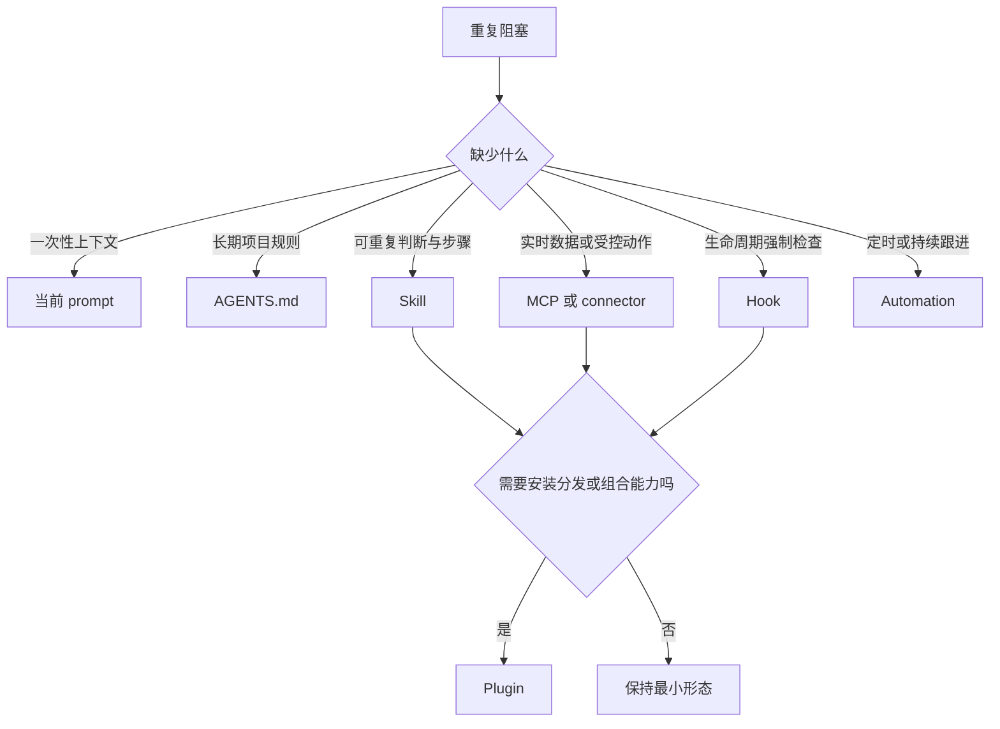
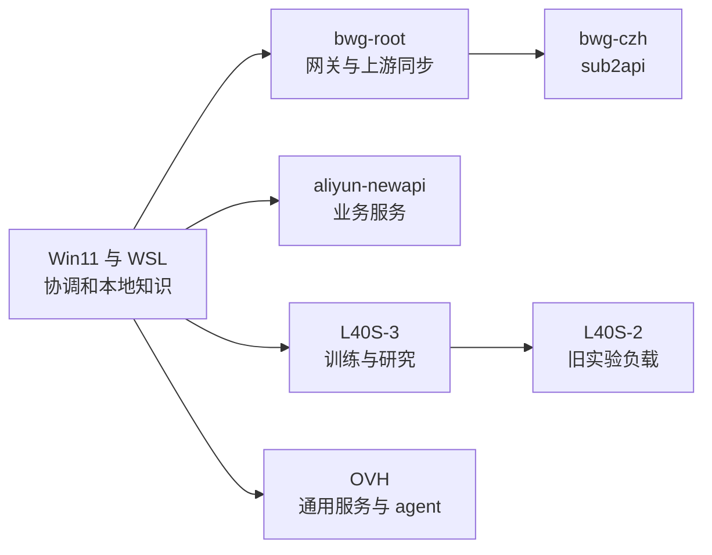
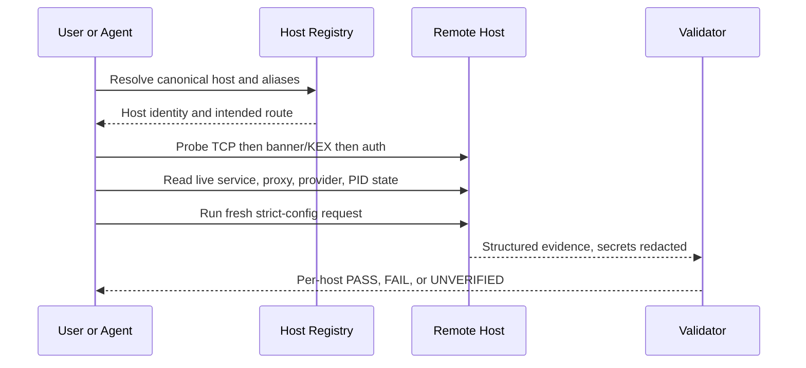

# Codex 会话阻塞与插件效率审计

> [!note] 结论先行
> 这批会话最需要的不是“尽量多装官方插件”，而是建立三个稳定能力：跨会话交接、跨主机 live-state 诊断、研究与实验证据管理。官方 180 项目录中，第一批只值得试用 `github`、`hugging-face`、`codex-security` 和 `plugin-eval`；开发官方 OpenAI API/Agents SDK/ChatGPT Apps 时再项目级启用 `openai-developers`，Web 项目再按需启用 `build-web-apps` 与 `build-web-data-visualization`。Feishu、SSH fleet、训练监控、OpenReview 证据映射都没有现成官方插件，需要自建 skill 或 plugin。

## 0. 本文回答什么

读完本文后，应该能够：

- 看清 WSL、Win11 和目前可访问服务器上的 Codex 工作分布；
- 区分“反复出现的话题”“真实 runtime error”和“由会话正文污染造成的关键词假象”；
- 从 180 个 `Codex official` 插件中选出与当前工作真正匹配的少数项；
- 判断一个重复工作应该放进 `AGENTS.md`、skill、plugin、MCP、hook 还是 automation；
- 按收益顺序建设自己的 Codex workflow，而不是堆叠相互争抢 trigger 的插件。

### 0.1 版本与证据边界

| 项目 | 审计边界 |
|---|---|
| 审计日期 | 2026-07-28，Asia/Tokyo |
| 官方文档 | 当日刷新后的 Codex manual；文档正文来自 OpenAI 官方 `learn.chatgpt.com` 与 `developers.openai.com` 页面 |
| “180 个插件” | `/home/alex_mercer/.codex/.tmp/plugins/.agents/plugins/marketplace.json` 中的 `openai-curated` / `Codex official` 快照 |
| 插件快照 commit | `11c74d6ba24d3a6d48f54a194cd00ef3beea18f9`，2026-07-13；本地 grafted snapshot，无 remote，不能声称是 2026-07-28 的线上目录 |
| 当前 WSL CLI | `codex-cli 0.145.0` |
| 当前 Win11 bundled App 物料 | App `26.721.41059`；Browser/Chrome/Computer Use 同版本，LaTeX `0.2.4`，Visualize `1.0.15` |
| WSL 会话 | `~/.codex/sessions` 与 `~/.codex/archived_sessions`；审计快照为 623 active + 9 archived，目录在审计期间继续增长 |
| Win11 会话 | `C:\Users\Alex Mercer\.codex\sessions` 与 `archived_sessions`，8 active + 2 archived |
| 服务器 | 对 SSH config 中的同义 alias 去重后，只读检查可连接主机的 `~/.codex` 会话目录和 `session_index.jsonl` |
| 当前审计任务 | 从 workload/error 统计中排除 `019fa6cd-73eb-7e81-a336-c03ce690c0ec` 及其 subagent，避免自我污染 |

> [!warning] “完整”的准确含义
> 本次覆盖了所有**可访问** rollout 的文件级元数据，并覆盖了 927 个有 `session_index` 的唯一用户任务。WSL 的 primary session 还做了去敏后的用户消息和事件聚合。远端没有集中导出全部消息正文，避免把源码、prompt、凭据或业务数据复制到本地；远端 workload 主要依据全量 index title、cwd、日期和文件元数据。四个当前不可取证的服务器入口单列为缺口，不能假装已经分析过。

### 0.2 三类证据

- **直接事实**：文件数、日期、cwd、事件类型、插件 manifest、skill 描述和当前 config。
- **工作负载信号**：用户消息或 thread title 至少命中一次某主题；类别允许重叠，只说明做过这类工作。
- **建议**：根据直接事实推导出的 workflow 设计，不冒充官方功能或 runtime 事实。

## 1. 一句话 mental model

> [!note] 最小合适载体
> 先问“缺的是稳定步骤、实时数据、机械约束，还是定时执行”，再选 skill、MCP、hook 或 automation；plugin 只是把其中若干能力打包、安装和分发的容器。



OpenAI 的当前文档也采用同一边界：skill 适合可重复指令和资源；MCP 适合 live data、认证与受控动作；plugin 可以组合 skill、MCP、connector 和 hook；UI 只应在比较、确认、编辑或导航结构化数据时加入。参见 [Plugin architecture](https://developers.openai.com/plugins/concepts/plugins)、[Brainstorm plugin use cases](https://developers.openai.com/plugins/plan/use-case) 与 [Skills & Plugins](https://learn.chatgpt.com/docs/skills-and-plugins)。

## 2. 可访问会话全景

### 2.1 文件级覆盖

| 位置 | Rollout 文件 | 唯一 indexed task | 日期范围 | 大小 | 主要工作 |
|---|---:|---:|---|---:|---|
| WSL | 623 active + 9 archived | 126 | 2026-03-25 至 2026-07-28 | 约 1.2 GB | 本地开发、agent harness、论文、业务项目和跨主机运维 |
| Win11 | 8 + 2 | 10 | 2026-07-15 至 2026-07-26 | 16.5 MB | `C:\AppsExternal\automation` 下的桌面协调、SSH、Feishu 和生活任务 |
| `ovh` | 181 + 8 | 103 | 2026-06-18 至 2026-07-22 | 228.5 MB | 通用 Ubuntu 与 agent 开发 |
| `ovh-109` | 19 + 0 | 5 | 2026-07-22 至 2026-07-27 | 19 MB | 小规模 TokenRouter 延续工作 |
| `bwg-root` | 479 + 34 | 97 | 2026-05-26 至 2026-07-28 | 909 MB | TokenRouter、cc-gateway、上游同步、安全审查和 harness |
| `aliyun-newapi` | 661 + 281 | 243 | 2026-05-03 至 2026-07-25 | 886 MB | `dragtokens-app`、`oai_account2json` 和业务服务开发 |
| `L40S-3` | 814 + 56 | 326 | 2026-04-02 至 2026-07-28 | 1.225 GB | VERL、训练、评测和研究开发 |
| `l40s-2` | 24 + 10 | 10 | 2026-05-27 至 2026-06-05 | 140.1 MB | 较早的 WARP-OPD 工作负载 |
| `bwg-czh` | 34 + 0 | 7 | 2026-06-14 至 2026-07-14 | 19 MB | `sub2api` 与部署 |
| **总计** | **3,243** | **927** | 2026-03 至 2026-07 | **约 4.6 GB** | 可访问范围 |

文件数和 index 数不能互换：一个用户任务可以产生 primary、guardian、subagent、compaction 或其他内部 rollout；反过来，一些 CLI rollout 没有进入 desktop 的 `session_index.jsonl`。

### 2.2 当前无法取证的入口

| 入口 | 只读探测结果 | 本文如何处理 |
|---|---|---|
| `yuyun-jp-newapi` 及 public 同义 alias | `known_hosts` 中的旧 key 与当前 key 不同 | 不绕过严格 host-key 检查；先由 operator 核验真实主机指纹 |
| `yuyun-hk-dragtokens` | host key changed | 同上 |
| `a100-server-1` | KEX 前被 peer reset | 只记录不可达，不猜是服务端策略还是网络问题 |
| `autodl` | KEX 前被 peer reset | 只记录不可达，不把它计入会话结论 |

这四个缺口本身也说明为什么需要 fleet doctor：SSH TCP、banner/KEX、host identity 和认证是不同层，不能用“端口通了”或 `StrictHostKeyChecking=no` 抹平。

## 3. 我们实际在用 Codex 做什么

### 3.1 WSL primary session 的 workload 信号

以下数字按“至少有一条短用户消息命中该主题的 primary session 数”统计，类别可以重叠；它不是事故数。

| 工作类型 | Sessions | 对效率设计的含义 |
|---|---:|---|
| 研究、论文、LaTeX、reviewer | 74 | 需要证据归属、引用和实验决策模板 |
| 会话连续性、resume、context | 64 | 需要可移植的 handoff，而不是反复重读几百 MB 历史 |
| SSH、fail2ban、known_hosts、server | 58 | 需要分层的 live probe 和 host 去重 |
| hooks、pre-commit、CI | 38 | 需要统一、可失败的 preflight 命令 |
| proxy、WebSocket、v2ray、Mihomo | 38 | 需要比较 file state、controller state 和 fresh runtime |
| training、GPU、SFT、RLHF | 35 | 需要实验 ledger、训练监控与 unattended notification |
| Feishu、Lark、OAuth | 21 | 需要 enterprise/profile-aware 的专用 workflow |
| browser、Chrome、Playwright | 20 | 需要 API-first、session-aware 的浏览器状态机 |
| automation、cron、monitor | 18 | 需要把稳定检查从人工聊天转为 schedule/notification |

### 3.2 各主机的自然分工



这个分工带来一个结构性问题：同一类操作会跨不同 alias、用户、cwd、Codex 版本、provider 和网络路径重复。只写一份静态 runbook 还不够；runbook 必须先读取该主机的 live state，再生成 host-specific 结论。

### 3.3 生活与行政任务的效率判断

生活类任务样本远少于开发与研究，但它们揭示的原则相同：先复用已经存在的日历、邮件和文档 source of truth，不要为一次性动作造 plugin。

| 任务 | 当前最合适的能力 | 判断 |
|---|---|---|
| 日程、会议和提醒 | Win11 config 声明 enabled 的 Google Calendar（fresh session 验证可调用后再用），或 Feishu 对应能力 | 只连接真实使用的日历；若日程在 Feishu，Google Calendar 不能代替它 |
| 邮件查找、整理和回复 | `gmail` 仅适用于真实 Gmail mailbox；其他邮箱使用对应 connector/CLI | connector 能减少复制粘贴，但发送、删除和归档仍需确认 |
| 通知、材料、PDF、表格、幻灯片 | Win11 config 声明 enabled 的 Documents/PDF/Spreadsheets/Presentations；先做 fresh-session runtime 验证 | 优先验证现有 runtime plugin，不重复安装相同文档能力 |
| 当前价格、服务商和网页调研 | Web search + Win11 config 声明 enabled 的 Chrome（登录态任务前先确认 runtime tool 出现） | 登录态网站用 Chrome；公开事实优先搜索和官方网页，不需要为每个网站装 vendor plugin |
| “三小时后关机”一类单次动作 | OS scheduler 或一次性 automation | 没有可复用判断时，不应创建永久 skill/plugin |
| 经常重复的行政材料格式 | 一个小 skill + 模板 | 只有需要跨端安装、connector 或团队分发时才打包 plugin |

## 4. 真实阻塞：哪些是 error，哪些只是工作话题

### 4.1 Codex 会话生命周期信号

在排除当前审计和 subagent 后，WSL primary sessions 中观察到：

| 事件 | 覆盖 sessions | 事件数 | 能说明什么 | 不能说明什么 |
|---|---:|---:|---|---|
| `turn_aborted` | 101 | 197 | 中断、改向或取消频繁 | 不能直接等同网络或模型失败 |
| `context_compacted` | 54 | 135 | 长任务确实反复压缩上下文 | 不能说明压缩结果一定丢失关键信息 |
| `thread_rolled_back` | 60 | 109 | 回滚和分支式探索常见 | 不能自动判定前一方案错误 |
| 硬 `error` event | 6 | 12 | 5 个涉及 remote compaction stream-send/request，1 个为 usage limit | 不能据此把 browser、SSH 或训练都归因给 Codex transport |

这组数据支持建设 handoff 和 session analytics；它不支持“所有中断都是 WebSocket 问题”之类的结论。

### 4.2 十一类反复阻塞

| 阻塞 | 会话中的表现 | 根因模式 | 最合适的改进 |
|---|---|---|---|
| 长会话交接成本 | compact、rollback、resume 后重新确认目标和证据 | 任务状态只存在聊天正文中 | `session-handoff` skill；结束时输出目标、已验证事实、未决项、恢复命令和敏感值占位符 |
| 跨主机配置漂移 | WSL、Win11、L40S、OVH、BWG 的 Codex/cc-switch/provider 不一致 | 同一模板被不同 runtime、版本和 auth mode 消费 | `codex-fleet-doctor` 的只读 diff + fresh request 验证 |
| file state 与 live state 不一致 | 配置文件正确但 Mihomo controller、长驻进程或 app-server 仍旧 | long-lived process 缓存旧环境；runtime 有自己的状态 | live controller、`/proc/<pid>/cmdline`、fresh process 和真实请求必须同时过关 |
| SSH 层次混淆 | TCP/22 通，但 banner/KEX/auth 失败；alias 重复；fail2ban 干扰 | 把 transport、host identity、authentication 混成一个“SSH 通不通” | host registry + TCP/banner/KEX/auth/fail2ban 分层 probe |
| GitHub/CI/review 重复操作 | 拉分支、看 diff、读 review thread、查 Action、改、再验证 | 本地 Git 与 GitHub 上下文分裂 | 官方 `github` plugin；repo 内统一 `preflight`，不靠泛化 prompt |
| 论文证据与 reviewer 归属 | human review、PAT、meeting inference、manuscript 被混在一起 | 缺少 evidence graph 和显式/推断边界 | `research-evidence-lab` skill；Zotero/HF/Scite 只提供外部资料，不替代归属判断 |
| 实验设计与训练浪费 | ablation 可能代数等价；指标、数据构造、队列和 checkpoint 分散 | 开跑前缺少机制 gate，运行中缺少 invariant 与告警 | experiment ledger + algebra/autograd check + monitor automation |
| Feishu OAuth 与表格操作 | 浏览器账号、app 所属企业、profile、scope 混淆；填表需人工核对 | connector identity 不等于浏览器当前账号 | Feishu skill/plugin，先 `profile/enterprise/auth status/doctor`，写入前 preview、写后 readback |
| 浏览器 automation 脆弱 | Chrome/Playwright/session 生命周期、人机验证、邮箱等待 | 用 UI 猜测代替稳定 API；session identity 没有显式建模 | Chrome/Browser 负责观察与交互；业务层自建幂等状态机、断线恢复和证据截图 |
| 生产故障容易看错层 | 仓库看似异常，但真实 URL、Caddy、backend 或静态资源是另一层 | 先读代码，后测用户端 endpoint | incident skill 固定“真实 URL → service chain → live logs/config → repair → external recheck” |
| 验收出现假绿 | test 没跑、pipeline 丢 exit code、只验证模板未验证 runtime | 检查本身无法失败或未覆盖真实消费者 | repo-local preflight/hook/CI；故意破坏一次确认能变红；Codex Security 只补安全面 |

## 5. “180 个官方插件”到底是什么

### 5.1 两个容易混淆的目录

| 名称 | 本机事实 | 作用 |
|---|---|---|
| `openai-curated` / `Codex official` | 本地 snapshot 恰好 180 项 | 用户所说的“180 个” |
| `openai-bundled` | 当前 Win11 bundle 只有 Browser、Chrome、Computer Use、LaTeX、Visualize 5 项；WSL materialization 只有 Visualize | 随 App build 绑定的本地能力，不是 180 项目录 |

180 项快照中：

- 180 个 marketplace entry，180 个顶层 plugin 目录；
- 154 个 `.app.json` connector/app 描述；
- 72 个 plugin 含 skills，共 607 个 `SKILL.md`；
- 8 个含 `.mcp.json`：`linear`、`figma`、`github`、`notion`、`cloudflare`、`build-ios-apps`、`codex-security`、`openai-developers`；
- 48 个 `commands/` 文件；
- 177 项 `ON_INSTALL` auth，3 项 `ON_USE` auth；
- 165 项未限定产品，15 项标记 `CODEX`。

`AVAILABLE` 只表示目录允许安装，不表示当前账号已有 entitlement、OAuth、PAT、付费套餐或 workspace permission。官方手册也明确说明：plugin 安装、connector 登录、MCP 设置和 host sandbox 是不同层。参见 [Plugins](https://learn.chatgpt.com/docs/plugins)。

model-provider auth 与 plugin/app/MCP/CLI auth 彼此独立。当前 `model_provider = "custom"` 与 `auth_mode = "chatgpt"` / bearer credential 既不会自动登录 SaaS connector，也不能证明某个 plugin 的工具或 entitlement 会出现在新会话里。本地另有一个名为 `openai-api-curated` 的 29 项 `api_marketplace.json`；它证明存在不同 catalog materialization，但仅凭本地文件不能断言由哪种 runtime、product 或 credential 选择。本文的 180 项清单不是“当前账号可立即使用 180 项”的承诺。

### 5.2 当前 config 声明 enabled 的插件

**WSL config 声明**：

- personal `goal-plan`；
- bundled `visualize`。

**Win11 config 声明**：

- bundled：`browser`、`chrome`、`computer-use`、`visualize`；
- primary runtime：`documents`、`pdf`、`spreadsheets`、`presentations`、`template-creator`；
- curated：`google-calendar`、`slack`。

Win11 bundle 中存在 LaTeX，但当前 config 未启用。论文工作很多，因此它比新增大多数 SaaS connector 更值得试用。

> [!tip] 不要把 cache 当成 enabled
> plugin 目录出现在 cache 中，只能证明曾下载或 materialize；`enabled = true` 也只是 config state。必须在 fresh session 中验证对应 skill/tool 是否真的出现并可调用，才能称为 runtime capability。

## 6. 官方插件推荐

### 6.1 第一批：直接试用或项目内按需启用

| 插件 | 优先级 | 为什么与现有工作匹配 | 它不能解决什么 | 验证门槛 |
|---|---:|---|---|---|
| `github` | P0 | PR、issue、review thread、Actions CI、push/draft PR 都是高频；自带 `gh-fix-ci`、`gh-address-comments`、`yeet` | 不替代本地测试、Git identity 和部署后 runtime 验证 | 先识别实际 auth 路径：ChatGPT app connector、直接 GitHub MCP 的 `GITHUB_PAT_TOKEN`、本地 `gh auth` 彼此独立；再读一个 PR、unresolved thread 和 Action log |
| `hugging-face` | P0 | 模型、dataset、paper、community eval、Hub CLI 与训练资料直接匹配科研和 HF 业务 | 不替代本地 GPU 调度、OpenReview review 解析或自有训练 harness | 先用无需 auth 的公开 paper 页面；写 endpoint 需要 `HF_TOKEN`，HF Jobs 还要求 Pro/Team/Enterprise 与 billing，不能用安装成功推断 entitlement |
| `codex-security` | P0，若账号具备能力 | API 中转站、公开 Web 服务、auth 和自动化代码需要独立 security diff/repo scan | 不替代功能 review、部署验证或 secrets management | 它在本文审计的 180 项 catalog 中为 `ON_USE` 且限定 `CODEX`；先做 capability/entitlement preflight，再对一个授权 repo 做小 diff scan |
| `plugin-eval` | P0，建自有插件时启用 | 可做静态分析与 isolated benchmark；observed token usage 只有 telemetry 可用时才成立 | 静态 token budget 不是实测使用量，也不会自动证明业务流程有效 | 准备正例、负例和一个 known-red 场景，再运行真实 benchmark，确认 evaluator 能检出 trigger 漂移 |
| `openai-developers` | P1，项目级 | 适用于官方 OpenAI API、Agents SDK、ChatGPT Apps 与 app submission；包含 Platform API-key gate | 不负责 Codex App、`chatgpt.com/backend-api/codex`、自建 relay、cc-switch 或 provider runtime；broad key gate 可能干扰 relay-backed 项目 | 只在对应项目启用，验证一个官方 API failure 或 Agents/App flow；不得让它覆盖现有 custom provider |
| `build-web-apps` | P1，Web 项目按需 | frontend QA、Browser-first 测试、React/Next、Stripe、Supabase 指南覆盖多个业务 Web 项目 | 不能代替真实站点 endpoint、Caddy/backend 和生产数据检查 | 仅在 Web repo 启用；做一次 responsive/browser regression 验证 |
| `build-web-data-visualization` | P1，研究/运维看板按需 | 训练曲线、uncertainty、dashboard、UML、Gantt 与 report export 都匹配 | 不采集数据、不监控 GPU，本身只是设计/实现 workflow | 用一份既有 experiment metrics 做图，核对统计诚实性与导出 |

“直接试用”不等于七个都全局常开。`build-web-*` 含很多 broad-trigger skill，更适合相关项目启用；否则会扩大 initial skill list 和 trigger competition。官方文档说明技能很多时，Codex 会压缩或省略初始描述，因此稀疏安装有实际收益，参见 [Build skills](https://learn.chatgpt.com/docs/build-skills)。

### 6.2 第二批：有前置条件才试

| 插件 | 触发条件 | 价值 | 当前不应直接装的原因 |
|---|---|---|---|
| `zotero` | 已用 Zotero Desktop 管理真实 library | 本地 library 搜索、BibTeX、引用插入和全文读取 | 当前会话证据主要是 Obsidian/本地文稿，不证明 Zotero 已成为 source of truth |
| `scite` / `readwise` | 已有对应账号或订阅 | citation context、论文阅读与 highlights | 不能解析 reviewer/PAT/meeting 的本地证据关系 |
| `google-drive` / `gmail` | Google Workspace 确实承载材料或客服邮箱 | Docs/Sheets/Slides、邮箱 triage 与回复草稿 | 当前主要协作面是 Feishu；不要同时维护两套 knowledge source |
| `sentry` | 项目已接入 Sentry 且 token 可用 | 直接读取 production issue/event | plugin 不会替你部署 observability；没有 telemetry 时没有收益 |
| `posthog` / `datadog` | 对应服务已经采集有效数据 | product analytics，或 logs/metrics/traces | 采用新 SaaS 是架构决策，不应由“目录里有插件”倒推 |
| `coderabbit` | 团队愿意引入第二套 AI review | 快速 diff review | 与 guardian、independent reviewer 和 Codex Security 重叠；先测新增召回是否大于噪声 |
| `cloudflare` / `render` / `digitalocean` | 真实 workload 已部署在对应 vendor | vendor-native deploy、logs 和资源管理 | 不能管理 Aliyun、OVH、BWG、L40S；不是通用 SSH plugin |
| `figma` / `canva` / `biorender` | 产品 UI 或论文图真正使用该工具 | design implementation、海报或科研图 | 当前没有足够会话证据证明它们是高频 source of truth |
| `stripe` / `quickbooks` / `hubspot` / `intercom` | 业务正式采用对应 SaaS | 支付、记账、CRM、客服 | connector 不能替代现有业务系统；涉及外部写操作和账务风险 |

### 6.3 当前明确不推荐

- 不要一次安装几十个“可能以后会用”的 SaaS connector。
- 不要因为做 server 运维就安装某个云厂商 plugin；现有主机并不属于同一 vendor。
- 不建议安装 `superpowers` 作为全局 workflow。它的多个 skill 使用极宽的 MUST trigger，与已有 `agent-core`、`goal-plan`、独立 reviewer 和测试规则高度重叠，容易重复规划、重复 review 和争抢触发。
- 不要把 `notion` 当作通用知识管理增强；当前 source of truth 是本地 repo、Obsidian 与 Feishu。只有明确迁移到 Notion 才应连接。
- 不要期待官方目录解决 Feishu Base、OpenReview、AdsPower、cc-switch、Mihomo、fail2ban 或多主机 Codex provider；180 项中没有这些专用能力。

### 6.4 180 项目录的类别审计

| 类别 | 数量 | 与当前工作的判断 |
|---|---:|---|
| Developer Tools | 44 | 价值最高，但多数是 vendor/framework-specific；优先看 GitHub、HF、OpenAI、Security、Web build/eval |
| Productivity | 44 | 大量 task/CRM/document SaaS；没有 Feishu/Lark，避免重复知识源 |
| Finance | 27 | 除非实际采用 Stripe/QuickBooks 等，否则不应连接财务数据 |
| Business & Operations | 15 | CRM/销售工具居多；仅在业务流程已经存在时接入 |
| Data & Analytics | 13 | 需要先有对应 telemetry/data warehouse |
| Communication | 12 | Gmail/Slack/Teams 等；当前 Feishu 缺口仍需自建 |
| Education & Research | 11 | Zotero、Scite、Readwise 较相关，其余领域性很强 |
| Creativity | 9 | Figma/Canva/BioRender 条件性有用 |
| Travel | 2 | 当前无稳定映射 |
| Other | 2 | 当前无稳定映射 |
| Security | 1 | `codex-security` 与公开服务代码高度相关 |

全目录名称见附录 A。没有进入前两批的项目都按“当前没有已知 vendor/workflow 映射”处理，这不是对插件质量的评价。

## 7. 应该自建什么

### 7.1 优先级总表

| 优先级 | 能力 | 最小第一版 | 后续是否做 plugin/MCP | 成功指标 |
|---|---|---|---|---|
| P0 | `session-handoff` | 一个 skill + schema validator | 稳定后并入 personal plugin | resume 后首次有效操作前不再重读整段历史；handoff 无明文 secret |
| P0 | `codex-fleet-doctor` | skill + 只读 scripts | 需要统一远端工具时加 MCP；共享时打包 plugin | 每台 host 都产生 TCP/banner/auth/live config/process/fresh request 的证据矩阵 |
| P0 | `research-evidence-lab` | skill + Markdown templates + 小型 parser | 与 Zotero/HF connector 组合时再做 plugin | reviewer 归属错误为零；explicit/inferred 始终分栏；开跑前检查等价性 |
| P1 | `feishu-ops` | 现有 DragAI skill + auth doctor + read/write diff | 需要跨端授权和结构化工具时做 MCP plugin | wrong enterprise/profile 重试归零；每次写入都有 preview 和 readback |
| P1 | `experiment-guardian` | monitor scripts + automation + WxPusher | 需要统一多机 job API 时做 MCP plugin | OOM/stall/completion 通知延迟；无 silent checkpoint/data invariant failure |
| P1 | `codex-session-intelligence` | 去敏 metadata/index analyzer + 周报 | 需要交互 dashboard 时加 UI/plugin | 每周识别的重复序列、abort/compact 趋势和被消除阻塞 |
| P2 | `browser-ops-resilience` | skill + Playwright/AdsPower state machine contract | 需要受控浏览器账号动作时加 MCP | invalid-session 重试率、重复点击和人工接管次数下降 |
| P2 | `incident-evidence` | endpoint-first skill + service-chain templates | 可并入 fleet plugin | 首个 live endpoint probe 时间；“只看 repo 就下结论”的次数为零 |

### 7.2 `session-handoff`: 先做 skill，不做日志 API plugin

建议固定输出：

```yaml
goal: 一句话冻结目标
scope:
  included: []
  excluded: []
verified_facts:
  - claim: ""
    evidence: "path/command/runtime"
changes_made: []
verification:
  passed: []
  failed: []
open_blockers: []
resume_commands: []
sensitive_placeholders: []
next_acceptance_check: ""
```

不要把当前 JSONL schema 写成 plugin 的稳定 public API。Codex 版本和 event shape 会变；第一版只读 `session_index` 与 session metadata，并保留 adapter/version boundary。

### 7.3 `codex-fleet-doctor`: skill + 受控 live tools



第一版默认只读，输出每台主机独立结论。任何 restart、unban、配置写入或 provider 切换都作为显式 write action，先给 preview 和 rollback。这个能力需要 live state，因此纯 prompt 或静态 skill 不够；但可以先让 skill 调现有 SSH/CLI scripts，等 schema 稳定后再封装 MCP。

### 7.4 `research-evidence-lab`: 把“审稿意见”变成证据图

建议核心对象：

| 对象 | 必填字段 |
|---|---|
| Claim | 原文、来源类型、reviewer ID、issue anchor、显式/推断 |
| Hypothesis | reviewer 的因果假设、可证伪结果 |
| Control | 改变什么、保持什么、局部还是 whole-run |
| Equivalence check | algebra、autograd graph、optimizer trajectory 是否等价 |
| Experiment | compute、seed、metric、accept/reject rule、依赖 |
| Evidence | 文件、行号、日志、table/figure、运行状态 |

HF、Zotero、Scite 可以提供 paper metadata、library 和 citation context；它们不能自动判断“这是 reviewer 明说的，还是 meeting/PAT 推断的”。这个判断应该由 skill 强制留证据栏。

### 7.5 `feishu-ops`: 先增强现有 skill；出现跨端安装或统一 OAuth 需求后再打 plugin

未来若打包 plugin，建议包含：

- `feishu-auth-doctor` skill：app、tenant/enterprise、profile、account、scope、token 状态分层检查；
- 现有 `dragai-feishu-workbench` skill：OneSafePay/DragAI Base 的具体业务 schema；
- 通用 Base/Docs skill：query、diff、write、readback、reconcile；
- CLI adapter 或 MCP tools：结构化参数、错误码和最小权限；
- write safety：目标 base/table/view/record 明示、批量变更 preview、金额和退款字段二次确认；
- audit result：写入后读取目标行，报告新增、更新、跳过和冲突数。

Google Drive、Notion 或 Airtable plugin 的 workflow 可以参考，但不能替代 Feishu 的企业绑定和 Base schema。

### 7.6 `experiment-guardian`: 监控，不擅自改实验

第一版只做：

- 枚举 job、GPU、PID、日志、checkpoint、queue 状态；
- 监控 loss/grad norm/reward/throughput、NaN/OOM/NCCL/stall；
- 检查数据与 metric invariant；
- 完成、失败、idle GPU 或需决策时发送 WxPusher；
- 生成 handoff 和最小复现证据。

它不应无人值守地改学习率、恢复错误 checkpoint、杀训练或重排实验。automation 负责“何时检查”，skill 负责“怎样判断”，MCP/CLI 负责“读取 live state”，有后果的动作仍需授权。

## 8. 不同载体的明确边界

| 需求 | 应放在哪里 | 不应放在哪里 |
|---|---|---|
| “这个 repo 永远先跑哪些测试” | repo `AGENTS.md` + 可执行 preflight | 全局 plugin 的长篇说明 |
| “每次排 SSH 都按相同层次” | reusable skill + scripts | 只写在某次聊天里 |
| “读取所有服务器当前状态” | CLI/MCP live tools | 纯 skill 中硬编码上次结果 |
| “禁止提交 secret / 验收必须可失败” | repo-local hook/CI | 只靠 agent 自觉 |
| “每 10 分钟看训练是否结束” | automation + notification | 长聊天里手工 sleep/poll |
| “把多个 skill 和连接器安装到 WSL/Win11” | plugin | 为一个小 workflow 过早建 MCP/UI |
| “一次性的 reviewer 解释” | 当前 prompt | 新建永久 plugin |

Hooks 的当前官方用途包括 prompt secret scan、Stop validation、memory capture 和 directory-specific context；它们需要 trust review，多个匹配 hook 会并发运行。参见 [Hooks](https://learn.chatgpt.com/docs/hooks)。Scheduled tasks 适合训练、PR、部署和定期报告，但本地项目任务要求电脑开机、App 运行，并应使用尽可能窄的 sandbox。参见 [Scheduled tasks](https://learn.chatgpt.com/docs/automations)。

Record & Replay 很适合“演示一次 UI 工作流后生成 skill”，但当前官方文档只说明 macOS 可用，不能把它当作 Win11 方案。参见 [Record & Replay](https://learn.chatgpt.com/docs/extend/record-and-replay)。

## 9. 建议的实施顺序

### 第 1 周：只建立 baseline

1. 在一个新会话中逐个验证 `github`、`hugging-face` 和有 entitlement 的 `codex-security`，不要一次全局安装所有候选；只有正在开发官方 OpenAI API/Agents SDK/ChatGPT Apps 的项目才启用 `openai-developers`。
2. 记录每个 plugin 是否成功触发、是否需要额外 auth、输出是否减少 CLI/浏览器切换。
3. 启用 Win11 bundled LaTeX 做一次真实论文 compile/doctor；现有 Documents/PDF/Sheets/Slides 保持不变。
4. 如果 Google Calendar/Slack 没有真实使用，停用而不是保留“以后可能用”。

### 第 2 周：消除最高频人工序列

1. 写 `session-handoff` skill，并用一次长会话 compaction 前后验证。
2. 写 `codex-fleet-doctor` 的 host registry 与只读 probes；先覆盖 WSL、Win11、L40S-3、bwg-root、aliyun-newapi。
3. 为每个高频 repo 暴露一个统一 `preflight` 命令，让 hook、CI 和 agent 调同一入口。

### 第 3 周：科研与 Feishu

1. 写 `research-evidence-lab`，拿已有 reviewer/PAT 案例做回放测试。
2. 先扩展现有 DragAI skill，加入通用 auth doctor 并做 replay test；只有证明需要跨端安装、统一 OAuth、结构化 tools 或批量确认后，再打包 personal `feishu-ops` plugin。
3. 用 `plugin-eval` 的正例、负例、known-red 和 isolated benchmark 检查 trigger、token budget 与跨项目误触发；只有 telemetry 存在时才记录 observed token usage。

### 第 4 周：监控与清理

1. 上线只读 `experiment-guardian` automation 与 WxPusher 通知。
2. 生成第一份 session friction 周报。
3. 停用四周内没有触发、没有节省步骤或制造冲突的 plugin。

## 10. 如何衡量有没有真的提效

| 指标 | 当前 baseline | 目标方向 |
|---|---|---|
| Resume 后到第一个有效操作的时间 | 64 个 continuity 相关 session 表明成本高 | handoff 后无需重读完整历史 |
| 每次多主机任务的未验证主机数 | 过去需要反复补验 | 报告必须逐 host 标记 PASS/FAIL/UNVERIFIED |
| 从用户报告故障到首次 live endpoint/probe 的时间 | 多次出现先看 repo 的风险 | 第一轮操作就触达真实 endpoint/host |
| reviewer/PAT/agent inference 误归属 | 曾需要人工纠正 | evidence table 中为零 |
| 因等价 ablation 浪费的训练 | 存在真实风险 | 开跑前 algebra/autograd gate 拦截 |
| plugin trigger 命中率与误触发率 | 尚无统一记录 | 用 plugin-eval + 真实任务集度量 |
| 长任务无通知等待 | automation 需求至少 18 个 WSL sessions | completion/failure/decision 都有及时通知 |
| 假绿验收 | 多项目都强调 runtime 与可失败检查 | preflight 故意破坏时稳定变红 |

不要以“安装了多少 plugin”作为 KPI。真正的 KPI 是减少用户纠正、减少重复 probe、减少切换工具和减少错误实验。

## 11. 判断练习

> [!question] 练习 1
> L40S-3 的 `config.toml` 显示 `supports_websockets = true`，但 App 仍然 reconnect。应该新增什么载体，第一轮要收集哪些证据？

<details>
<summary>参考答案</summary>

需要 `codex-fleet-doctor` 的 live CLI/MCP probes，而不是再写一条 `AGENTS.md`。第一轮至少收集 canonical host/route、当前 provider、Mihomo controller live mode、direct/proxy TLS/WS 对比、精确 app-server/proxy PID 与环境、fresh strict-config request 的 transport 结果。配置文件只能证明期望状态。

</details>

> [!question] 练习 2
> 一条 reviewer 评论、一条 PAT 建议和一次 meeting 讨论都要求“加 seed”。应该怎样避免把它们写成同一条 reviewer 要求？

<details>
<summary>参考答案</summary>

`research-evidence-lab` 为每条 claim 保存来源类型、reviewer ID、anchor、原文和 explicit/inferred 字段。可以把它们映射到同一个 experiment，但不能合并 provenance；报告分别说明谁明确要求、谁只是支持同一决策。

</details>

> [!question] 练习 3
> Feishu Base 每天都要写退款行，应该只建 skill，还是直接建带 UI 的 MCP plugin？

<details>
<summary>参考答案</summary>

先用 skill 固化 schema、preview、去重、write/readback 和错误处理，并复用 Lark CLI。只有当跨 ChatGPT/Codex 安装、统一 OAuth、结构化工具调用或批量确认确实需要时，再打包 plugin 并加入 MCP。UI 只有在批量比较、编辑和确认明显优于文本 preview 时才值得做。

</details>

> [!question] 练习 4
> 为什么不建议全局安装 `superpowers`，即使它包含 TDD、debugging 和 review？

<details>
<summary>参考答案</summary>

当前 `agent-core`、`goal-plan`、reviewer gate 和 repo 规则已经覆盖这些 workflow。`superpowers` 的 trigger 很宽，部分要求“任何开发前必须触发”，会造成重复 planning、重复 review 和 skill 竞争。应先补当前体系缺失的 live tools 和 handoff，而不是叠加第二套总控流程。

</details>

## 12. 证据索引与不确定性

| 结论 | 主要证据 | 不确定性 |
|---|---|---|
| 180 项是 `openai-curated` 快照 | `/home/alex_mercer/.codex/.tmp/plugins/.agents/plugins/marketplace.json`、repo `HEAD` | 本地 snapshot 无 remote，可能落后线上目录 |
| bundled 不是 180 项 | Win11/WSL `openai-bundled/.agents/plugins/marketplace.json` 与 materialization key | bundle 随 App 更新会变化 |
| 当前 enabled plugins | WSL 与 Win11 的 `.codex/config.toml` | 新会话、其他 host 或 workspace policy 可有不同状态 |
| WSL workload 与 lifecycle | `~/.codex/sessions`、`archived_sessions`、`session_index.jsonl` | 正则类别重叠；短用户消息仍是 workload signal，不是因果标签 |
| 远端分工与数量 | 各主机 `~/.codex/session_index.jsonl` 和 rollout metadata | 未集中读取全部消息正文；四个入口不可达 |
| plugin/skill/MCP 边界 | OpenAI manual 与 manifest/skill files | public product rollout、entitlement 和 OAuth 仍需安装时验证 |

代表性历史文件：

- WebSocket/proxy：`/home/alex_mercer/.codex/sessions/2026/05/05/rollout-2026-05-05T19-22-19-019dfb17-e24c-77f0-9f2f-edd3d0dba9b4.jsonl`
- remote compaction error：`/home/alex_mercer/.codex/sessions/2026/05/05/rollout-2026-05-05T23-50-53-019dfc0d-c21e-7853-a28b-8e78299cf7ba.jsonl`
- recent multi-host WebSocket deployment：`/home/alex_mercer/.codex/archived_sessions/rollout-2026-07-24T00-15-56-019f92fb-16c2-71c3-b0c7-03f4d6429f18.jsonl`
- Feishu OAuth：`/home/alex_mercer/.codex/archived_sessions/rollout-2026-07-23T06-17-52-019f8f20-158c-7960-a878-011ad776c91b.jsonl`
- reviewer/PAT evidence mapping：`/home/alex_mercer/.codex/sessions/2026/07/23/rollout-2026-07-23T07-26-27-019f8f5e-e12b-7ed2-b516-b538756fa6f4.jsonl`

## 附录 A：180 项 `Codex official` 快照

### Business & Operations（15）

`attio`, `carta-crm`, `demandbase`, `hubspot`, `pipedrive`, `streak`, `zoominfo`, `close`, `apollo`, `clay`, `outreach`, `intercom`, `actively`, `zoho`, `hebbia`

### Communication（12）

`gmail`, `slack`, `teams`, `outlook-email`, `circleback`, `fireflies`, `fyxer`, `granola`, `otter-ai`, `read-ai`, `zoom`, `superhuman`

### Creativity（9）

`canva`, `figma`, `remotion`, `biorender`, `hyperframes`, `heygen`, `shutterstock`, `picsart`, `fal`

### Data & Analytics（13）

`deepnote`, `amplitude`, `coupler-io`, `hex`, `motherduck`, `omni-analytics`, `windsor-ai`, `similarweb`, `mixpanel`, `mixpanel-headless`, `thoughtspot`, `posthog`, `alation`

### Developer Tools（44）

`hugging-face`, `netlify`, `vercel`, `game-studio`, `superpowers`, `github`, `circleci`, `cloudflare`, `sentry`, `build-ios-apps`, `build-macos-apps`, `build-web-apps`, `build-web-data-visualization`, `test-android-apps`, `expo`, `coderabbit`, `neon-postgres`, `plugin-eval`, `cloudinary`, `hostinger`, `marcopolo`, `quicknode`, `sendgrid`, `statsig`, `vantage`, `yepcode`, `render`, `temporal`, `supabase`, `twilio-developer-kit`, `openai-developers`, `datadog`, `convex`, `replit`, `lovable`, `nvidia`, `wix`, `base44`, `shopify`, `magicpath`, `catalyst-by-zoho`, `openai-ads-conversions`, `replayio`, `digitalocean`

### Education & Research（11）

`life-science-research`, `zotero`, `dow-jones-factiva`, `govtribe`, `particl-market-research`, `policynote`, `readwise`, `scite`, `midpage`, `ngs-analysis`, `boltz-api-cli`

### Finance（27）

`stripe`, `alpaca`, `binance`, `brex`, `cb-insights`, `cube`, `daloopa`, `dnb-finance-analytics`, `keybid-puls`, `moody-s`, `morningstar`, `mt-newswires`, `pitchbook`, `quartr`, `razorpay`, `setu-bharat-connect-billpay`, `taxdown`, `third-bridge`, `tinman-ai`, `lseg`, `s-p`, `factset`, `aiera`, `quickbooks`, `chronograph-lp`, `fiscal-ai`, `chronograph-gp`

### Other（2）

`cogedim`, `myregistry-com`

### Productivity（44）

`linear`, `atlassian-rovo`, `google-calendar`, `sharepoint`, `outlook-calendar`, `jam`, `box`, `google-drive`, `notion`, `brand24`, `channel99`, `clickup`, `common-room`, `conductor`, `coveo`, `docket`, `domotz-preview`, `dovetail`, `egnyte`, `happenstance`, `help-scout`, `highlevel`, `mem`, `monday-com`, `network-solutions`, `pylon`, `ranked-ai`, `responsive`, `semrush`, `signnow`, `skywatch`, `teamwork-com`, `united-rentals`, `waldo`, `asana`, `datasite`, `docusign`, `meticulate`, `calendly`, `rox`, `hg-insights`, `airtable`, `brighthire`, `glean`

### Security（1）

`codex-security`

### Travel（2）

`finn`, `weatherpromise`

## 附录 B：官方资料

- [Plugins](https://learn.chatgpt.com/docs/plugins)
- [Skills & Plugins](https://learn.chatgpt.com/docs/skills-and-plugins)
- [Build skills](https://learn.chatgpt.com/docs/build-skills)
- [Build plugins](https://learn.chatgpt.com/docs/build-plugins)
- [Plugin architecture](https://developers.openai.com/plugins/concepts/plugins)
- [Brainstorm plugin use cases](https://developers.openai.com/plugins/plan/use-case)
- [Hooks](https://learn.chatgpt.com/docs/hooks)
- [Scheduled tasks](https://learn.chatgpt.com/docs/automations)
- [Record & Replay](https://learn.chatgpt.com/docs/extend/record-and-replay)
