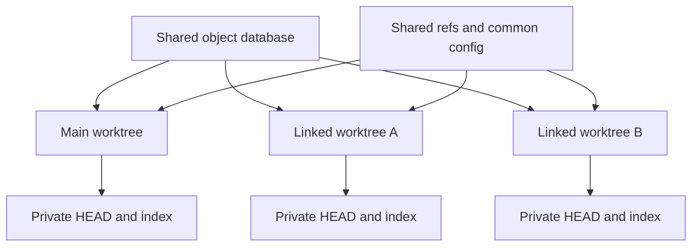
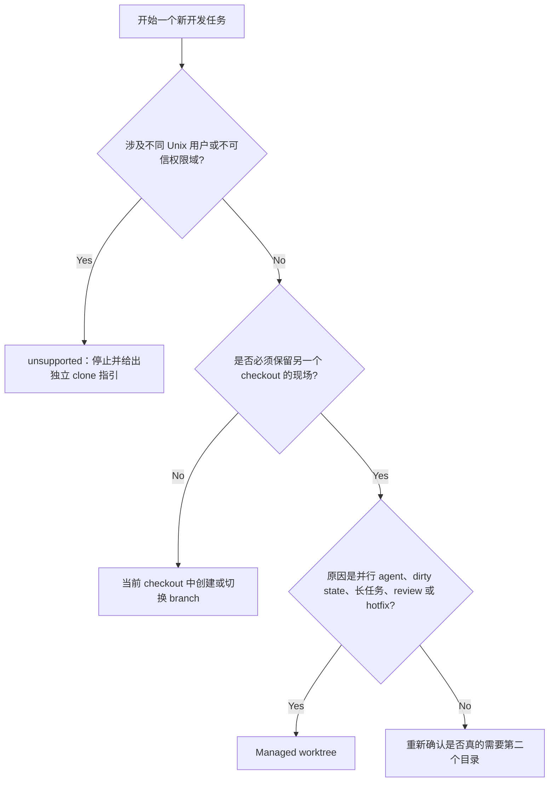
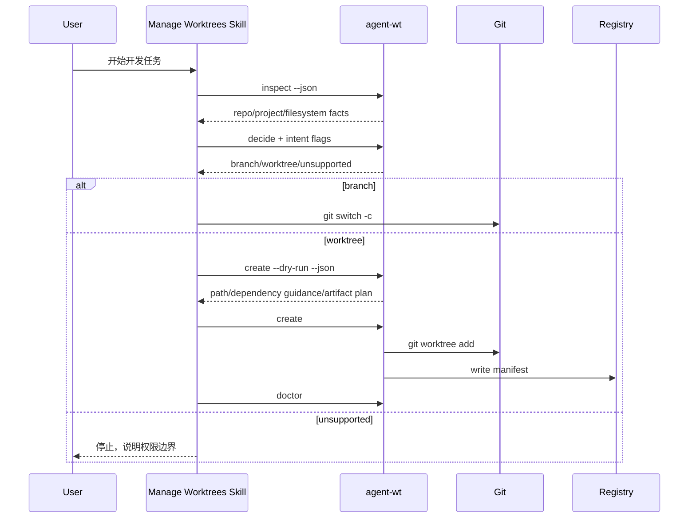

# Git Branch、Worktree 与 Agent Workspace：原理、判断和 CLI 设计

> [!note] 学完后你应该能做到
> - 解释 branch、working tree、linked worktree 和 clone 分别隔离了什么。
> - 判断一个 Coding Agent 任务应使用当前 branch、worktree，还是停止并给出独立 clone 指引。
> - 设计不会重复堆积依赖、构建缓存和训练产物的服务器目录。
> - 使用 `agent-wt` v0.1.0 预览、创建和检查 managed worktree。

## 0. 边界

| 项目 | 内容 |
|---|---|
| 调研日期 | 2026-08-14 |
| Git 官方边界 | `git-worktree` 在线文档，访问于 2026-08-14 |
| 本地 Git | 2.43.0 |
| 服务器 Git | L40S-3 2.49.0；bwg-root 2.34.1 |
| CLI | `agent-wt` v0.1.0，源码位于 `skills/manage-worktrees/scripts/agent_wt.py` |
| 已核查服务器 | L40S-3、bwg-root；2026-08-11 只读核查 |
| 本文回答 | 何时用 worktree、它如何隔离、目录和环境如何设计、CLI 为何这样实现 |
| 本文不回答 | 自动删除、merge、push、branch cleanup、生产部署 |

本文同时包含两种材料：前半部分是第一次学习 worktree 所需的知识；后半部分把两台服务器的审计结果转成 `agent-wt` 的产品规则。服务器空间数字是本次实际检查结果，产品建议则是基于这些事实作出的工程判断。

## 1. 先给结论

> [!note] 一句话模型
> Branch 是一个 ref；worktree 是另一个 checkout。单线开发默认用 branch，只有当切换当前 checkout 会干扰另一个有价值的现场时，才增加 worktree。

“每个 feature branch 都创建 worktree”没有必要。“只有多人协作才需要 worktree”也不完整。真正的判断问题是：**当前是否需要两个 working directory 同时存在**。

需要同时存在的常见原因包括：

- 两个 Coding Agent 并行修改不同 branch；
- 当前目录有未提交修改，又要处理 hotfix；
- 一个测试、训练或服务进程必须继续读取当前 checkout；
- 需要在本地运行 PR，同时保留正在开发的代码；
- 多个可信协作者共用同一个 Unix 账号和 repository。

不需要同时存在时，`git switch -c <branch>` 更简单。

> [!warning] Worktree 不是多用户安全边界
> Linked worktree 共享 object database、refs、repository config 和通常的 hooks。不同 Unix 用户、不同权限域或互不信任的开发者应使用各自的 clone 和文件所有权；worktree 只能提供工作目录隔离。

## 2. 五个对象不要混在一起

| 对象 | 它是什么 | 它隔离什么 | 它不隔离什么 |
|---|---|---|---|
| Commit | 一棵不可变 Git tree 的引用 | 历史版本 | 工作目录、运行环境 |
| Branch | 指向 commit 的可移动 ref | 历史推进线 | 文件目录、未跟踪文件、运行进程 |
| Working tree | checkout 后的普通文件 | 当前可编辑文件 | Git objects、全局 cache、外部服务 |
| Linked worktree | 同一 repository 的另一个 working tree | `HEAD`、index、工作目录和部分 pseudo refs | objects、大部分 refs、common config/hooks |
| Clone | 独立 repository 和 working tree | Git metadata、config、refs、目录所有权 | 机器级 cache、Docker daemon、端口、数据库 |

Git 官方定义中，一个 repository 有一个 main worktree 和零个或多个 linked worktree。`git worktree add` 创建额外 working tree，并共享除 `HEAD`、index 等 per-worktree 文件之外的 repository 数据。[Git worktree 官方文档](https://git-scm.com/docs/git-worktree.html)



### 2.1 为什么 branch 本身不能解决并发

`git switch feature-a` 会把同一个目录里的文件换成 `feature-a`。如果另一个 agent、测试进程或开发者仍在使用这个目录，它看到的文件也一起变化。

Branch 只回答“这个名字指向哪个 commit”。它没有第二份目录，也不拥有自己的 `node_modules`、`.venv` 或运行进程。

### 2.2 Worktree 实际共享哪些 Git 状态

Git 在 common Git directory 下为 linked worktree 建立管理目录。每个 worktree 有独立的 `HEAD` 和 index；大多数 `refs/` 仍共享。默认 repository config 也共享。需要 per-worktree config 时，可以启用 `extensions.worktreeConfig`，但旧 Git 版本可能不识别该扩展，因此工具不应擅自开启。[Git worktree configuration](https://git-scm.com/docs/git-worktree.html#_configuration_file)

Git 还明确提醒：submodule 对 multiple checkout 的支持不完整。因此带 submodule 的 superproject 必须进入 warning 或项目特例，而不能假设与普通 repository 等价。

## 3. 决策树：Branch、Worktree 还是 Clone



### 3.1 默认使用 branch

同时满足以下条件时，使用 branch：

- 当前只有一个任务；
- 可以安全改变当前 checkout；
- 没有必须保留的 dirty state；
- 没有依赖当前文件持续运行的测试、训练或服务；
- 没有另一个 agent 或开发者同时使用这个目录。

### 3.2 使用 worktree

任一条件成立时，worktree 通常更合适：

- 当前 checkout 有未提交修改，而新任务必须立刻开始；
- 两个 agent 要并行写不同 branch；
- 当前 branch 有长时间运行的进程；
- 要同时运行 review candidate 和开发 candidate；
- main/dev checkout 需要保持稳定；
- 同一可信 Unix 账号下有多个开发任务。

### 3.3 返回 unsupported guidance

这些场景不要把 worktree 当成解决方案：

- 不同用户需要独立权限和 config；
- 一方不应更新另一方可见的 refs；
- 需要完全独立的 Git hooks、remote、credential helper；
- repository 需要被移动、挂载或归档而不依赖 common Git directory。

## 4. Worktree 为什么会浪费磁盘

Git objects 通常不是主要问题。每个 working tree 仍会有一份 checkout 文件，ignored/untracked 内容也不会自动共享。真正容易膨胀的是：

| 类型 | 为什么重复 | 错误做法 | 更稳的做法 |
|---|---|---|---|
| `node_modules` | 每个 worktree 独立 install | 整目录 copy 或可写软链 | pnpm store / npm cache + per-worktree graph |
| `.venv` | 每个环境安装相同 wheel | copy venv 或无 identity 软链 | uv cache + per-worktree env |
| Conda env | cache 与 env 跨 mount 时退化成 copy | 每个 worktree复制完整 env | 同 mount 的 `pkgs_dirs` / `envs_dirs` |
| build/test cache | 工具默认写当前目录 | 把旧 `dist/build` 复制过去 | 外部、按 key 命名的 cache |
| ML artifact | 脚本把输出写进源码树 | worktree/rsync 连产物一起复制 | 外部 artifact root |
| Docker/DB | 名称和端口全局冲突 | 所有 worktree 共用同名 volume/DB | 独立 namespace，共享 daemon/image |

pnpm 的 `node_modules` 结构把包文件 hardlink 到 content-addressed store，再用 symlink 构造依赖图。这比把一个可写 `node_modules` 软链给所有 branch 安全。[pnpm 官方结构说明](https://pnpm.io/symlinked-node-modules-structure)

uv 使用全局 cache 避免重复下载和构建；在支持条件满足时通过 copy-on-write 或 hardlink 安装。官方特别不推荐把 symlink mode 当默认，因为清理 cache 会破坏所有指向它的环境。[uv cache 文档](https://docs.astral.sh/uv/concepts/cache/)

Python 官方把 venv 定义为 disposable，并明确说它不应被移动或复制，而应从依赖声明重建。[Python `venv` 文档](https://docs.python.org/3/library/venv.html)

Conda 也建议把 `envs_dirs` 和 `pkgs_dirs` 放在同一 mounted volume，以便 hardlink；跨 mount 时会退化成 copy。[Conda 自定义环境与 package cache](https://docs.conda.io/projects/conda/en/latest/user-guide/configuration/custom-env-and-pkg-locations.html)

Hugging Face Hub cache 已经使用 blobs + snapshots + symlinks 在 revision 间共享不变文件。应统一 `HF_HOME`，而不是把模型 snapshot 复制进每个 worktree。[Hugging Face cache 文档](https://huggingface.co/docs/huggingface_hub/main/guides/manage-cache)

## 5. 两台服务器教会我们的事

### 5.1 事实：L40S-3

2026-08-11 只读扫描得到：

- `/data-1/code` 约 14 GB；40 个 Git root，33 个 common-dir group；
- worktree 目录约 3.1 GB；
- 对 ≥1 MiB 文件做 SHA-256，确认 3.91 GB 重复且 link count 为 1；
- 最大重复不是 `.venv`，而是 `verl/recipe` 下的 validation、metrics、W&B 和 log；
- 三份 Slurm `.venv` 只贡献约 90 MB 可减少空间；
- `/tmp` 还有约 0.9–1.1 GB review worktree 候选空间。

**架构推断**：如果只优化 dependency install，仍然解决不了 L40S 的主要浪费。训练和评测程序必须从源头接受 external artifact root。

### 5.2 事实：bwg-root

同日只读扫描得到：

- 根盘约 155 GB，已用 148 GB，只剩约 757 MB；
- 主要目录约有 142 个 linked worktree；
- Git objects 大多已经共享；
- `tokenrouter` 至少 16 个 `node_modules`，多个 worktree 从约 55 MB 膨胀到 754–879 MB；
- `new-api` 至少 40 个 `node_modules`、20 个 `dist`，抽样 worktree 每个约 2.25 GB；
- 保守工程估算已有 7–8 GB dependency/build 重复，候选空间更高；
- Docker overlay 是另一类容量问题，不能通过 `df --total` 重复累计后算进 worktree 浪费。

**架构推断**：bwg 已经正确使用 Git linked worktree，但缺少 create 后的 environment policy 和持续 doctor。问题不是“有没有用 `git worktree`”，而是“只管理了 Git，没有管理 workspace”。

## 6. 路径设计

推荐默认布局：

```text
<repo-parent>/
├── <repo>/
├── _worktrees/
│   └── <repo>/<branch-slug>/
├── _artifacts/
│   └── <repo>/<branch-slug>/
└── _cache/
    ├── pnpm-store/
    ├── npm/
    ├── uv/
    ├── pip/
    └── huggingface/
```

例如主仓是 `/data-1/code/verl`：

```text
/data-1/code/_worktrees/verl/codex-dual-rollout
/data-1/code/_artifacts/verl/codex-dual-rollout
/data-1/code/_cache/uv
```

### 6.1 为什么不默认放 repo 内的 `.worktrees`

- language server、test discovery、备份和 `find` 容易递归扫到 sibling checkout；
- 每个 worktree 自己又可能看到更多 worktree 路径；
- repo 大小统计容易重复；
- 删除或移动 main checkout 时 blast radius 更大。

### 6.2 为什么不默认放 `/tmp`

- reboot、tmp cleaner 或系统策略可能删除；
- 无 owner/task/TTL 时无法区分活跃和孤儿；
- 路径不稳定，不适合长任务和恢复。

### 6.3 路径选择顺序

`agent-wt` v0.1.0 使用以下顺序：

1. 命令行 `--root`；
2. repository `.agent-wt.json`；
3. Unix `$XDG_CONFIG_HOME/agent-wt/config.json` 或 Win11
   `%LOCALAPPDATA%/agent-wt/config.json`；
4. 环境变量 `AGENT_WT_ROOT`；
5. `<repo-parent>/_worktrees`。

工具检查目标是否位于 repo 内、目标是否已存在、branch 是否已在别处 checkout、目标 mount 的可用空间，以及 repo 与目标是否跨 filesystem。默认少于 2 GiB 可用空间时拒绝创建；不会静默 fallback 到 `/tmp`。

## 7. Skill 与 CLI 为什么要分层



Skill 擅长理解任务语义，例如“这个训练还要跑两天”“另一个 agent 正在改 main”。CLI 无法从 Git 自动可靠地知道这些事实。

CLI 擅长确定性执行，例如检查 branch collision、选择路径、调用 Git、原子写 registry、输出 JSON。让 Skill 手写 shell 命令会重新产生历史上的不一致。

## 8. `agent-wt` v0.1.0

### 8.1 命令边界

```bash
agent-wt inspect --json
agent-wt decide [intent flags] --json
agent-wt create <branch> --base <ref> --task <id> --dry-run --json
agent-wt create <branch> --base <ref> --task <id> --json
agent-wt list [--all] --json
agent-wt doctor [path] --json
```

第一版故意没有：

```text
remove  prune  merge  push  delete-branch  arbitrary project hooks
```

这不是缺少几个子命令，而是风险边界：创建和只读检查易于验证；删除、merge 和执行 repo-provided shell command 需要单独的授权、recovery 和 approval 设计。

### 8.2 `decide`

无 intent flag、当前 checkout clean 时推荐 `branch`。下列 flag 会推荐 `worktree`：

```text
--parallel
--preserve-current
--long-running
--review
--hotfix
--shared-working-directory
```

`--untrusted-users` 返回 `unsupported`，并说明独立 clone 应由本工具之外的权限管理流程提供。如果当前 checkout dirty，开始另一个任务时推荐 worktree。

### 8.3 `inspect`

输出：

- repo root、Git dir、common dir、branch、HEAD、dirty state；
- main/linked worktree 和现有 worktree 数量；
- Node、Python、uv、Conda、Go、Rust、Docker、Hugging Face markers；
- lockfile 路径和综合 SHA-256；
- filesystem capacity 和 registry entry。

### 8.4 `create`

`create` 先解析完整 base SHA，再创建 branch/worktree。它创建外部 artifact root，生成 cache environment 建议，并把以下信息写入 per-user registry：

```text
repo/common-dir/remote
branch/base SHA/worktree path
artifact root/cache root
owner/task/created_at
project types/lock hash/dependency guidance
```

v1 只报告 dependency command 和 cache guidance，绝不执行 dependency install、package lifecycle script、repository hook 或任意 setup command。

### 8.5 `doctor`

`doctor` 检查：

- worktree 是否 linked、是否登记；
- registry branch 是否与实际 branch 一致；
- submodule warning；
- free-space gate；
- 整个 `.venv` / `node_modules` 是否被软链；
- 大型 artifact、build 和 cache 是否仍在源码树；
- 扫描是否因 time/file budget 截断；
- linked worktree 是否仍共享 common Git config。

它不做内容 hash，因此报告的是 policy evidence 和空间下界，不是 byte-level deduplication proof。

## 9. 为什么不直接只用 Worktrunk

Worktrunk 已经提供成熟的 worktree lifecycle UX：`switch/list/remove`、路径模板、shell integration、hooks、端口模板、project/user config，以及对 project command 的 approvals。[Worktrunk 官方仓库](https://github.com/max-sixty/worktrunk)、[Worktrunk hooks](https://worktrunk.dev/hook/)

| 领域 | Worktrunk | `agent-wt` v0.1.0 |
|---|---:|---:|
| 快速 switch / shell integration | 强 | 不做 |
| merge / remove lifecycle | 强 | 故意不做 |
| hooks 和 approvals | 强 | 不执行任何 hook/setup |
| branch vs worktree admission | 部分依赖用户 | 核心功能 |
| mount/free-space server policy | 通用路径配置 | 核心功能 |
| dependency/cache adapter | hook 可扩展 | 内置检测和 plan |
| ML artifact separation | 项目 hook 可实现 | 核心 doctor 规则 |
| registry / agent JSON contract | saved state | 面向 agent 的稳定输出 |

**实践建议**：不要 fork 或重写 Worktrunk。`agent-wt` 保持窄而可组合：需要成熟 lifecycle UX 时可以让 Skill 调 Worktrunk；需要服务器 workspace policy 时继续调用 `agent-wt inspect/decide/doctor`。

## 10. 常见误区

> [!warning] “只要是多人就用 worktree”
> 不同 Unix 用户的权限隔离不能由 worktree 提供。可信共享账号可用 worktree；不可信或独立 ownership 应用 clone。

> [!warning] “node_modules 软链一份就省空间”
> Branch lockfile、Node ABI、postinstall 和并发写会污染其他任务。共享 package store，不默认共享整个可写安装树。

> [!warning] “worktree 比 branch 更安全”
> 它只增加 working-directory isolation。refs、objects、config、hooks 和外部服务仍可能共享。

> [!warning] “创建成功就说明环境规范”
> Git 只管理 checkout。dependency、cache、artifact、port、DB、Docker namespace 都需要额外 policy。

> [!warning] “du 看到相同大小就是确定重复”
> 同尺寸只能形成候选。严格下界需要 hash，同时排除 hardlink、reflink、sparse file 和 overlay 重复口径。

## 11. 实操 walkthrough

### 11.1 单线任务

```bash
agent-wt inspect --json
agent-wt decide --json
# recommendation: branch
git switch -c codex/my-change origin/main
```

### 11.2 并行 agent

```bash
agent-wt decide --parallel --json
agent-wt create codex/task-b \
  --base origin/main \
  --task task-b \
  --dry-run \
  --json
agent-wt create codex/task-b --base origin/main --task task-b --json
agent-wt doctor /path/from/create --json
```

### 11.3 多用户服务器

```bash
agent-wt decide --untrusted-users --json
# recommendation: unsupported
```

这一步不是失败，而是工具拒绝把目录隔离冒充权限隔离。

## 12. 小练习

> [!question] 练习 1：概念判断
> 一个 repository 当前在 `feature-a`，working tree clean。你要连续开发 `feature-b`，没有其他 agent、进程或开发者使用该目录。应该选择什么？为什么？

<details>
<summary>参考答案</summary>

直接创建或切换到 `feature-b` branch。当前不需要两个 checkout 同时存在，worktree 只会增加目录和环境管理成本。

</details>

> [!question] 练习 2：隔离边界
> 两名互不信任的 Unix 用户需要在同一服务器修改同一项目。为他们创建两个 linked worktree 是否足够？

<details>
<summary>参考答案</summary>

不够。Linked worktree 共享 Git common directory、refs、repository config 和通常的 hooks，也不能替代 Unix ownership。应给每个用户独立 clone 和权限边界；机器级 cache 可以另外设计为只读或受控共享。

</details>

> [!question] 练习 3：证据查找
> 用哪两个 Git 命令可以证明当前 checkout 是 linked worktree，并找到共享 common directory？

<details>
<summary>参考答案</summary>

运行 `git rev-parse --git-dir` 和 `git rev-parse --git-common-dir`。在 main worktree 中两者通常指向同一 `.git`；在 linked worktree 中，Git dir 指向 common directory 下的 worktree-specific 管理目录，而 common dir 指回共享 repository metadata。

</details>

> [!question] 练习 4：环境设计
> 两个 Python worktree 的 `uv.lock` 相同，但一个使用 Python 3.11，另一个使用 Python 3.12。能否直接共享一个 `.venv`？应该共享什么？

<details>
<summary>参考答案</summary>

不能只凭相同 `uv.lock` 共享 `.venv`。Python interpreter 和 ABI 也是 environment identity 的一部分。应共享 uv 的 package/build cache，各 worktree 根据 lockfile 和 interpreter 建自己的环境；只有完整 identity 相同且环境被当作不可变对象管理时，才考虑集中环境。

</details>

> [!question] 练习 5：CLI 设计
> 为什么 `agent-wt create` 不运行项目自定义 setup hook？

<details>
<summary>参考答案</summary>

因为 repository config 是代码输入，hook 可以执行任意命令、访问凭据或修改系统。自动执行会把“创建目录”的低风险动作扩大成未审查代码执行。v0.1.0 只输出 dependency guidance，安装依赖由独立、明确授权的流程完成。

</details>

## 13. 最后记住

- Branch 是默认；worktree 是第二个 checkout，不是每个 branch 的容器。
- 判断 worktree 的问题是“是否必须同时保留另一个现场”，不是“有没有创建 branch”。
- 不可信多用户场景使用独立 clone，worktree 不是 security boundary。
- Git objects 已经共享，真正的大头常是 dependency、build、cache 和 artifact。
- 共享只读/content-addressed 内容，隔离可写状态，训练产物移出源码树。
- Skill 负责语义判断，CLI 负责确定性执行；不要让 agent 每次重写 shell 流程。
- 成熟 lifecycle 交给 Worktrunk 一类工具；`agent-wt` 专注服务器和 Coding Agent 的 workspace policy。

## 14. 证据索引和不确定性

| 结论 | 证据 | 不确定性 |
|---|---|---|
| Worktree 共享 repository、分离部分 per-worktree 状态 | [Git worktree docs](https://git-scm.com/docs/git-worktree.html) | 老版本 Git 的可用选项不同 |
| pnpm 使用 content-addressed store/hardlink | [pnpm docs](https://pnpm.io/symlinked-node-modules-structure) | package manager 配置可改变布局 |
| uv cache 支持高效链接且不推荐默认 symlink mode | [uv cache docs](https://docs.astral.sh/uv/concepts/cache/) | 实际 link mode 取决于 filesystem |
| venv 应重建而不是复制/移动 | [Python docs](https://docs.python.org/3/library/venv.html) | Conda/uv centralized env 有自己的机制 |
| Conda hardlink 依赖同 mount | [Conda docs](https://docs.conda.io/projects/conda/en/latest/user-guide/configuration/custom-env-and-pkg-locations.html) | pip 安装内容可能仍是独立 copy |
| HF snapshots 复用 blobs | [HF docs](https://huggingface.co/docs/huggingface_hub/main/guides/manage-cache) | 应用指定 `local_dir` 时行为不同 |
| L40S 3.91 GB 严格重复 | 2026-08-11 远端 ≥1 MiB SHA-256 扫描 | 未 hash 小文件；真实重复只会更高 |
| bwg 7–8 GB 保守估算 | 2026-08-11 定向 `du` 与依赖目录盘点 | 根盘满，未执行全量 hash |
| `agent-wt` 行为 | `skills/manage-worktrees/scripts/agent_wt.py` 与 tests | v0.1.0 不处理删除、clone 创建或 dependency install |

## 15. DRAGAI-88 Prototype challenge matrix

The source snapshot is intentionally unreviewed: commit
`de3db92171366f3fbe88e588559116f3adb09a78`, tree
`2f9f6e4f643abef52344b6f747f8ed11b46dadc7`, captured from
`codex/agent-wt@d59e3e681edcb1b514a1ba4c8788804b87d6db98`. The Delivery
branch was created from `main@243acb2411db37bdc107f49210e110f37357387c`;
the prototype branch was not merged.

| Prototype input | Disposition | Challenge result |
|---|---|---|
| `README.md` | revise | Keep the discoverability entry, but describe only the approved five commands and Codex support boundary. |
| `bin/agent-wt` | revise | Keep a thin Unix launcher; make interpreter discovery and errors deterministic. |
| `docs/GIT_WORKTREE_AND_AGENT_WT_GUIDE.md` | revise | Keep the teaching-first structure and server audit, but remove dependency-execution and verified-portability claims that exceed v1. |
| `install.sh` | revise | Keep guarded launcher/Skill wiring; install exactly one Codex user Skill at `.agents/skills/manage-worktrees`, and reject unmanaged duplicate legacy installs. Do not install a Claude copy. |
| `skills/manage-worktrees/SKILL.md` | revise | Keep intent interpretation; return unsupported clone guidance at permission boundaries and never run dependency setup. |
| `skills/manage-worktrees/agents/openai.yaml` | retain | The display metadata and default prompt match the approved Skill boundary. |
| `skills/manage-worktrees/references/policies.md` | revise | Keep the decision matrix; rename clone as guidance rather than a v1 execution mode and document all path-policy layers. |
| `skills/manage-worktrees/references/adapters.md` | revise | Keep shared-cache/local-environment guidance; remove every path that could execute dependency installation. |
| `skills/manage-worktrees/scripts/agent_wt.py` | revise | Keep the standard-library core and five commands. Replace `--setup`, silent Win11 locking, Unix-only allocated-size use, unversioned JSON, incomplete error codes, and incomplete path policy. |
| `skills/manage-worktrees/tests/test_agent_wt.py` | replace | Expand from happy-path smoke tests to contract, collision, policy precedence, no-mutation, scan-bound, Win11 path/state/locking, and subprocess-quoting tests. |
| `tests/test_install_target_guard_wiring.py` | revise | Restore it on the approved base, then assert guard-before-write and duplicate-free current/legacy Skill locations on Unix and Win11. |
| Prototype-only Codex patch-safety hunks mixed into `install.sh` | remove | They are outside DRAGAI-94 and already have independent ownership; the immutable snapshot preserves them for audit, but the Delivery import does not reintroduce them. |

No prototype line receives completion credit from this table alone. The later
Issue sections bind each retained behavior to targeted tests, candidate CI, and
independent review.
