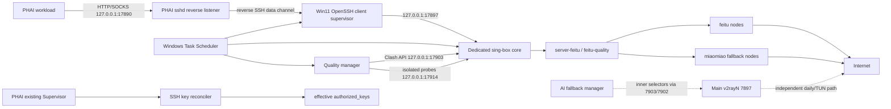

# Win11 ↔ PHAI Proxy Relay Wrapper 架构与迁移路线

## 1. 结论

这套方案应当作为一个独立 wrapper 维护，而不是当作 v2rayN 里的几条临时配置。它解决的问题是：

- Win11 保留日常上网和 AI 流量的主 v2rayN；
- PHAI 通过 reverse SSH 使用 Win11 上一条隔离的代理链；
- 开发机链路的节点切换不依赖 v2rayN GUI，也不被日常手动切换拖垮；
- 主机替换时，公开 runtime、私有节点配置、SSH 身份和 PHAI 授权可以分开迁移。

当前代码已完成 portable runtime 的主体；当前生产部署仍是 `AtLogOn` 任务，不等于真正的无人值守服务。路线图的首要项是将目标 Win11 切换到 `Boot`/`SYSTEM` 模式，然后完成“重启后未登录”验收。

## 2. 系统边界

### 2.1 Wrapper 负责什么

Wrapper 负责下列能力：

1. 从主 v2rayN 数据库以只读方式生成开发机专用 sing-box 配置。
2. 监督专用 sing-box core，对本机只暴露 loopback 端口。
3. 检测真实 HTTPS 内容，管理内层 selector，实现“飞兔优先、喵喵备用”。
4. 监督 reverse SSH，将 PHAI loopback 端口转发到 Win11 专用代理。
5. 提供安装、启停、状态、Doctor、备份和回滚入口。
6. 用 allowlist 打包公开 runtime，拒绝将节点凭据、SSH key、数据库和日志放入 ZIP。

### 2.2 Wrapper 不负责什么

- 不代替 Tailscale；Tailscale 提供管理和 SSH 可达性，代理数据面仍是 reverse SSH。
- 不托管订阅 URL、节点密码、SSH 私钥、Codex/CC Switch 凭据。
- 不承诺恢复已失败的 HTTP/SSH 业务请求；它只能恢复后续新请求的通道。
- 不将“Scheduled Task 显示 Running”当成网络验收；必须检查实际 HTTPS payload。
- 不负责 PHAI 实例自身的完整灾备。当前 key reconciler 借用 PHAI 现有 Supervisor 生命周期，属于外部集成。

## 3. 逻辑架构



数据面的生产路径只有一条：

```text
PHAI 127.0.0.1:17890
  -> reverse SSH
  -> target Win11 127.0.0.1:17897
  -> dedicated sing-box
  -> server-feitu / feitu-quality
  -> feitu-primary or miaomiao-fallback
  -> Internet
```

主 v2rayN 和 dedicated relay 是两个运行面。主 v2rayN 负责 Win11 日常/TUN/AI 流量；dedicated relay 负责 PHAI。两者可以从同一 v2rayN 数据库生成配置，但不共享生产监听端口或运行时 selector 状态。

主 v2rayN 的 AI pool 不再继承模板中已有的 leaf。`settings.json` 的
`main_ai_subscriptions` 只声明订阅名称，节点地址、端口和凭据始终从该机
v2rayN 数据库中的当前订阅行重建。生成时会删除上一轮 AI leaf，并写出
不含凭据的 `main-ai-source.json` 与 `main-ai-node-labels.json`。因此迁移到
另一台 Win11 时只需复用订阅名称契约并在新机刷新订阅，不复制旧模板节点。

## 4. 组件和所有权

| 组件 | 运行位置 | 所有者/生命周期 | 输入 | 输出/职责 |
|---|---|---|---|---|
| 主 v2rayN | 目标 Win11 | v2rayN 自身 | 订阅、用户手动选择 | `7897` 主代理，`7903/7902` Clash API，日常/TUN/AI 路由 |
| Config builder | 目标 Win11，按需 | 运维命令 | 只读 v2rayN SQLite + `settings.json` | 私有 `server-config.json`、node labels/sources；过滤台湾与元数据行 |
| Dedicated sing-box | 目标 Win11 | `FeituServerProxy` | 私有 relay config | `17897` 代理，`17903` controller，`17914` 隔离测量口 |
| Quality manager | 目标 Win11 | `ProxyQualityManager` | Clash API、HTTPS payload、短下载 | 只改 `feitu-quality`/`feitu-measure` 等内层 selector；保留外层手动选择 |
| Reverse SSH supervisor | 目标 Win11 | `PhaiReverseProxyTunnel` | 专用 SSH key/config、`17897` | PHAI `127.0.0.1:17890 -> Win11 127.0.0.1:17897`；keepalive、指数退避、自动重连 |
| AI fallback manager | 目标 Win11 | `AiProxyFailover` | 主 v2rayN API 与 `17911-17913` 测量口 | 管理主 v2rayN 内层 AI selector；不在 PHAI 数据路径上 |
| Control/Doctor | 目标 Win11，按需 | 运维命令 | `settings.json`、tasks、probe script | Status/Start/Stop/Restart/Dashboard；在 Win11 `17897` 和 PHAI `17890` 执行无重试 payload 检查 |
| Key reconciler | PHAI 持久存储 + 容器 | 现有 `lgx-agent-services` Supervisor | 目标 Win11 公钥 entry | 将 key 恢复到可能被只读 ConfigMap 投影覆盖的 effective `authorized_keys` |

## 5. 端口契约

| 端口 | 所在端 | 用途 | 暴露范围 |
|---:|---|---|---|
| `7897` | Win11 | 主 v2rayN mixed proxy | loopback；不是 PHAI 生产入口 |
| `7903` / `7902` | Win11 | 主 v2rayN TUN/非 TUN Clash API | loopback |
| `17897` | Win11 | dedicated relay mixed proxy | loopback；reverse SSH 的本地目标 |
| `17903` | Win11 | dedicated relay Clash API | loopback |
| `17914` | Win11 | dedicated relay 隔离测量口 | loopback |
| `17911-17913` | Win11 | 主 v2rayN AI primary/fallback/measure 检查 | loopback；不在 PHAI 数据面 |
| `17890` | PHAI | reverse SSH 产生的开发机代理入口 | 只绑定 PHAI `127.0.0.1` |

不应将任何一个上述 controller 或 proxy 端口改为 `0.0.0.0`。这套架构依赖 loopback 边界将管理面和数据面限制在各自主机内。

## 6. 选路和故障语义

### 6.1 Selector 分层

- `server-feitu`：开发机外层策略，允许人工切换；quality manager 对它只读。
- `feitu-quality`：quality manager 管理的生产内层 selector。
- `feitu-measure`：隔离测量 selector，用于不影响生产链路地检查候选节点。
- `feitu-auto`：sing-box 原生 URLTest 备用，只表示延时评估，不代表真实内容验收。

主 AI pool 的 `ai-node-*` tag 不能使用 v2rayN `IndexId`：订阅刷新会重建 `IndexId` 并可能改变行顺序。Wrapper 根据订阅名和节点的非秘密网络身份生成稳定 SHA-256 tag，并按 tag 排序。密码/UUID 轮换不改 tag；协议、地址、端口、SNI、Reality public key/short ID 等出站语义改变时产生新 tag。重复稳定身份必须让生成失败，不能静默共用 selector tag。

### 6.2 健康策略

1. 候选节点先通过目标站点真实 HTTPS payload 校验。
2. 开发机池要求 Hugging Face、PyPI、Cloudflare 内容成功，并结合 Google/GitHub 等端到端验收。
3. 通过可靠性门槛后再比较短下载吞吐、请求失败率、延时抖动。
4. 同等健康条件下选 feitu；无合格 feitu 时才选 miaomiao。
5. 两个订阅都无合格节点时记录失败，不把端口存活说成链路已恢复。

Cloudflare speed endpoint 返回 `403/404` 可能是 benchmark 端点拒绝，不是节点必然失效。此时使用完整 Hugging Face tokenizer payload 作备用内容检查，但不把它称为饱和带宽测试。

### 6.3 故障恢复的边界

- sing-box 或 SSH 进程退出：各自 supervisor 使用 `3s -> ... -> 60s` 有上限退避重启；稳定运行 60 秒后退避重置。
- SSH 半开连接：`ServerAliveInterval=15` 与 `ServerAliveCountMax=6` 检测，`ExitOnForwardFailure=yes` 防止“SSH 存活但端口未绑定”。
- 节点失效：quality manager 只改管理范围内的 selector，且保留 miaomiao 候选位。
- 已建立的 CONNECT、POST、模型生成或部分下载不会被 wrapper 自动重放。重试和断点续传由调用端根据幂等性决定。

## 7. 配置、私密数据和可发布产物

| 类别 | 示例 | 能否进 Git/公开 ZIP | 迁移方式 |
|---|---|---|---|
| Runtime source | `install.ps1`、`control.ps1`、`runtime/*` | 可以 | 由 `build-package.py` allowlist 打包并核对 SHA-256 |
| 运行契约 | `settings.json` | 不应直接从旧机器盲拷 | 新机通过 installer 按实际路径生成 |
| 节点配置 | `state/server-config.json`、node labels/sources | 不可公开 | 单独加密/受控传递，或从新机 v2rayN DB 重建 |
| SSH 身份 | private key | 不可复制到公开包 | 每台机器生成独立 key，PHAI 单独授权 |
| SSH 主机信任 | `known_hosts`、generated `ssh_config` | 不公开 | 在新机核验 host key 后由 installer 生成/复制 |
| 状态与日志 | `state/*.db`、`*.log`、backup | 不公开 | 一般不迁移；故障调查时按需保留 |

`build-package.py` 同时拒绝 `state`、backup、DB、log、private config、SSH config/key-like 产物，这是可发布边界的机器检查，不只是文档约定。

## 8. 生命周期和启动 DAG

```text
Windows boot/network
  -> FeituServerProxy (dedicated core; must make 17897 ready)
     -> PhaiReverseProxyTunnel (waits until 17897 accepts TCP)
        -> PHAI 17890 becomes available
  -> ProxyQualityManager (can assess/switch after core controller is ready)

PHAI container/Supervisor
  -> keep-agent-services.sh
     -> ensure-target-win11-key.sh
        -> effective authorized_keys contains the target-machine public key
```

Task Scheduler 对三个服务任务设置无执行时限、最多 999 次重启和 1 分钟任务级重启间隔；脚本内部还有更快的有上限退避。

Installer 支持两种模式：

- `Logon`：以用户身份在登录后启动四个任务，便于调试，但依赖交互式会话。
- `Boot`：以 `SYSTEM` 在开机时启动 dedicated core、reverse tunnel、quality manager；AI fallback 仍属于交互式主 v2rayN 路径。`Boot` 安装需管理员 PowerShell，使用生成的 service SSH config，不依赖 `SYSTEM` 的 `~/.ssh`。

## 9. 标准迁移和切换 Runbook

### 9.1 准备新 Win11

1. 安装 Python 3.10+、Windows OpenSSH Client 和已验证的 sing-box（当前代码记录的验证版本为 1.13.4）。
2. 安装 v2rayN 并导入两个订阅；先在新机验收主 v2rayN 的常用模式。
3. 生成新机专用 SSH key，把公钥作为独立 entry 加入 PHAI 持久 key 源；不复用旧机私钥。
4. 配置 SSH alias，核验服务器 host key，确认 `ssh -o BatchMode=yes <alias> true` 成功。
5. 从受信源解压公开 ZIP，核对 sidecar 和 ZIP 内 manifest 的 SHA-256。

### 9.2 预验收，不抢占生产端口

1. 在新机生成/导入私有 relay config，先运行 sing-box native config check。
2. 将新机 `remote_proxy_port` 临时设为 `17891`，避免与当前生产 `17890` 冲突。
3. 启动新机 dedicated core、quality manager 和 test reverse tunnel。
4. 在新 Win11 `17897` 与 PHAI `17891` 执行同一批无重试 payload 检查。
5. 人工切换一次 selector，确认 quality manager 不会覆盖外层人工选择；对一个真实 generated tag 做 feitu 故障注入，确认 miaomiao 回退。

### 9.3 生产切换

1. 保留旧机安装目录、私有配置和 Task XML 备份。
2. 停止旧机 `PhaiReverseProxyTunnel`，确认 PHAI `17890` 已释放。
3. 把新机 remote port 从 `17891` 切换为 `17890`，启动正式 tunnel。
4. 在 PHAI 实际容器内验收 Cloudflare、Google、GitHub、PyPI、Hugging Face；对完整 HF payload 核对字节数/哈希。
5. 停用旧机生产 task，但不立即删除旧安装与 key，保留一个明确回滚窗口。

### 9.4 回滚

1. 停止新机 tunnel，确认 PHAI `17890` 释放。
2. 恢复旧机的 Task XML/配置，或直接重启保留的旧 task。
3. 在旧机 `17897` 和 PHAI `17890` 重跑 payload 验收。
4. 只在新方案已确认废弃后才从 PHAI 持久 key 源删除新机公钥。

不要同时让两台机器争用同一个 PHAI `17890`，也不要用“批量结束 PowerShell/ssh”代替按 task 所有权启停。

## 10. 验收矩阵

| 层级 | 检查 | 成功标准 | 不能替代它的信号 |
|---|---|---|---|
| 配置 | sing-box native check | 私有 config 可被指定 core 解析 | JSON 可读 |
| 进程 | Task + listener + owner PID | 指定 task 在运行，`17897/17903` 由 dedicated core 监听 | 只看 PowerShell/ssh 进程名 |
| Win11 数据面 | `probe.py --proxy http://127.0.0.1:17897` | 每个站点状态和 payload 都符合预期 | TCP connect/延时 |
| PHAI 数据面 | 从实际容器访问 `127.0.0.1:17890` | 同一批 payload 全部通过 | SSH session 本身还在 |
| 选路 | 隔离测量 + selector readback | 优先合格 feitu，否则合格 miaomiao；无合格候选时报错 | URLTest 延时最低 |
| 自恢复 | 可控故障注入 | 杀死专用 core/SSH 后 task 自动恢复；删 key 后 reconciler 恢复 | 静态 task 定义 |
| 开机恢复 | 重启 Win11，不登录 | PHAI `17890` 自动恢复并通过 payload 检查 | `AtLogOn` 模式下登录后成功 |
| PHAI 重建 | 完整重建/替换实例 | Supervisor 和 key reconciler 从持久存储恢复 | 只在当前容器内重启进程 |

## 11. 2026-09-09 部署快照

| 对象 | 已确认状态 | 证据性质 |
|---|---|---|
| 旧本机 Win11 `DESKTOP-5NMPN77` | `PhaiReverseProxyTunnel` 已 Disabled | 2026-09-09 从 WSL 调用宿主 PowerShell 读取 |
| 目标 Win11 `ALEX` (`100.99.53.104`) | 四个 task 均为 Running；全部是用户 `26656` 的 `MSFT_TaskLogonTrigger` | 2026-09-09 通过 Tailscale SSH 只读查询 |
| 目标 Win11 dedicated core | `127.0.0.1:17897` 与 `17903` 由同一 sing-box PID 监听 | 2026-09-09 只读查询 |
| 目标 Win11 reverse SSH | PID `13708` 持有 `-R 127.0.0.1:17890:127.0.0.1:17897` | 2026-09-09 只读查询；PID 只是快照，不是持久标识 |
| PHAI | `127.0.0.1:17890` 由 sshd session 监听；Cloudflare/PyPI/Hugging Face payload 全部通过 | 2026-09-09 在实际 PHAI 容器执行无重试 probe |
| PHAI key 持久化 | `keep-agent-services.sh` 运行；reconciler 和 target key entry 存在，权限分别为 `0700`/`0600` | 2026-09-09 只读查询 |
| 代码回归 | runtime unit tests 43 个通过 | 上一次实现验收记录；本文档轮次会重跑 |

历史完整验收曾在 Win11 `17897` 和 PHAI `17890` 通过 Cloudflare、Google、GitHub、PyPI、Hugging Face；完整 HF tokenizer 为 1,355,256 bytes，两端 SHA-256 一致。这是实现轮次的历史证据，不代替本次快照的三站无重试 probe。

## 12. 已知风险和路线图

| 优先级 | 工作 | 完成定义 | 当前状态 |
|---|---|---|---|
| P0 | 将目标 Win11 三个 relay task 从 `AtLogOn/26656` 切到 `AtStartup/SYSTEM` | 重启 Win11 后不登录，PHAI `17890` 在规定时间内恢复并通过 Doctor | **未完成**；当前明确依赖用户登录 |
| P0 | 验证 PHAI 完整实例重建 | 新容器从持久存储恢复 Supervisor/reconciler/key，目标 Win11 可重连 | **未验证**；只验证了当前容器内进程恢复 |
| P1 | 把 PHAI key reconciler 接入 repo 级可审计部署产物 | 脚本、安装/卸载、权限和红/绿故障注入都有版本化定义 | 部署端已有脚本，repo 内尚无对应 installer |
| P1 | 将 migration/cutover 参数化 | 预验收端口、目标机 SSH alias、验收 URL 可通过 manifest 生成，且 plan mode 不写状态 | 本文档先给出人工 runbook |
| P1 | 增加服务级观测 | Doctor 输出结构化 JSON，区分 core/tunnel/selector/payload，并设置日志保留和时钟漂移检查 | 已有 JSON probe 和轮转日志，尚无统一健康摘要 |
| P2 | 给订阅变更加差分/门禁 | 生成后报告节点增删、转换警告，native check 通过后才允许重载 | 已有过滤结果和 native check，未形成完整 diff gate |

P0 完成前，这台目标 Win11 可以作为“长期放在公司使用的已登录主机”，但不应宣称为“重启后无需登录就会自动恢复的无人值守服务”。

## 13. 代码导航

- 使用与迁移入口：[`tools/win11-proxy-relay/README.md`](../tools/win11-proxy-relay/README.md)
- 安装、备份、Task Scheduler 注册：[`install.ps1`](../tools/win11-proxy-relay/install.ps1)
- 启停与 Doctor：[`control.ps1`](../tools/win11-proxy-relay/control.ps1)
- 配置生成和订阅过滤：[`build-configs.py`](../tools/win11-proxy-relay/runtime/build-configs.py)
- Dedicated core supervisor：[`run-server-proxy.ps1`](../tools/win11-proxy-relay/runtime/run-server-proxy.ps1)
- Reverse SSH supervisor：[`phai-reverse-proxy.ps1`](../tools/win11-proxy-relay/runtime/phai-reverse-proxy.ps1)
- 节点评估与回退：[`quality-manager.py`](../tools/win11-proxy-relay/runtime/quality-manager.py)
- 有界 payload 检查：[`probe.py`](../tools/win11-proxy-relay/runtime/probe.py)
- 公开包 allowlist：[`build-package.py`](../tools/win11-proxy-relay/build-package.py)

## 14. 维护原则

1. 改网络模式时测完 `neither / system-only / TUN-only / both` 矩阵，再恢复选定状态。当前日常默认是 TUN on、Windows system proxy off。
2. 节点判定以真实 HTTPS payload 为门槛，TCP connect 和延时只是辅助信号。
3. 修改外层 selector 必须是人的明确操作；自动化只管理内层 selector。
4. 启停和故障处理按 task/port/command line 归属，不按 `powershell.exe`、`ssh.exe` 程序名批量杀进程。
5. 任何部署改动都先保留 task XML、私有 config 和旧安装目录，验收后才结束回滚窗口。
6. 每次迁移都使用新 SSH key，只传公钥到 PHAI；不在文档、日志或 Git 中记录订阅 URL、节点密码、私钥或 bearer token。
