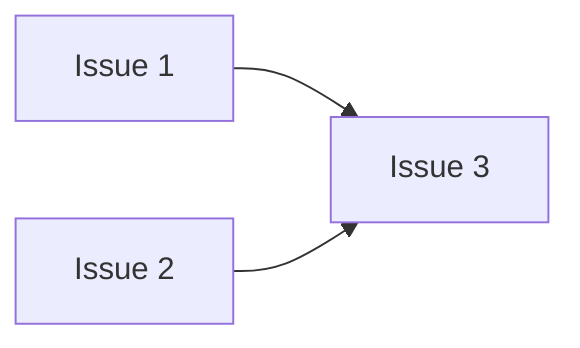

# Linear Document Template：产品需求文档（PRD）

## 在 Linear 中的模板设置

- **Template name**：`产品需求文档｜PRD`
- **Document title 建议**：`PRD｜{Project name}`
- **适用范围**：Project 的产品需求、范围和产品级验收
- **不保存**：详细代码方案、ADR、API/schema 定义、迁移脚本或运维 runbook；这些内容保存在对应 repo，并从本 PRD 链接过去

> 这是 Project 的产品需求唯一事实源。花括号中的文字是填写提示；PRD 进入 Approved 前必须替换或删除。

---

## 模板正文

### Document control

- **Project**：{Linear Project 链接}
- **Status**：Draft / In review / Approved / Superseded
- **Product owner**：{姓名}
- **Reviewers**：{负责产品、技术或运行风险判断的人}
- **Last reviewed**：{日期}

### 1. Executive summary

{用三到五句话说明谁遇到了什么问题、准备改变什么，以及如何判断成功。}

### 2. Problem and evidence

#### Current behavior

{描述目前真实发生的行为，不描述解决方案。}

#### Impact

{说明受影响的用户、业务、运营或系统后果。}

#### Evidence

- {日志、数据、用户反馈、截图、事故记录或可复现实验}

### 3. Users and scenarios

| User / actor | Current need | Expected behavior |
|---|---|---|
| {用户或系统角色} | {当前需要完成的事情} | {本 Project 完成后的行为} |

### 4. Goals

- {必须实现的产品结果；使用可观察的结果表述}

### 5. Non-goals

- {本次明确不解决的相邻问题、产品范围或技术重构}

### 6. Proposed behavior

#### Primary flow

1. {用户或系统触发行为}
2. {系统产生的关键响应或状态变化}
3. {用户或运营可以观察到的最终结果}

#### Failure and edge behavior

- {关键失败场景以及用户应该看到的行为}
- {兼容、重试、幂等、权限或数据边界中与产品体验相关的要求}

### 7. Scope

#### Included

- {本次包含的产品能力或业务流程}

#### Excluded

- {不属于本次交付的能力}

#### Affected systems

| System / repository | Responsibility in this Project | Contract owner |
|---|---|---|
| {系统或仓库} | {它需要提供或消费的行为} | {负责人} |

### 8. Product requirements

| ID | Requirement | Priority | Notes |
|---|---|---|---|
| PR-1 | {明确、可测试的产品要求} | Must / Should / Could | {必要约束} |

### 9. Acceptance and success

#### Product acceptance criteria

- [ ] **PAC-1**：{端到端可观察结果}
  - Evidence：{E2E、运行数据、人工验收或其他证据类型}
- [ ] **PAC-2**：{第二个必要结果；不需要时删除}
  - Evidence：{对应证据类型}

#### Success metrics

| Metric | Baseline | Target | Measurement window |
|---|---:|---:|---|
| {指标；没有适用的量化指标时删除此表并说明原因} | {当前值} | {目标值} | {观察周期} |

### 10. Constraints and product decisions

- **Security/privacy**：{产品层面的权限、敏感信息或合规要求；没有则写 None}
- **Money/billing**：{支付、余额、计费影响；没有则写 None}
- **Compatibility**：{必须维持的用户或系统兼容性；没有则写 None}
- **Operational constraints**：{停机窗口、人工流程或容量约束；没有则写 None}
- **Resolved decisions**：{记录已经确认且会影响 Issue 拆解的产品决定}

### 11. Risks and release policy

| Risk | Impact | Mitigation / fallback |
|---|---|---|
| {具体风险} | {发生后的产品或运营影响} | {降低风险或恢复的方法} |

- **Rollout policy**：{灰度、feature flag、分阶段发布或直接发布的产品要求}
- **Rollback expectation**：{出现哪些信号时必须回滚，以及恢复到什么行为}

### 12. Technical references

{这里只放链接和边界摘要，不复制 Technical Design。}

- **Technical design**：{repo 文档链接；尚不需要时写 None}
- **ADR**：{架构决策链接；没有架构决策时写 None}
- **API/schema contract**：{接口或 schema 文档链接；没有则写 None}
- **Migration/runbook**：{迁移或运维文档链接；没有则写 None}

### 13. Delivery decomposition

#### Decomposition rules

- Issue 必须对应一个可独立判断完成与否的工作结果
- 生产代码 Issue 原则上只属于一个 repository
- 生产代码 Issue 先在 GitHub 创建，再由 GitHub → Linear 自动同步；不得手工创建第二份同内容的 Linear Issue
- 非代码、Discovery 和跨仓库规划工作可以只存在于 Linear
- 同步后的 Linear Issue 必须关联本 Project，并使用 Linear 原生关系表达 DAG 依赖
- DAG 只表达真实依赖；可以并行的 Issue 不添加虚假顺序
- Issue 是追踪和验收单元，不强制对应一次 Agent 会话或一次 PR
- 同一仓库中紧密相关的 Issues 可以组成一个 Delivery Batch

#### Proposed issue DAG

{用真实 Linear Issue ID 替换示例节点；没有依赖时删除图并明确说明 Issues 可并行。}

#### Delivery batches

| Batch | Repository | Included issues | Batch acceptance | Full CI / review point |
|---|---|---|---|---|
| {批次名称} | {repository} | {Linear/GitHub Issue IDs} | {批次完成的整体行为} | {何时运行完整 CI 和 review} |

### 14. Open questions

{列出仍需回答的问题。PRD 进入 Approved 前，本节必须清空，或把不会阻塞开发的问题转为独立 Discovery Issue。}

### 15. Approval

- [ ] Product owner 已确认 Problem、Goals、Non-goals 和 Scope
- [ ] 技术负责人已确认拆解不要求 Agent 自行补产品决策
- [ ] 高风险变更已有对应 Technical Design / ADR 计划
- [ ] Issue DAG 和 Delivery Batches 已人工检查
- [ ] 每个代码 Issue 已指定唯一 GitHub repository，且不存在手工维护的 Linear 内容副本
- [ ] PRD 可以进入 Approved，允许相关 Issues 进入 Ready
