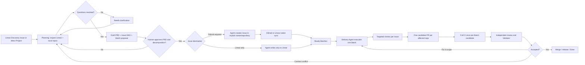
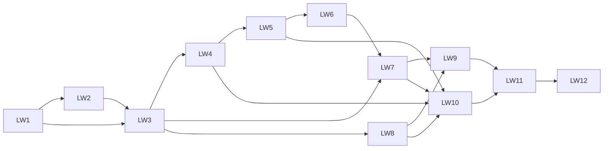

# Linear-first Agent Workflow PRD

- **文档状态**：Draft for review
- **文档版本**：0.3
- **日期**：2026-08-09
- **产品负责人**：GongxunLi
- **实现仓库**：`agent-tools`
- **拟议产品名**：Linear Workflow
- **替代对象**：已移除的长任务规划流程

## 1. Executive summary

`Linear Workflow` 是一套同时供 Codex 和 Claude Code 使用的 Coding Agent 工作流。它以 Linear 作为产品需求、任务关系和执行状态的唯一事实源，以代码仓库和 GitHub CI 作为实现与验证证据的事实源。

产品由三个职责分离、共享同一数据协议的组件组成：

1. **Planning**：把模糊需求整理为 PRD，读取相关代码和现有约束，提出需要用户回答的问题，生成 Project、Issues、依赖 DAG 和 Delivery Batches。
2. **Delivery**：领取一个已经批准的 Batch，按拓扑顺序连续完成其中的多个 Issues；在 Issue 边界运行定向检查，在 Batch 边界提交每仓库一个 PR 并运行完整 CI。
3. **Validator**：用确定性规则验证 PRD、Issue DAG、Batch、PR 和验收证据；它不判断产品方向，也不重复实现 Coding Agent 已完成的推理。

三者作为一个可安装、可升级的套件发布，但 Planning 和 Delivery 必须使用不同入口，避免同一 Agent 在一次不间断执行中自行定义需求、批准需求、扩大范围并宣布完成。

本产品不把 Linear 变成代码执行环境，也不自建项目管理 SaaS。Agent 通过 Linear MCP 读写工作项，通过本地仓库理解代码；Validator 在需要不可绕过的机器门禁时使用 Linear API 和 GitHub CI。

## 2. Problem statement

旧长任务规划流程试图在一次长会话中同时解决目标冻结、任务规划、授权、实现、runtime ledger、review 和最终验收。实践中暴露出四类问题：

1. **计划和执行没有真正分离**：同一个 Agent 可以解释目标、扩大实现范围、增加脚手架，再用自己生成的验证材料证明完成。
2. **验证频率与交付单位错配**：每个叶子 Issue 都可能触发独立 commit、merge、完整 CI 和 review，多个紧密相关任务被拆成高成本串行流程。
3. **形成第二套事实源**：`docs/goals/<id>/plan.md`、runtime ledger 和 acceptance 文件与 Linear Project、PRD、Issue 状态重复，内容容易分叉。
4. **结构校验被误认为质量校验**：旧 validator 主要检查字段和事件形状，无法证明 PRD 正确、拆解合理、代码可维护或验收覆盖真实行为。

团队已经能用 Linear MCP 完成“需求整理 → PRD → DAG → Issues → GitHub 关联”的基本流程，但目前依赖临时 prompt，缺少稳定入口、机器检查、Batch 执行协议以及 Codex/Claude 的统一安装方式。

## 3. Goals

### G1. 一个事实源，两个证据域

- Linear 保存 Project、PRD Document、Issue、依赖、Batch、owner、risk 和执行状态。
- Repo 保存源代码、Technical Design、ADR、API/schema contract、migration 和 runbook。
- GitHub 保存 branch、PR、review、CI 和合并记录。
- 各域只保存指向其他域的 ID、链接和必要摘要，不复制完整正文。

### G2. 让 Agent 能可靠地规划，也能高效地连续交付

- Planning Agent 必须读取 Linear 上下文和相关本地代码后再提出拆解。
- Delivery Agent 可以接收整个 Project 的全局视图，但只获得一个已批准 Batch 的修改授权。
- 一个 Batch 可以包含多个相关 Issues；完整 CI 和 PR review 默认只在 Batch candidate 上运行一次。

### G3. 把可以机器判断的规则做成 validator

- 检查必填字段、placeholder、DAG 环、Ready 状态、Batch 边界、repo/PR 映射、candidate SHA 和证据完整性。
- 所有 gate 必须有 known-bad fixture，证明错误输入确实会变红。
- 不用更多 prompt 代替可以由程序判断的条件。

### G4. 同一产品支持 Codex 和 Claude Code

- 共享 schema、validator、references 和版本号。
- 客户端只保留薄适配层：Skill、slash command、agent prompt 和安装目标路径。
- Linux、WSL2 和 native Win11 使用同一发布版本，并通过安装后检查发现漂移。

### G5. 不继承旧长任务流程

- 新任务只从 Linear Workflow 的 Planning 或 Delivery 入口进入。
- 已有历史记录只作为审计材料保留，不作为新任务的事实源。
- 本产品不提供旧流程兼容入口、迁移向导或生命周期扩展。

## 4. Non-goals

- 不实现 Linear 的替代品、通用编排平台、常驻 daemon、任务数据库或自定义 Web UI。
- 不让 Agent 自动批准自己的 PRD、Issue DAG、范围变更或最终验收。
- 不要求每个 Issue 对应一个 Agent 会话、一个 branch、一个 PR 或一次完整 CI。
- 不把所有 GitHub Issues 复制成 Linear 与 GitHub 两份独立维护的正文。
- 不在 v1 自动部署生产环境或执行不可逆数据库迁移。
- 不把 `/goal` 作为普通软件开发的默认执行器。
- 不承诺 AI 能自动判断架构优劣、需求真实性或代码长期可维护性。

## 5. Product decisions

### 5.1 一个套件，两个 Skill 入口，一个 Validator

产品采用一个发布包，而不是三个彼此独立的治理系统：

```text
Linear Workflow package
├── linear-plan skill       # PRD、拆解、DAG、Batch proposal
├── linear-deliver skill    # Batch execution、PR、review handoff
└── linear-workflow CLI     # deterministic validation and evidence checks
```

不设置可以在一次调用中自动完成 Planning 和 Delivery 的“万能 Skill”。两个入口共享数据模型，但权限和停止条件不同。Validator 是 CLI/library，不是第三个自由推理 Agent。

### 5.2 Project、Issue 与 Batch 的含义

- **Project**：一次有明确结束条件、需要多个 Issue 协同完成的产品或工程结果，不代表 repo 或永久产品域。
- **PRD Document**：Project 的产品问题、目标、非目标、范围和产品级验收的唯一事实源。
- **Issue**：可独立判断完成与否的跟踪与验收单元，不强制单独合并。
- **Delivery Batch**：一次连续开发、candidate 固定、完整 CI 和 review 的最小交付单位。
- **Milestone**：面向产品或发布阶段的进度点；不强制与 Batch 一一对应。

Batch 在 Linear v1 中表示为带 `workflow:batch` 标签的 parent Issue，其 sub-issues 是本批叶子任务。Issue 之间使用 Linear 原生 `blocked by / blocking` 关系表达 DAG；拓扑序由关系计算，不单独维护一份序号表。

### 5.3 PRD 与技术文档的边界

PRD 只保存在 Linear。Repo 不保存 PRD 副本。

Repo 内文档只在变更确实需要时创建：

- Technical Design：实现边界、组件交互和关键技术取舍；
- ADR：需要长期保留的单个架构决策及其理由；
- API/schema contract：本系统提供或消费的接口、字段、版本和兼容规则；
- migration/runbook：数据或部署状态怎样变化、怎样验证、怎样回滚。

这些文档是代码实现的一部分，必须和实现版本一起 review，因此属于 repo。Linear PRD 只链接它们并保存产品级摘要。

### 5.4 Linear MCP 与 Linear API 的分工

- **MCP**：供 Planning/Delivery Agent 在交互会话中读取和更新 Linear；所有开发机不必安装额外自制 Agent App。
- **GraphQL API**：供 Validator、GitHub Action 和安装自检执行确定性查询；token 使用最小权限，保存在本机或 CI secret 中。
- **GitHub API / `gh` CLI**：供 Planning Agent 在用户批准后向明确的完整 repo 创建代码 Issue，供 Delivery 创建 PR 和读取 CI；执行前验证当前 GitHub identity 对目标 repo 的权限。
- **Webhook/Linear Agent App**：不进入 v1。只有在明确需要从 Linear UI 主动启动后台 Agent 时再评估。

MCP 和 API 必须通过同一个内部 `LinearGateway` 数据结构归一化，避免把某个客户端的原始响应格式写进核心规则。

### 5.5 Linear Issue 与 GitHub Issue 的边界

Project、PRD、DAG、Batch 和所有同步后的工作状态以 Linear 为 canonical。需要修改代码并交给开发者或 Coding Agent 实现时创建 GitHub Issue；内部调研、PRD、产品决策、协调和不产生代码交付的工作只保留 Linear Issue。用户可以在批准 preview 时显式覆盖单项 destination，workflow 不自行扩大到 GitHub。

#### Path A：需要 GitHub Issue 的代码任务

1. Planning Agent 在 preview 中明确 `repository_full_name`，并生成完整 GitHub Issue 草案。
2. Agent 一次生成当前 decomposition 的全部候选 Issue；用户集中审阅，指出需要删除或修改的单项。Agent 修订后，用户一次批准整个候选集合。
3. 获得整批批准后，Agent 通过 GitHub API 在各目标 repo 创建批准范围内的 Issues；用户不需要手工复制正文，也不逐条点击批准。
4. 已配置的 GitHub → Linear one-way sync 创建对应 synced Linear Issue。
5. Workflow 按 GitHub Issue URL/number 找到该 synced Linear Issue，将它关联到 Project、DAG 和 Batch，再补充 Linear-only planning properties。
6. 此后 Linear 保存 Project 关系、dependency、Batch、risk 和状态；GitHub Issue 保存 repo-facing outcome、acceptance 和讨论。双方由 Linear 原生 sync 维护的字段遵循 sync 结果，不再手工创建第二份 Issue。

这条路径不要求在创建 GitHub Issue 前猜测 Linear identifier；Linear identifier 由同步创建 Linear Issue 时自动分配。

如果同步在配置的等待窗口内没有出现，workflow 返回 `Blocked: issue sync missing`，报告完整 GitHub URL 和预期 Team；不得通过手工创建一个 Linear Issue 来“修复”同步失败。

Agent 生成的 GitHub Issue 使用自然语言标题，不预填尚未产生的 Linear ID；body 至少包含 Project link、完整 `owner/repository`、planned base branch、repo-local outcome、acceptance 和验证预期。同步完成后，以 Linear sync banner/attachment 和 workflow 解析出的 Linear ID 作为正式映射，不回头发明第二个编号。

#### Path B：不需要 GitHub Issue 的任务

Discovery、PRD 调研、产品决策、跨 repo 协调、Batch、非代码工作，以及不需要交给开发者或 Coding Agent 写代码的 leaf task，直接在 Linear 创建。Agent 可以整理和更新内容，但除非用户明确要求，不创建 GitHub Issue，也不做 Linear → GitHub projection。

#### Duplicate prevention

- 禁止针对同一工作手工创建一个 Linear Issue 和一个独立 GitHub Issue，再靠标题相似度猜测关联。
- 创建 GitHub Issue 前，workflow 使用稳定 proposal key 和批准记录检查是否已经创建；创建后以完整 GitHub URL、`owner/repository#number` 和 Linear sync attachment 解析唯一 Linear 对象。
- 同一个 GitHub Issue URL 已附着到 Linear Issue 时，workflow 复用该 synced Issue，不再手工创建第二个 Linear Issue。
- Linear `duplicateOf` 关系是 canonical 判定依据；即使 GitHub sync 后来把 duplicate 的状态推进到 Done，Validator 仍把它视为 duplicate，并拒绝将它加入新的 Project/DAG/Batch。
- 一个 GitHub Issue 映射多个 Linear Issues、一个 Linear Issue 映射多个同类 GitHub Issues、或目标 repo 与声明不一致时 fail closed。
- Linear 原生 two-way sync 同一 team 同时只能面向一个 repo，因此多 repo workflow 默认使用 GitHub → Linear one-way sync；不依赖 Linear 自动判断目标 repo。

现有重复项采用可恢复清理：以同一 GitHub Issue URL、明确的 `duplicateOf`、Project/DAG membership 和实际 PR evidence 选择 canonical Issue；旧对象保留历史并设为 `Duplicate`，不删除正文。若证据冲突则停止并交给人选择，不用标题相似度自动合并。

现有 `docs/linear-templates/` 已采用 Path A，不需要重新设计或替换。

### 5.6 Identifier and work-reference contract

不得改变 Linear 已配置的 team identifier，也不得由 Agent 自行分配编号。每个代码交付使用结构化 work reference，而不是发明另一个缩写 ID：

```yaml
linear_project: https://linear.app/gongxunli/project/request-id-mapping
linear_batch: DRAGAI-120
linear_issues:
  - DRAGAI-123
repository_full_name: AlexJJ009/tokenrouter
base_branch: main
base_sha: 1111111111111111111111111111111111111111
working_branch: linear/dragai-120-request-id-mapping
candidate_sha: 2222222222222222222222222222222222222222
github_issue: AlexJJ009/tokenrouter#37
github_pull_request: AlexJJ009/tokenrouter#52
```

`DRAGAI` 是当前 DragAI Team 已核验的 identifier；实现仍必须在运行时从 Linear 读取并验证，不在配置中猜测或重新分配。完整身份由下列 tuple 确定：

```text
(linear_batch_or_issue, repository_full_name, base_branch, working_branch, candidate_sha)
```

规则如下：

- repo 一律使用 GitHub canonical full name：`owner/repository`；不得使用 `TR`、`NA` 等自定义缩写。
- GitHub Issue/PR 一律写成 `owner/repository#number`；裸 `#37` 不能跨 repo 唯一识别。
- Linear ID 保持原样，不在其中编码 repo、branch 或环境。
- 工作分支格式固定为 `linear/<batch-or-issue-id-lowercase>-<slug>`。Standard/High Batch 使用 Batch ID；Fast 单 Issue 使用 Issue ID。前缀不编码 Codex、Claude、开发者用户名或其他客户端身份。
- branch 的全局引用是 `<owner/repository>@refs/heads/<working-branch>`；单独的 branch name 不视为跨 repo 唯一。
- branch 实体只存在于对应 Git repository；Linear 不创建第二个 branch 对象。Delivery 创建 branch 后，在 Batch activity/comment 写入完整 work reference，并附 GitHub branch/PR link。
- base SHA 和 candidate SHA 使用完整 40-character Git SHA；UI 可以缩写展示，但 evidence 和 validator 不得只保存短 SHA。
- Delivery Batch 默认只覆盖一个 primary repo。只有无法安全拆成独立发布、必须按同一版本组合联合验收的变更才允许跨 repo Batch；该 Batch 自动归为 High risk。每个 repo 仍建独立工作分支和 PR，共享同一 Linear Batch ID，由 `repository_full_name` 区分。

### 5.7 Contribution contract and repository overrides

Linear Workflow 保存所有项目通用的贡献规则：work reference、Issue 创建路径、branch/PR 关联、Batch、candidate evidence、commit baseline 和 validator 规则。建议位置：

```text
linear_workflow/shared/references/contribution-contract.md
```

每个采用本工作流的 repo 仍保留项目级 `CONTRIBUTING.md`，只保存无法通用化的内容：base branch、build/test 命令、required checks、release/deploy 流程、受保护路径、语言生态特有规则和更严格的 commit 要求。Repo 文档链接共享 contract，不复制 Issue 创建路径、work reference、validator 规则或整套贡献规范正文。

`AGENTS.md` / `CLAUDE.md` 只说明如何进入 `linear-plan` / `linear-deliver` 以及本 repo 的实际验证命令；GitHub PR template 收集 Linear/Batch/evidence 字段；CI 使用共享 validator 强制执行。可以机器检查的规则不得只停留在 `CONTRIBUTING.md`。

现有三个 Linear 模板继续复用：

- `需求收集｜Discovery / Triage`；
- `项目交付｜Project Delivery`；
- `产品需求文档｜PRD`。

模板不重新复制到新的第四套格式。`docs/linear-templates/` 是模板定义的版本化来源，Linear App 中的模板是人工部署副本，实际 Linear-side Project、Document、planning properties 和状态以 Linear 为事实源。当前模板结构无需变化；填写 repo 时统一使用完整 `owner/repository`，填写 Issue/PR 时统一使用完整 work reference。

## 6. Source-of-truth contract

| Artifact | Canonical location | Allowed replicas |
|---|---|---|
| Product problem, goals, non-goals, scope, product AC | Linear PRD Document | 链接和不超过一段的摘要 |
| Project state, Issue DAG, Batch membership | Linear | PR/commit 中的 ID 和链接 |
| Code Issue requiring GitHub visibility | GitHub/Linear native synced pair | Linear-only Project、dependency、Batch、risk properties |
| Work item not requiring GitHub Issue | Linear Issue | PR 中的 Linear ID/link |
| Technical Design, ADR, API/schema, migration/runbook | Repo | Linear 中的链接和边界摘要 |
| Code and tests | Repo | 无正文副本 |
| PR, review, CI, candidate SHA | GitHub | Linear comment/property 中的链接和结果摘要 |
| Runtime progress | Linear Issue/Batch status | 本地临时 cache，可重建，不提交 |
| Old Goal history | Existing `docs/goals/` | Linear migration record 中只放归档链接 |

系统禁止人为创建两份需要独立维护的正文。由 Linear GitHub integration 创建的 synced pair 视为同一个逻辑 work item；Project、DAG、Batch 和 risk 等 planning properties 只在 Linear 维护。

## 7. Target workflow



### 7.1 Intake

模糊想法可以先建 Discovery Issue；已经明确需要多个 Issue 协作时，可以直接建 Project 和 Draft PRD，不强制先建空 Issue。Issue 是工作跟踪单元，不是所有需求进入系统前必须经过的形式。

Planning 的启动输入为 Linear Issue ID 或 Project ID。用户也可以只提供口头需求，由 Agent 先拟定 Draft 对象清单和草案；任何写入前必须展示将创建或修改的对象清单。Preview 必须逐项标注 `linear_only` 或 `github_to_linear`；未标注的项不得写入任一系统。

### 7.2 Planning

Planning Agent 必须：

1. 读取对应 Linear Issue、Project、已有 PRD 和相关关系。
2. 识别候选 repos，并在本地读取 `AGENTS.md` / `CLAUDE.md`、架构入口、相关代码、测试和现有技术文档。
3. 区分产品问题、产品决定和技术实现，不用技术方案替代尚未回答的产品问题。
4. 对不确定项提出集中问题；未回答的阻塞问题使状态保持 `Needs clarification`。
5. 生成或修订 Linear PRD Document。
6. 提出 leaf Issues、真实依赖 DAG、风险等级和 Delivery Batches，并为每个代码 Issue 写出完整 `repository_full_name`。
7. 对需要 GitHub Issue 的项整批生成候选草案；用户指出不可靠的单项，Agent 逐项修订后，由用户一次批准整批创建，再等待 GitHub → Linear sync 并关联 Project/DAG/Batch。
8. 对不需要 GitHub Issue 的项只写 Linear；除非用户明确要求，不创建 GitHub projection。
9. 在任何外部写入前输出 diff-like preview；批准单位是当前 preview 的完整对象集合，不要求用户逐 Issue 批准。任何修订都会先更新 preview，再执行一次整批写入。
10. 运行 planning validator；通过后由用户将 PRD 与 Batches 标记为 Ready。

Planning Agent 不得修改代码、创建实现 PR、把自己的草案标记为 Approved，或在没有读到相关 repo 时声称完成了可靠技术拆解。

Planning 可以在当前会话中展示草案并等待批准，但写入 Ready 后不得在同一个不间断 turn 中直接进入 Delivery。Delivery 必须由新的显式用户命令、单独委派的 Batch ID 或新的 Agent session 启动。

### 7.3 Delivery

Delivery Agent 的输入是一个 Ready Batch ID，不是任意 Project ID。它可以读取完整 Project 和 PRD 以理解全局，但修改权限只覆盖该 Batch 声明的 repos、Issues 和范围。

执行规则：

1. 确认 Batch 为 Ready、依赖已满足，并解析完整 work reference：Linear IDs、`repository_full_name`、base branch/base SHA 和 working branch。
2. 按 DAG 拓扑顺序处理 Issues；没有依赖的任务可在同一 Batch 中并行调查，但共享改动由主实现 Agent 整合。
3. 每完成一个 Issue，运行与该 Issue 变更面相关的 lint、unit、typecheck 或小型 integration check，并把摘要写回 Linear。
4. 不因 Issue 完成自动 merge main，也不为每个 Issue 强制完整 CI。
5. Batch 内所有实现完成后，固定每个 repo 的 candidate SHA；每个 repo 创建一个主要 PR。
6. 在 candidate 上运行一次该 repo 的完整 required CI；跨 repo Batch 再运行一次绑定所有 candidate SHAs 的 integration acceptance。
7. 把 PR、candidate SHA、CI runs、review verdict 和未完成风险链接回 Batch。
8. 如果发现 PRD 矛盾、必须扩大产品 AC、出现未声明 repo 或不可逆操作，停止相关路径并把 Batch 标为 Blocked；返回 Planning，不自行改 contract。

### 7.4 Branch, PR and commit contract

#### Branch

- Standard/High Batch：`linear/<linear-batch-id-lowercase>-<slug>`，例如 `linear/dragai-120-request-id-mapping`。
- Fast 单 Issue：`linear/<linear-issue-id-lowercase>-<slug>`。
- `linear/` 是客户端无关的固定前缀；Codex、Claude Code 或人类开发者都使用相同格式。
- Branch 由 Delivery workflow 在 GitHub repository 中创建。Linear App 的 “Copy git branch name” 只作为便利功能；如果当前 workspace 的内建格式不能生成固定 `linear/` 前缀，Agent 不使用其结果，也不要求修改 Team identifier。
- 创建 branch 前记录 `repository_full_name`、base branch 和完整 base SHA。仅有 `linear/dragai-120-request-id-mapping` 不能构成跨 repo 的全局引用。

#### Pull request

PR title 以 Batch ID 开头；Fast 单 Issue 使用 Issue ID：

```text
[DRAGAI-120] Preserve request ID across router boundaries
```

PR body 至少包含：

```yaml
Linear-Batch: DRAGAI-120
Linear-Issues: DRAGAI-123, DRAGAI-124
Repository: AlexJJ009/tokenrouter
Base: main@1111111111111111111111111111111111111111
Candidate: 2222222222222222222222222222222222222222
GitHub-Issues: AlexJJ009/tokenrouter#37
Risk-Profile: standard
```

完成整个 Issue 时在 PR description 使用 `Fixes DRAGAI-123`；只完成一部分时使用 `Part of DRAGAI-123` 或 `Refs DRAGAI-123`。PR comment 不作为创建关联的可靠入口。

#### Commit

通用 commit header 采用 Conventional Commits 子集：

```text
<type>(<scope>): <imperative summary>
```

允许的 `type`：`feat`、`fix`、`refactor`、`test`、`docs`、`perf`、`build`、`ci`、`chore`、`revert`。`scope` 表示真实 module/component，不是 repo 缩写。

示例：

```text
fix(relay): preserve upstream request ID
test(relay): cover missing request ID propagation
```

- 每个 commit 保持一个可解释的代码意图；提交 review candidate 前清理 `WIP`、`fixup!` 和 `squash!` commits。
- 默认不要求每个中间 commit 重复 Linear ID；branch 和 PR 承担 Batch 级追踪，避免制造噪声。
- 需要独立 cherry-pick 或 repo policy 要求 commit-level traceability 时，加入 `Linear-Batch: DRAGAI-120` 或 `Linear-Issue: DRAGAI-123` trailer。
- 默认使用 squash merge，让一个 Batch 在每个 repo 的 main 历史中形成一个可追踪提交。只有 repo 的 `CONTRIBUTING.md` 明确要求保留完整 commit graph 时才覆盖该默认值。
- 禁止用缺少 PR 的 direct-to-main commit 规避 Linear/CI gate。
- 普通工作区继续使用开发者的人类 Git identity；Agent 作为协作者写入 `Co-Authored-By: Codex <noreply@openai.com>` 或 `Co-Authored-By: Claude <noreply@anthropic.com>`。

### 7.5 Validation and review

Validator 分三次运行，检查不同事实：

| Stage | Checks | Does not check |
|---|---|---|
| Planning admission | required fields、placeholder、PRD approval、DAG acyclic、Issue/Batch/repo mapping、risk policy | 产品方向是否正确 |
| Pre-review | diff scope、candidate SHA、声明的 checks 是否实际出现、Batch AC evidence | 代码设计是否优雅 |
| Merge admission | required CI 通过、review 绑定当前 SHA、阻塞 Issue 清零、必要 rollback evidence | 生产环境未来不会发生任何故障 |

独立 Reviewer 读取 PRD、Batch、diff 和现有 CI evidence。Reviewer 默认复用 candidate 上已经通过的完整 CI，只运行针对风险和失败模式的定向 adversarial probes。仅当 candidate 变化、required check 缺失、证据来源不可确认或测试环境不同，才重新运行相应完整检查。

### 7.6 State model

工作流复用 Linear status category，不要求每个 workspace 创建大量自定义状态：

| Workflow state | Linear representation | Entry condition | Exit authority |
|---|---|---|---|
| Discovery | Backlog | 模糊需求已记录 | Product owner / Planning |
| Draft planning | Backlog | 正在形成 PRD | Planning proposes |
| Needs clarification | Backlog；阻塞问题写在 PRD/Open questions | 存在阻塞产品问题 | Product owner answers |
| PRD Review | Backlog；PRD control=`In review` | PRD 草案和 repo 调研已完成 | Human reviews product contract |
| Breakdown Review | Backlog；candidate preview 未批准 | Issue DAG 和 Batches 已生成 | Human reviews delivery shape |
| Ready | Ready | PRD、DAG、Batch 通过 validator 和人工批准 | Human approval only |
| In Progress | Started/In Progress | Delivery 已领取 Batch | Delivery |
| Blocked | Blocked | contract conflict、依赖未满足或权限不足 | Planning/human resolves |
| In Review | Started/In Review | candidate SHAs 固定，evidence 齐全 | Delivery/reviewer |
| Done | Completed/Done | merge/release policy 和 Batch AC 满足 | Validator + required approval |
| Canceled | Canceled | 明确不再交付 | Product owner |

`Planning Agent proposes` 不等于批准。Ready、contract change 和 High-risk Done 必须包含可识别的人类 actor；MCP 调用者与批准者相同时仍需一次显式批准动作，不能从聊天沉默推断。状态承担流程阶段，Labels 只表达 Batch 类型和风险，不再复制状态语义。

## 8. Risk profiles and verification budget

| Profile | Typical work | Planning approval | Delivery / review rule |
|---|---|---|---|
| Fast | 文案、局部 UI、低风险小 Bug、非生产脚本 | 一个清晰 Issue；可以没有 Project | targeted tests；一个 PR；现有 required CI；轻量 review |
| Standard | 普通 feature、单 repo 行为变更、多个相关 Issues | Approved PRD 或明确 parent Issue；Batch Ready | per-Issue targeted checks；Batch full CI；独立 review |
| High | auth、money、权限、schema migration、生产 infra、多 repo release | PRD + Technical Design/ADR（适用时）+ rollout/rollback + 人工批准 | exact candidate SHAs；每 repo full CI；跨 repo integration evidence；独立 review；发布验证 |

Risk profile 决定验证深度，不决定代码量。Validator 不允许 Agent 为了满足 High profile 自动搭建新的平台或测试框架；缺少可行验证方法时应 Blocked，并由 Planning 缩小范围或设计最小测试 seam。

## 9. Machine-enforced rules

### 9.1 Planning rules

- PRD 的 Goals、Non-goals、Scope、Acceptance 和 owner 必须存在。
- `TBD`、`TODO`、`replace-me`、`待定` 及模板提示不得残留在必填 planning fields。
- 阻塞 Open questions 不得在 Approved PRD 中存在。
- DAG 必须无环；每条依赖引用真实 work item。
- 每个生产代码 leaf Issue 必须有唯一 primary repo。
- primary repo 必须是 GitHub canonical `owner/repository`；缩写、只有 repo basename 或本地目录名无效。
- 每个 proposed Issue 必须声明 destination：`github_to_linear` 或 `linear_only`。
- `github_to_linear` 必须引用 Agent 创建的 GitHub Issue URL 和其 native synced Linear Issue；`linear_only` 在没有用户新授权时不得出现 GitHub Issue。
- 每个 Batch 必须声明 included Issues、repos、batch acceptance、risk profile 和 full-CI point。
- 每个 Batch 默认只有一个 primary repo；只有不可分割的联合发布可以跨 repo，且必须标记为 High risk、为每个 repo 创建独立 PR，并绑定联合 candidate evidence。
- 一个 Issue 只能属于一个未完成 Batch；跨 Batch 关系用依赖表示。
- Planning Agent 的写入必须带 workflow version 和 source session link，便于追踪，但不复制会话全文。

### 9.2 Delivery rules

- 只有 Ready Batch 能进入 In Progress。
- Batch 由人明确派发给一个开发者或一个 Agent session。v1 不实现 lease、claim token 或自动抢占；避免重复派发由分配任务的人负责。
- 开始实现前必须存在完整 work reference，并验证 repo remote、base branch/base SHA 和 working branch 一致。
- PR 必须引用 Batch ID 和包含的 Linear Issue IDs。
- PR metadata 中的 `Repository` 必须等于 GitHub 当前 `owner/repository`，branch 必须包含相应 Batch/Issue ID。
- 每个 repo 在一个 Batch 中默认只有一个 primary PR；拆成多个 PR 必须在 Batch 中说明发布顺序。
- 修改未声明 repo、受保护路径或产品 contract fields 时 fail closed。
- CI 读取 base branch 上的 gate 规则；修改 gate 本身必须由 ruleset 保护。
- required check 不仅要 green，还必须实际出现在当前 candidate SHA 上。
- review verdict 必须绑定 candidate SHA；生产代码、test、workflow、contract 或 validator 变化后旧 verdict 失效。
- full CI 或 review 后 push 的任何 commit 都产生新 candidate；此前 full-CI、review 和跨 repo integration verdict 全部变为 non-authoritative，直到在新 candidate 上重新验证。
- 同一 candidate 的同一 full CI 不重复运行；重跑必须记录原因。
- PR 修改 CI workflow、validator、test harness、branch/ruleset configuration 或 repo agent instructions 时，强制进入 High-risk review lane，并从受保护 base branch 运行 validator。
- Review candidate 不得包含 `WIP`、`fixup!` 或 `squash!` commit subject；commit header 必须符合本 PRD 的通用类型集合或 repo 明确声明的更严格规则。

### 9.3 Gate canaries

每条机器规则至少有一个 known-bad fixture。测试必须证明：

- 删除关键 guard 会使测试失败；
- 缺失 workflow/check 不会被解释为通过；
- placeholder、DAG cycle、错误 Issue ID、旧 SHA verdict 和跨 scope diff 会被拒绝；
- Fast profile 不会错误触发 High profile 的所有证据要求。

## 10. `/goal` admission policy

`/goal` 或其他持续优化循环不属于 Linear Workflow 的默认执行路径。只有同时满足以下条件，Delivery Agent 才能建议在当前 Batch 的隔离子任务中使用；启动仍需用户明确要求：

1. evaluator 能以机器方式反复运行，并能见到真实失败；
2. evaluator 在循环期间不可由 implementer 静默修改；
3. 优化对象范围固定、结果可回滚；
4. 有最大轮次、时间或成本预算；
5. 指标改善不会明显牺牲未被测量的重要行为；
6. 达到阈值或预算耗尽时可以自动停止。

适合示例：性能 benchmark、测试通过率、明确格式转换、有限搜索空间的参数优化、已冻结数据集上的模型或 prompt evaluator。

不适合示例：开放式产品开发、跨 repo 架构重构、需求尚未明确的“把系统做好”、难以自动判断可维护性的代码生成。

## 11. Product architecture

### 11.1 Proposed repository layout

```text
linear_workflow/
├── VERSION
├── shared/
│   ├── schemas/
│   │   ├── prd.schema.json
│   │   ├── issue.schema.json
│   │   ├── batch.schema.json
│   │   └── evidence.schema.json
│   ├── references/
│   │   ├── lifecycle.md
│   │   ├── risk-profiles.md
│   │   ├── source-of-truth.md
│   │   ├── contribution-contract.md
│   │   └── linear-object-contract.md
│   └── runtime/
│       ├── pyproject.toml
│       ├── src/linear_workflow_runtime/
│       └── tests/
├── codex/
│   ├── skills/linear-plan/
│   ├── skills/linear-deliver/
│   └── plugins/linear-workflow/
└── claude/
    ├── skills/linear-plan/
    ├── skills/linear-deliver/
    ├── commands/
    └── agents/linear-workflow-reviewer.md
```

Codex 和 Claude 的 `SKILL.md` 只描述触发条件、职责和执行步骤；详细 schema、状态机和风险矩阵来自 `shared/references`。确定性逻辑只存在于 runtime。发布测试需要验证两个客户端适配层引用同一 workflow version，核心规则没有复制出分叉版本。

客户端文件不靠人手同时修改。`shared` 是 canonical source；构建脚本生成或装配 Codex/Claude adapters，CI 重新生成后必须得到零 diff。只有客户端真实能力差异保留在 adapter-owned 文件中。

### 11.2 Configuration

本机配置不写入 repo，包含：

- Linear workspace/team ID 和从 Linear 读取的真实 team identifier；
- MCP connection name；
- Validator 使用的 Linear API credential reference；
- GitHub organization 和默认 host；
- GitHub CLI/API credential reference 与当前 authenticated account；
- client identity（Codex/Claude）；
- 以完整 `owner/repository` 表示的 repo allowlist 和 GitHub → Linear sync map。

密钥使用操作系统或现有客户端的 secret storage；Linux/WSL fallback 文件权限必须为 `0600`。安装器不得从一台机器复制 live token 到另一台机器。

正式采用工作流的 repo 必须提交最小 `.linear-workflow.yml`，只保存项目事实，不保存 token：

```yaml
schema_version: 1
linear_team: DragAI
repository_full_name: AlexJJ009/tokenrouter
base_branch: main
issue_creation: github_to_linear
```

Team identifier 不复制进 repo config，而由 `doctor` 根据 Linear team ID 读取，防止 Team 设置与十几个 repos 分叉。Repo config 不能修改 Linear 设置。Repo rename、transfer 或 base branch 变化必须通过普通 PR 更新此文件，并使旧 scope/evidence cache 失效。

### 11.3 Installation and distribution

复用 `agent-tools` 已有的统一源码和多目标安装方式，但新增独立开关：

```text
install.sh --linear-workflow
install.sh --linear-workflow-only
install.sh --no-linear-workflow
scripts/install-win11.ps1 -LinearWorkflow
linear-workflow doctor
```

Python package、Unix console script 和 Windows launcher 统一使用 `linear-workflow`；子命令固定为 `plan-check`、`batch-check`、`pr-check`、`migrate` 和 `doctor`。

安装器应直接围绕当前受管组件实现复制、注册和 drift check。不要为了已经移除的旧流程保留兼容 helper、runtime 安装路径或 marketplace 注册分支。

安装流程必须：

1. 写入前运行 `scripts/codex_target_guard.py`，确认 Unix/WSL/Win11 profile 边界。
2. 将 Codex skills/plugin 和 Claude skills/commands/reviewer 安装到当前用户对应目录。
3. 在隔离的 `uv` environment 安装 `linear-workflow` CLI，不污染目标 repo Python。
4. 不自动修改 Linear workspace、GitHub ruleset 或生产仓库。
5. 不覆盖已有 MCP credential；缺少认证时由 `doctor` 给出登录/配置命令。
6. 安装后 byte-compare managed copies、检查 runtime 版本和客户端发现能力；Linear read-only query、GitHub authenticated account 和 repo access 由 `doctor` 探测。未登录只产生清晰 warning，不使本地安装失败；真正运行 Planning/Delivery 时认证失败必须 fail closed。
7. 支持 dry-run、check、upgrade 和可恢复卸载。

Linux/WSL 安装不写 `/mnt/c` 下的 native Windows profile；Win11 必须原生运行 PowerShell installer。Fleet 分发使用 `scripts/codex_fleet_guard.py` 和 checked manifest，不通过交互式 SSH 猜测目标 profile。

## 12. Functional requirements

### FR-P: Planning

- **FR-P1**：接受 Linear Issue ID、Project ID 或用户口述需求作为输入。
- **FR-P2**：通过 MCP 读取现有 Linear 对象，并在本地定位和检查候选 repos。
- **FR-P3**：在信息不足时生成合并后的 clarification questions，不虚构答案。
- **FR-P4**：按现有 Linear PRD/Project/Issue 模板生成内容，不要求用户手工复制 Agent 输出。
- **FR-P5**：先 preview 全部候选；用户可指出单项问题，Agent 修订后接受一次整批批准，再按 destination 批量写入 GitHub 或 Linear，不要求逐 Issue 批准。
- **FR-P6**：生成无环依赖、risk profile 和 Delivery Batches；允许无依赖任务并行。
- **FR-P7**：支持 dry-run 和幂等更新；以 proposal key、完整 GitHub URL、sync attachment 和 `duplicateOf` 关系识别既有对象，重复执行不创建重复 Projects/Issues。
- **FR-P8**：用户批准前不得将 PRD 或 Batch 标记为 Ready。
- **FR-P9**：为 `github_to_linear` code Issue 创建完整 GitHub Issue、在有界等待内解析 synced Linear ID 并建立一一映射；同步缺失时 Blocked，不创建替代 Linear Issue。
- **FR-P10**：为 `linear_only` work item 禁止无授权 GitHub 写入。

### FR-D: Delivery

- **FR-D1**：只执行人明确派发给当前开发者或 Agent session 的 Ready Batch；读取完整 Project，但按 Batch 限制修改范围。v1 不实现 lease/claim 服务。
- **FR-D1a**：用 Linear ID、完整 repo、base/working branch 和 SHAs 恢复 work reference；不得靠 repo 缩写或聊天上下文猜测。
- **FR-D2**：按 DAG 连续完成多个 Issues，不在每个 Issue 后强制 merge。
- **FR-D3**：记录 Issue 级 targeted checks 和 Batch 级 full CI evidence。
- **FR-D4**：每 repo 生成一个 primary PR，并自动关联 Linear IDs。
- **FR-D5**：更新 Linear 的 In Progress、In Review、Blocked、Done 状态和简短证据链接。
- **FR-D6**：contract conflict、scope expansion、未声明 repo 或高风险动作触发 fail closed。
- **FR-D7**：支持同一 Batch 从 Codex 切换到 Claude 或反向接手，不依赖私有会话上下文才能恢复。

### FR-V: Validator

- **FR-V1**：提供 `plan-check`、`batch-check`、`pr-check` 和 `doctor`。
- **FR-V2**：查询 Linear/GitHub 后归一化为共享 schema；核心规则不依赖具体 Agent。
- **FR-V3**：错误信息指出对象 ID、字段、失败规则和修复方向。
- **FR-V4**：支持本地 CLI 与 GitHub Action 共用同一核心库。
- **FR-V5**：缓存只用于性能优化；删除 cache 后可以从 Linear/GitHub 重建状态。
- **FR-V6**：每条 blocking rule 有正例、反例和 guard-deletion canary。
- **FR-V7**：检查 GitHub/Linear mapping、完整 repo names、branch naming、work reference 和 commit/PR metadata。

## 13. Human decision points

系统只保留三个默认人工决策点：

1. **PRD/decomposition approval**：确认问题、目标、非目标、范围、DAG 和 Batch。小任务可以合并成一次批准。
2. **Contract change approval**：Delivery 发现必须改变产品 AC、扩大 repo/范围或执行不可逆操作时。
3. **Merge/release approval**：按 repo 风险和现有 ruleset 决定；High profile 不允许 Agent 自批。

格式修正、定向测试失败、普通 in-scope bug fix、同一 candidate 的证据链接更新不产生新的用户审批点。

### 13.1 Responsibility boundary

| Operation | Human in Linear App | Agent / workflow | Reason |
|---|---:|---:|---|
| Connect/unlink GitHub organization or repository | Required | Forbidden in v1 | 改变整个 workspace 的同步与权限边界 |
| Select one-way/two-way Issue creation direction | Required | Read/validate only | 错误设置会创建重复 Issue 或投递到错误 repo |
| Change Team identifier | Required | Forbidden | 会改变所有 Linear Issue references |
| Create/edit/delete Linear UI templates | Required | Read packaged definition and report drift | 模板是 workspace 配置；当前 MCP/tooling 不作为模板部署器 |
| Create initial statuses | Required | Validate presence | 当前 Linear MCP 没有创建 workflow status 的写接口 |
| Create approved workflow labels | Approve names | Create missing / validate | MCP 可以创建标签，但不得自行扩充 label taxonomy |
| Draft Project/PRD/Issue content | Review | Primary | Agent 读取代码并形成草案 |
| Create GitHub code Issue | Approve preview | Primary | Agent 能指定准确 repo 并避免人工复制 |
| Create Linear-only task | Approve preview when part of planning batch | Primary | 不产生 GitHub 副本 |
| Attach synced Issue to Project/DAG/Batch | Audit | Primary | 机械映射，适合自动化 |
| Approve PRD and decomposition | Required | Forbidden | 产品目标和范围不能由 Agent 自批 |
| Mark Batch Ready | Required | Validator assists | Ready 是实现授权 |
| Update In Progress/In Review and evidence links | Audit | Primary | 可从 branch/PR/CI 事实推导 |
| Resolve sync conflict or duplicate mapping | Select canonical when ambiguous | Detect, preserve `duplicateOf`, clean proven duplicates | 证据明确时可机械清理；有冲突时由人选择 |
| Approve contract expansion / High-risk release | Required | Forbidden | 改变产品或生产风险 |

### 13.2 One-time Linear App setup

以下操作由 workspace/team 管理者在 Linear App 中完成一次。已有等价配置时复用，不创建重名项。

#### Step 1：确认 Team identifier

1. 打开 `DragAI` Team settings。
2. 在 General 或 team identifier 设置中查看当前 identifier。
3. 保持现有值，不为了 repo 改名，也不创建 repo 缩写 team。
4. 将准确值记录到本机 Linear Workflow config；`doctor` 从 Linear 读取后必须与配置一致。

填写规则：

- Linear identifier 只识别 Team；当前 DragAI 的实际格式是 `DRAGAI-120`。
- repo、branch 和环境不写进 Linear identifier。
- 修改 identifier 属于显式迁移操作，不由 Skill 自动执行。

#### Step 2：逐 repo 配置 GitHub → Linear sync

对每一个允许创建 GitHub Issues 并同步进 DragAI 的 repo：

1. 打开 Workspace settings → Integrations → GitHub。
2. 在 `GitHub Issues` 区域点击 `+` 或 `Add repository`。
3. `GitHub repository` 选择完整 repo，例如 `AlexJJ009/tokenrouter`；不要用本地目录名或缩写。
4. `Linear team` 选择 `DragAI`。
5. `Issue creation direction` 选择 `One-way: GitHub → Linear`。
6. 保存后确认列表中显示准确的 `owner/repository → DragAI` 映射。

多 repo Team 不使用 two-way 作为默认值。若未来某个独立 Team 只管理一个 repo，才单独评估 two-way；改变方向前先检查是否已有重复 Issues。

Linkbacks 推荐设置：

- 私有 repo：按实际协作需要开启；
- 公共 repo：只有确认不会泄露内部 Linear 标题时开启；
- `Include issue descriptions in linkbacks`：保持 OFF；
- `Link commits to issues with magic words`：只有 repo 确实需要 commit-level linking 时开启，默认依赖 branch/PR linking。

#### Step 3：核对现有三个模板

打开 Team settings → Templates，确认并复用这三个 workflow 模板；不要为本 workflow 新增重复模板，也不要删除其他用途的无关模板：

| Template type | Required name | Default | Manual check |
|---|---|---|---|
| Issue | `需求收集｜Discovery / Triage` | Status=`Backlog` | Discovery 不是开发授权；代码 Issue 走 Path A |
| Project | `项目交付｜Project Delivery` | Status=`Backlog` | Project 代表一次有结束条件的结果，不代表 repo |
| Document | `产品需求文档｜PRD` | 无执行状态 | Document 必须关联 Project，Approved 前清空阻塞问题 |

不新增“代码 Issue 模板”“Batch 模板”或另一份 PRD 模板。Agent 使用相同字段生成 GitHub Issue 和 Linear objects；Validator 检查结果，不依赖 UI 模板是否被点击。

当前模板不需要修改结构。使用时遵守两项填写规则：

1. 所有 repository 字段填写完整 `owner/repository`，例如 `AlexJJ009/new-api`；不得写 `NA`、`TR` 或只有 `new-api`。
2. 所有 GitHub Issue/PR 填写 `owner/repository#number`；不得只填 `#37`。

#### Step 4：核对 Issue statuses

打开 DragAI Team settings → Workflows → Issue statuses。已有同义状态时直接复用，只补缺失项：

| Status name | Linear category | 用途 |
|---|---|---|
| Backlog | Backlog/Unstarted | Draft planning |
| Ready | Backlog/Unstarted | 已人工批准，可以领取 |
| In Progress | Started | Agent 正在执行 Batch |
| In Review | Started | candidate 已固定，等待 CI/review |
| Blocked | Started | 有明确 blocker，不允许静默推进 |
| Done | Completed | 满足 Batch AC 和 merge/release policy |
| Canceled | Canceled | 明确不再交付 |

当前 DragAI 已核验为只缺 `Ready` 和 `Blocked`。这两项由 Team 管理者在 App 中手动新增；不要创建语义重复的 labels 代替它们。

具体操作：在状态列表点击新增状态，创建 `Ready` 并选择 `Unstarted` category；再创建 `Blocked` 并选择 `Started` category。保存后确认列表中名称唯一，且 `In Progress`、`In Review`、`Done` 等既有状态没有被重命名或删除。MCP/Skill 只读取并验证这两个状态，不尝试替用户修改 Team workflow。

#### Step 5：核对 workflow labels

在 DragAI Team labels 中只创建缺失项：

```text
workflow:batch
risk:fast
risk:standard
risk:high
```

四个 Label 是完整的 v1 taxonomy：一个 Batch 类型标记和三个互斥 risk labels。状态由 native status 表达，不再创建 `planning:*` 或 `delivery:*` labels。Repo 身份存入完整 work reference，不为十几个 repos 创建十几个缩写 labels。

### 13.3 Manual steps for each Project

#### Step 1：创建 Project

1. 在 Linear App 点击 Projects → New project。
2. 选择现有 `项目交付｜Project Delivery` 模板。
3. Project name 使用可完成结果，例如“打通 New API 与 TokenRouter 的 Request ID 映射”，不要使用“TokenRouter 仓库”这类永久容器名称。
4. Team 选择 `DragAI`，Owner 选择实际对产品取舍负责的人，初始 status 选择 `Backlog`。
5. 在 `Repositories` 填写完整列表，例如 `AlexJJ009/new-api`、`AlexJJ009/tokenrouter`。
6. `PRD status` 先保持 `Draft`；Milestones 只在确有产品阶段时创建。

Project template 字段这样填写：

| Field | 填写内容 |
|---|---|
| Project outcome | 一句话写结束时可观察的完整结果 |
| Why now | 当前失败、影响和现在处理的理由，不写实现方案 |
| PRD Document | 当前 Project 内唯一 PRD Document 链接 |
| PRD status | `Draft`、`In review` 或 `Approved`，与 Document control 一致 |
| Product owner | 对目标、范围和取舍负责的真实人员 |
| Affected products/services | 产品或部署服务的完整名称 |
| Repositories | 每行一个完整 `owner/repository` |
| External systems | 第三方 API、部署环境或人工运维依赖；没有则填 `None` |
| Milestones | 只列真实产品/发布阶段，不按 repo 或每个 Issue 机械创建 |
| Technical design / ADR | repo 内版本化文档链接；没有时填 `None` |

#### Step 2：创建并批准 PRD

1. 在 Project 内新建 Document，选择现有 `产品需求文档｜PRD` 模板。
2. 标题使用明确 Project 名，例如 `PRD｜打通 New API 与 TokenRouter 的 Request ID 映射`，并关联当前 Project。
3. 将 Project/Document URL 或 ID 交给 `linear-plan`。Agent 读取相关 repos 后直接完善 Document，不要求你复制正文。
4. 在 Agent 完成 preview 和 validator 后，人工阅读 Problem、Goals、Non-goals、Scope、Acceptance、Affected systems、DAG 和 Batches。
5. 如果仍有阻塞问题，将状态保持 `Needs clarification` 或 `PRD Review`，不要批准。
6. 确认后，在 Document control 中填写真实 Product owner、Reviewers、Last reviewed date，将 Status 改为 `Approved`；同步把 Project description 中的 `PRD status` 改为 `Approved`。

#### Step 3：批准 Issue creation plan

Planning preview 必须显示：

| Proposed item | Destination | Repository | Expected result |
|---|---|---|---|
| Code Issue needing GitHub visibility | `github_to_linear`（GitHub → Linear sync） | 完整 `owner/repository` | GitHub Issue URL + synced Linear ID |
| Linear-only work item | `linear_only`（只写 Linear） | `None` 或受影响 repos | Linear ID，不创建 GitHub Issue |
| Delivery Batch | `linear_only`（只写 Linear） | 完整 repo list | Linear Batch ID |

人工集中检查 destination、repo、DAG 和候选正文：指出不可靠的单项，Agent 修订 preview；确认后一次批准整个候选集合。批准只覆盖最终 preview 中列出的对象，不要求逐 Issue 批准；Agent 不得把 `Linear only` 项自动发到 GitHub。

#### Step 4：核对 synced Issues 和 DAG

Agent 创建 GitHub Issues 并等待 sync 后，在 Linear App 中检查：

1. 每个 synced Issue 显示正确 GitHub sync banner/attachment。
2. GitHub URL 属于 preview 中批准的完整 repo。
3. Issue 已关联正确 Project、parent Batch、milestone（适用时）和 dependency。
4. 没有同标题的第二个手工 Linear Issue。
5. Batch parent 带 `workflow:batch` 和一个 risk label。

#### Step 5：授权 Delivery

1. 确认 PRD 为 Approved，阻塞 questions 已清空。
2. 检查 Batch 的 included Issues、完整 repo names、dependency、risk、batch acceptance 和 full-CI point。
3. 将 Batch status 设为 `Ready`；不再添加重复表达状态的 label。
4. 把 Batch ID 只交给一个新的 `linear-deliver` 命令、开发者或 Agent session；不要让 Planning turn 自动继续实现，也不要把同一个 Batch 同时派发两次。

#### Step 6：人工 merge/release decision

- Fast/Standard：按 repo branch protection 和 review policy 决定 merge。
- High：人工确认 exact candidate SHAs、跨 repo integration evidence、rollout/rollback 后再批准。
- Agent 可以更新 Done evidence，但不能自行批准 contract expansion、生产不可逆操作或 High-risk release。

### 13.4 Repository adoption work

首次把某个 repo 纳入工作流时，由用户确认 canonical `owner/repository`、base branch、merge strategy 和部署源；merge strategy 默认填写 `squash`，只有 repo 已有明确理由时才覆盖。Agent 负责提交以下 repo-level 改动：

1. `CONTRIBUTING.md`：链接共享 contribution contract，并记录项目专属 build/test/release 规则。
2. `.github/pull_request_template.md`：收集 Linear Batch/Issues、完整 repo、base/candidate SHA、GitHub Issues、risk 和 evidence。
3. Repo `AGENTS.md` / `CLAUDE.md`：只记录 Skill 入口与真实验证命令。
4. CI/ruleset：调用共享 `linear-workflow pr-check`；保护 validator、workflow 和 agent-instruction paths。

这些文件由 Agent 产出并走正常 PR，不要求用户手工为十几个 repos 复制粘贴。用户必须人工决定 repo 是否正式采用该 gate，以及从哪一个 PR/日期开始 required。

## 14. Removed Workflow Boundary

### 14.1 Removal policy

- 仓库不发布旧长任务规划 skill、slash command、reviewer agent、runtime、plugin 或 CI。
- 安装器不注册旧 marketplace/plugin，不复制旧 skill，不创建旧 runtime launcher。
- 新文档不得把旧流程作为当前工作流、兼容层或迁移前置条件。
- 历史审计材料保留在仓库外归档；active docs 只描述当前支持的流程。

安装器可以清理自身曾经管理的旧文件，但必须通过明确的 uninstall/cleanup 子命令和 managed marker 限定范围，不能删除未确认归属的用户文件。

卸载 Linear Workflow 不删除 Linear 数据、MCP credential 或任何 repo 文件。

### 14.2 Historical records

| Historical artifact | Treatment |
|---|---|
| 旧计划文档 | 只读参考；新 PRD 从当前需求重新起草 |
| 旧 runtime events | 仓库外归档；active workflow 不读取 |
| 旧 findings | 人工判断仍有效后再创建新的 Linear Issue |
| 旧 acceptance/reviews | 只作为历史证据；不自动转换成当前验收 |

cleanup 命令必须默认 dry-run，输出将删除的受管路径和保留的历史路径；只有用户批准后才写本机状态。

## 15. Rollout plan and implementation DAG

### Batch A — Contract and fixtures

1. **LW-1：冻结共享数据模型与状态映射**
   - 输出：PRD/Issue/Batch/Evidence schemas、Linear property mapping、Issue destination、完整 work reference、branch/PR/commit contract 和 source-of-truth rules。
   - 依赖：无。
2. **LW-2：建立 known-good / known-bad fixtures**
   - 输出：placeholder、cycle、duplicate GitHub/Linear mapping、repo abbreviation、wrong branch、scope drift、missing check、stale SHA、Fast/High profile fixtures。
   - 依赖：LW-1。
3. **LW-3：实现 validator core 与 `plan-check` / `batch-check`**
   - 输出：确定性 CLI、单元测试、failure canaries。
   - 依赖：LW-1、LW-2。

### Batch B — Planning MVP

4. **LW-4：实现 `linear-plan` Codex adapter**
   - 输出：MCP 读取、repo discovery、destination-aware preview、GitHub Issue creation、sync resolution 和 approved write-back。
   - 依赖：LW-1、LW-3。
5. **LW-5：实现 `linear-plan` Claude adapter**
   - 输出：与 Codex 相同的 shared contract 和 fixtures。
   - 依赖：LW-4。
6. **LW-6：在一个真实小 Project 上 forward-test Planning**
   - 输出：PRD、DAG、Batches、人工评审记录；不启动代码实现。
   - 依赖：LW-4、LW-5。

### Batch C — Delivery MVP

7. **LW-7：实现 `linear-deliver` 两个客户端适配层**
   - 输出：Batch admission、拓扑执行、状态更新、handoff contract。
   - 依赖：LW-3、LW-6。
8. **LW-8：实现 PR/candidate/evidence validator**
   - 输出：`pr-check`、exact-SHA binding、check presence、duplicate-CI policy。
   - 依赖：LW-3。
9. **LW-9：用一个 Standard-risk Batch 跑通端到端试点**
   - 输出：多个 Issues、一个 repo PR、一次 full CI、独立 review、Linear Done 状态。
   - 依赖：LW-7、LW-8。

### Batch D — Distribution and Cleanup

10. **LW-10：接入 Linux/WSL/Win11 installer 与 drift check**
    - 输出：安装开关、target guard、isolated runtime、doctor、uninstall/upgrade tests。
    - 依赖：LW-4、LW-5、LW-7、LW-8。
11. **LW-11：移除旧长任务规划发布路径**
    - 输出：安装器不再复制旧 skill/plugin/runtime；active docs 不再引用旧流程；历史材料已归档。
    - 依赖：LW-9、LW-10。
12. **LW-12：实现可选 cleanup dry-run**
    - 输出：列出受管旧文件的本机清理计划，不自动删除。
    - 依赖：LW-11。

依赖关系：



实现时以上四个 Batch 各自最多提交一次完整 review candidate；Batch 内 Issue 只运行定向检查。LW-11 在新 workflow 通过真实端到端试点前不得改变旧环境的默认安装行为。

## 16. Acceptance criteria

### AC-01：Planning 按批准的 destination 写入，不需要人工复制

- Given 用户提供一个 Linear Discovery Issue 或 Project，且本机可以访问相关 repo，
- When `linear-plan` 完成调研，用户指出有问题的候选项，Agent 修订并获得对最终 preview 的一次整批批准，
- Then PRD、Linear-only items、dependencies 和 Batches 被幂等写入 Linear；需要 GitHub visibility 的代码 Issues 被 Agent 创建在明确的完整 repo 并解析为 synced Linear Issues；重复运行不会产生重复对象。

### AC-02：信息不足时不会伪造可靠拆解

- Given 需求缺少会改变产品行为或 repo 边界的答案，
- When Planning Agent 运行，
- Then 它把对象保持在 `Needs clarification`，列出具体问题，不将 Batch 标记为 Ready，也不启动 Delivery。

### AC-03：Project context 与 Batch scope 同时成立

- Given 一个 Project 包含多个 Batches 和多个 repos，
- When Delivery Agent 领取其中一个 Ready Batch，
- Then 它可以读取完整 PRD/DAG，但 Validator 会拒绝该 Batch 未声明的 repo、Issue 或 contract 修改。

### AC-04：多个相关 Issues 只产生一个 Batch candidate

- Given 一个 Standard-risk Batch 含同一 repo 的多个相关 Issues，
- When Delivery 完成它们，
- Then 每个 Issue 有 targeted-check evidence，整个 Batch 只有一个主要 PR 和一次当前 candidate 的完整 CI；没有为每个 Issue 单独 merge main。

### AC-05：跨 repo 交付保持独立 PR 与联合验收

- Given 一个无法安全拆分、必须联合发布且已归为 High-risk 的 Batch 合法涉及两个 repos，
- When 进入 review，
- Then 每个 repo 有独立 PR 和 candidate SHA，跨 repo acceptance 明确绑定该 SHA 组合；任一 candidate 变化使联合 verdict 失效。

### AC-06：Gate 不能因缺席而变绿

- Given required workflow 未触发、check 名称变化或 evidence 指向旧 SHA，
- When `pr-check` 运行，
- Then 返回非零并指出缺失项；known-bad fixture 可以稳定复现失败。

### AC-07：Fast path 不被重型流程拖慢

- Given 一个符合 Fast profile 的单 repo 小 Bug，
- When Planning 和 Delivery 运行，
- Then 允许从一个清晰 Issue 直接形成一个轻量 Batch，不要求完整 Project PRD、ADR、跨 repo manifest 或重复 full CI。

### AC-08：Codex 与 Claude 可以接力

- Given Codex 已完成 Batch 中一部分 Issues 并写回 Linear evidence，
- When Claude Code 在另一台已安装相同 workflow version 的机器上接手，
- Then 它只依赖 Linear、repo 和 GitHub 的 canonical artifacts 即可恢复，不需要读取 Codex 私有聊天历史。

### AC-09：安装器不会跨 profile 或复制 secrets

- Given Linux、WSL2 和 native Win11 三类目标，
- When 安装或升级 Linear Workflow，
- Then target guard 拒绝错误 profile，managed files 版本一致，credential 保持在目标机已有 secret storage，安装包和 repo 中不存在 live token。

### AC-10：旧流程不再承接新任务

- Given 一台机器可能存在历史工作材料，
- When 升级到新版本，
- Then 安装器不会注册旧入口；创建新任务时客户端只推荐 `linear-plan` / `linear-deliver`；历史材料只作为只读审计输入。

### AC-11：`/goal` 默认关闭

- Given 一个普通 feature Project 或 Batch，
- When Delivery Agent 读取任务，
- Then 不自动启动 `/goal`；只有用户明确要求且 admission 六项全部通过时才允许在隔离子任务中运行。

### AC-12：Linear-only item 不会被自动导入 GitHub

- Given Planning preview 将一个 work item 标记为 `linear_only`，
- When Agent 完成 planning write-back，
- Then 只创建或更新 Linear object；除非用户随后明确授权，GitHub API 没有对应 create call，也不存在 GitHub Issue mapping。

### AC-13：GitHub code Issue 正确同步并唯一映射

- Given 用户批准在 `AlexJJ009/tokenrouter` 创建一个代码 Issue，且该 repo 已配置 GitHub → Linear one-way sync，
- When Planning Agent 创建 GitHub Issue 并等待同步，
- Then workflow 通过完整 URL/number 找到唯一 synced Linear Issue，关联正确 Project/Batch；再次运行时复用同一对象；错误 repo、零匹配或多匹配均 fail closed。若对象带 `duplicateOf`，canonical target 始终优先，即使 duplicate 的同步状态后来变为 Done。

### AC-14：跨 repo 和 branch 引用无歧义

- Given 同一 Linear Batch 在两个 repos 中各有工作分支，
- When Validator 读取 planning、Git 和 PR evidence，
- Then 每个交付都能由 Linear ID、完整 `owner/repository`、base/working branch 和完整 SHAs 唯一恢复；working branch 使用客户端无关的 `linear/` 前缀；裸 Issue number、repo 缩写或孤立 branch name 被拒绝。

## 17. Success metrics

首轮试点记录基线，连续完成至少 5 个 Batches 后评估：

| Metric | Success threshold |
|---|---|
| 人工复制 PRD/Issue 次数 | 0 |
| 重复创建的 Linear/GitHub work items | 0 |
| `linear_only` item 的未授权 GitHub create calls | 0 |
| 使用 repo 缩写、裸 GitHub number 或孤立 branch name 的交付引用 | 0 |
| 因每 Issue 重复运行的 full CI | 0 |
| Batch full CI 中位次数 | candidate 未变化时 1 次 |
| Agent 未经批准扩大 repo 或产品 AC | 0 次合入 |
| 缺失 required check 被误判为通过 | 0 |
| Codex ↔ Claude handoff 依赖聊天历史 | 0 |
| Fast profile 从 Ready 到 PR 的流程开销 | 不超过实现时间的 25%，并记录绝对分钟数 |
| Standard profile 的 escaped regression | 不高于试点前基线；样本不足时只报告原始数量，不宣称改善 |

速度目标必须基于试点测量，不在实现前冻结虚假绝对时限。

## 18. Security and operational requirements

- Linear API token 使用最小 team 和 read/write scope；CI token 与个人 token 分开。
- Agent preview 和 Linear comments 不包含 secrets、完整环境变量、客户隐私数据或生产 credential。
- Planning 读取代码时遵循 repo 权限；Linear 上的公开程度不能扩大代码访问权限。
- Validator 请求失败时 fail closed，但必须区分认证失败、网络失败、对象不存在和规则失败。
- 所有外部写入支持 dry-run；批量创建对象时使用 idempotency key 或稳定 external ID。
- workflow version、schema version 和 validator version 写入 evidence，旧客户端不得静默解释新 schema。
- 安装和升级不改 GitHub ruleset、Linear workspace 配置或生产 deployment，除非用户单独授权对应操作。

## 19. Failure modes and safeguards

| Failure mode | Safeguard |
|---|---|
| Agent 生成过多 Issues 和脚手架 | Planning preview 展示对象数量、repo 数和 Batch 数；用户批准；Fast/Standard 风险预算 |
| Agent 为通过 gate 修改 evaluator | gate 从 base branch 加载；validator/test/workflow 变更使 verdict 失效；guard-deletion canary |
| Linear 与 GitHub 内容分叉 | Linear 保存 planning 正文；GitHub 只保存实现 Issue/PR 和 Linear link；不维护双份 PRD |
| Agent 把 Linear-only task 自动发到 GitHub | Preview 强制 destination；GitHub create 需要用户批准；Validator 检查 API/mapping evidence |
| 相同 Linear ID 在多个 repos/branches 中混淆 | 使用完整 work-reference tuple；禁止 repo 缩写、裸 Issue number 和孤立 branch reference |
| 同一 Agent 自写 PRD、自批、自验收 | Planning/Delivery 分入口；Ready 和 contract change 需要 human；High profile 独立 review |
| MCP 在某台服务器未登录 | `doctor` 在执行前探测，给出认证动作，不降级成离线猜测或复制旧上下文 |
| API/MCP 功能差异 | `LinearGateway` 归一化；contract tests 对相同 fixture 产生相同对象模型 |
| 大 Project 再次变成长会话 | Delivery 每次只领取一个 Batch；完整 Project 只提供 context，不等于无限修改授权 |
| Validator 越做越像平台 | v1 只提供 CLI/library/GitHub Action；无数据库、daemon、调度 UI |
| 历史材料被突然破坏 | cleanup 只作用于受管旧文件；未确认归属的历史材料只读保留 |

## 20. Release gates for this product

Linear Workflow v1 只有在以下条件全部满足后才能成为默认安装：

- 共享 schemas 与 validator fixtures 已版本化；
- Codex 和 Claude Planning forward-test 均能写出等价 Linear 对象；
- 一个 Standard-risk Batch 已完成多 Issue、单 PR、单次 full CI 的真实试点；
- 一个 known-bad scope drift 和一个 stale-SHA verdict 被 gate 拒绝；
- Linux/WSL/native Win11 安装、升级和 drift check 通过；
- 旧 Goal 兼容读取和 migration dry-run 通过；
- 独立 reviewer 确认本 PRD 的 AC-01 至 AC-14 均有对应测试或试点证据。

## 21. References

- [Linear MCP](https://linear.app/docs/mcp)
- [Linear API and webhooks](https://linear.app/docs/api-and-webhooks)
- [Linear issue templates](https://linear.app/docs/issue-templates)
- [Linear GitHub integration](https://linear.app/docs/github)
- Existing local templates: `docs/linear-templates/`
- Archived historical audit package: `/home/alex_mercer/projects/_artifacts/agent-tools/codex-remove-retired-workflow/history/retired-workflow-history-20260904.tar.gz`
