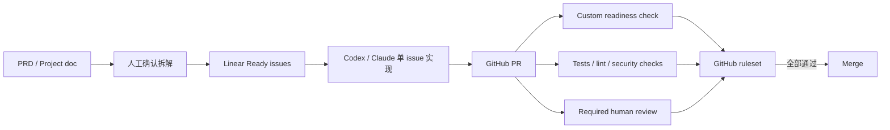

# 长程开发任务管理产品比较（官方资料边界）

> 调研日期：2026-08-05
> 比较对象：Linear + GitHub、GitHub Issues/Projects、Jira + GitHub、Plane + GitHub、Shortcut + GitHub
> 适用场景：小型多人团队，同时使用 Codex、Claude Code 等 coding agents 进行开发
> 资料边界：只使用厂商官方产品文档、集成文档和定价页。没有在官方资料中稳定确认的价格或能力不作猜测。

## 1. 结论

**建议采用 Linear + GitHub，但把强制门禁放在 GitHub。** Linear 在低管理负担、产品文档、Issue 模板、子任务、Project/Milestone/Initiative、GitHub PR 状态联动、Codex cloud delegation、Codex/Claude 可用的 hosted MCP 之间最均衡。对于小型团队，它比 Jira 更容易启动，又比纯 GitHub Projects 提供更明确的产品规划对象。[L1][L2][L3][L4][L5][L6][O1]

这不是“买了 Linear 就解决问题”。任何 tracker 都不能证明：

- 目标已经被正确拆解；
- PRD 的需求、约束和验收标准是正确的；
- agent 没有 overdesign；
- 代码可维护；
- 测试覆盖了真正的失败模式。

Tracker 的 workflow automation 最多改变状态或检查 tracker 内字段。真正阻止不合格代码合并的机制必须是 GitHub ruleset / branch protection 中的 required status checks、required review 和可选 merge queue。[G5][G6] 因此推荐组合是：

**第二选择是 GitHub Issues/Projects。** 如果首要目标是减少工具和同步层，GitHub 原生支持多层 sub-issues、issue dependencies、Project roadmap/iterations/custom fields、内置 automation、Actions 和 API；Issue、PR、CI、ruleset 在同一系统内。[G1][G2][G3][G4][G5] 代价是它刻意保持通用和可定制，不提供 Linear 那样清晰的 Initiative → Project → Milestone 产品对象模型；团队必须自己定义并机器检查 Ready 标准。[G3]

## 2. 如何读这份比较

- **官方事实**：官方页面直接说明的能力，逐项给出来源编号。
- **推断**：从已确认能力推导出的团队适用性，不冒充产品事实。
- **建议**：针对本次“长程任务漂移和垃圾代码”问题提出的使用方法。
- “PR linking / 状态联动”不等于“merge enforcement”。前者属于 tracker integration；后者只有代码托管平台的 ruleset、branch protection 和 CI check 能执行。

## 3. 一览表

| 方案 | 官方确认的强项 | 明确边界 | 小团队管理负担（推断） | 建议定位 |
|---|---|---|---|---|
| Linear + GitHub | 内置 Documents；Initiative / sub-initiative / Project / Milestone / Issue / sub-issue；Cycles；Project dependencies；Issue/form templates；GitHub PR/commit linking 和状态 automation；GraphQL/webhooks；hosted MCP；OpenAI 官方 Codex in Linear [L1-L7][O1] | Linear 的 PR 状态 automation 不会阻止 GitHub merge；未在本次官方资料中确认 self-host 产品 | 低到中 | **推荐默认方案** |
| GitHub Issues/Projects | Issue 可嵌套 8 层；issue dependencies；Projects table/board/roadmap、iterations、custom fields、automation；Issue/PR/Actions/ruleset 同平台；官方 MCP [G1-G8] | Project 是可定制视图，不是固定的产品 hierarchy；PRD 主要依赖 README/Issue/外部文档约定 | 低 | 预算/运维最简方案 |
| Jira + GitHub | 默认 Epic → Story → Subtask；Premium/Enterprise 可加 hierarchy；强 workflow/automation；Plans；Confluence 文档关联；GitHub development data；Rovo MCP [J1-J7] | 高级 hierarchy 属 Premium/Enterprise；文档体验依赖 Confluence；tracker 仍不执行 GitHub merge gate | 高 | 已有 Atlassian 管理能力或复杂治理需求时使用 |
| Plane + GitHub | 内置 Pages；Initiatives、Projects、Milestones、Modules、Cycles、Epic/Task；mandatory custom properties；workflow pre-validation；GitHub 双向 issue sync 和 PR state automation；明确支持 self-host [P1-P9] | 多项能力分布在 Pro/Business/Enterprise Grid；自托管把升级、备份、可用性转为团队责任 | 中（Cloud）/高（self-host） | self-host / data sovereignty 是硬需求时优先 |
| Shortcut + GitHub | Docs；Objective / Epic / Story / Sub-task；Iterations、Roadmap、Story dependencies；workflow；GitHub event handlers；hosted MCP（含 Docs）；REST/webhooks [S1-S9] | 本次官方资料未确认 self-host；未确认可把 tracker 字段变成 GitHub merge gate | 低到中 | 已在使用 Shortcut 或偏好其 Story/Epic 模型时可选 |

## 4. 逐项事实比较

### 4.1 PRD 和文档

| 产品 | 官方事实 | 推断 |
|---|---|---|
| Linear | Project 下有 Documents；官方 MCP 示例明确描述“把 planning document 转成 Project、Milestones、Issues 和 relationships”，并要求信息模糊时先返回 outline、不要猜测。[L5][L6] | 很适合把 PRD 和执行对象放在同一 tracker；但 MCP 示例只是推荐 prompt，不是平台强制校验器。 |
| GitHub | Projects 支持描述、README、status updates、Issue/PR/draft issue 和模板；官方页面把它定义为灵活的 table/board/roadmap。[G3] | 能保存需求，但没有独立 PRD 审批对象。若选择纯 GitHub，需要仓库内 PRD + CODEOWNERS/review + readiness check 来补足。 |
| Jira | Jira 的 Docs 功能用于把 Confluence 内容链接到 Jira space；父级 work item 可以链接 specification/design document 的 Confluence page。[J4] | 文档能力强，但实质上增加 Confluence 产品、权限和管理面。 |
| Plane | Pages 明确用于会议记录、technical/product requirements；支持 Markdown、work item mention，Business 可把选中文字转为 work item。[P1] | PRD 与任务共存能力强，接近 Linear，但高级关联能力受 plan 限制。 |
| Shortcut | Docs 支持文档、模板、Collections、双向 entity relationships，并可从高亮文本创建 Story/Epic/Iteration/Objective。[S1] | 对 PRD → work items 的人工拆解很友好；仍没有证据表明它能判断拆解质量。 |

### 4.2 Hierarchy、依赖和计划对象

| 产品 | 官方事实 | 重要限制 |
|---|---|---|
| Linear | Initiative 用于把 Projects 归入公司目标；支持 sub-initiatives；Project 内有 Milestones；Issue 可拆为 sub-issues；Cycles 是 1–8 周的重复 timebox；Project dependencies 当前是 end → start blocking relation。[L1][L2][L3] | Milestone 不能跨 Project 共享；Project dependency 类型只有 end → start。[L2][L3] |
| GitHub | 每个 parent issue 最多 100 个 sub-issues，最多 8 层嵌套；Issue 可标记 blocked by / blocking；Projects 提供 table/board/roadmap，iteration field 可配置长度和 break。[G1][G2][G3][G4] | Project 是一个跨 Issue/PR 的视图和字段系统，不是 Initiative/Epic 的固定语义层级。[G3] |
| Jira | 默认 hierarchy 是 Epic（level 1）→ Story（level 0）→ Subtask（level -1）；Premium/Enterprise 可增加上层 hierarchy 以跟踪 initiatives，且修改 hierarchy 可能破坏现有 parent/child relationship、不可撤销。[J1] | 高级层级需要更高 plan，也增加全站 admin 风险。[J1] |
| Plane | Initiatives 聚合多个 Projects/跨 Project work items；Modules 是 Project 内的可重复分组；Milestones 是 Project checkpoint；Cycles 是 sprint-like timebox；Epic 是 level 1、Task 是 level 0；Timeline 支持 FS/SS/FF dependencies。[P2][P3][P4][P5] | Modules、Cycles、Milestones 是不同正交维度，若团队没有定义用法，容易重复建模。 |
| Shortcut | Epic 是 Stories 的集合；Story 可拆为 Sub-tasks；Roadmap 按 Objective/Epic 展示；Iteration 是 timebox；Epic/Iteration 页面可显示 Story blocked/blocking Mermaid relationship。[S2][S3][S4][S5] | hierarchy 相对明确但较浅，复杂 portfolio 建模能力不如 Jira 高级 hierarchy。 |

### 4.3 Workflow、required fields 和 automation

| 产品 | 官方事实 | 能否强制“Ready 才开发” |
|---|---|---|
| Linear | Team-specific statuses；form templates 的任意字段可 required；模板可以预填 team/status/priority/assignee/agent/project/labels/estimate/sub-issues；parent/sub-issue 可自动 close。[L1][L4] | **部分可以**：用 form template 强制 intake 字段。但官方资料未证明所有 Issue 创建路径都必须使用某一模板，也不能验证字段内容质量。 |
| GitHub | Projects 内置 workflows 可在 item added/changed/closed/PR merged 时更新 Status，也可 auto-add/archive；GraphQL API 和 Actions 可扩展 automation。[G3][G7] | **需要自建**：Project automation 不是 merge gate。用 GitHub Action/App 读取 Issue/Project 字段并发布 required status check。 |
| Jira | Workflow、transitions 和 Automation（trigger/condition/action/branch）可配置；可在 GitHub branch/PR/build/deployment 事件后改变 work item 状态。[J2][J3][J5] | **tracker 内较强**，但 GitHub merge 是否允许仍需 GitHub required check。配置自由度高也意味着 admin 和误配置成本高。 |
| Plane | Work Item Types 可定义 custom properties，并把 property 标为 Mandatory；Business 提供 single workflow；Enterprise Grid 提供多 workflow、approval 和 Runner pre-validation，失败可阻止 tracker 状态 transition。[P6][P7][P9] | **tracker 内可强制**，但高级 gate 在 Enterprise Grid；仍不能替代 GitHub merge gate。 |
| Shortcut | Workflow 定义 Story/Subtask/Epic 状态；Free 只有一个 workflow，Team/Business/Enterprise 支持多个；Story template 可预填常见字段。[S6][S7] | **有限**：本次官方资料未确认 template 字段 required 或 transition validator。需要 GitHub readiness check。 |

### 4.4 GitHub PR linking、merge 和 CI enforcement

| 产品 | PR / commit linking（tracker 能力） | Merge / CI enforcement（GitHub 能力） |
|---|---|---|
| Linear | Branch、PR title/description、magic words 和 commit 可链接 Issue；PR/commit activity 可改变 Issue status；可按 branch 配规则。[L7] | Linear automation 不阻止 merge。必须在 GitHub ruleset/branch protection 配 required reviews/status checks。[G5][G6] |
| GitHub 原生 | PR 可手动或用 closing keyword 链接 Issue；对 default branch 的合并可关闭 Issue。[G8] | Ruleset/branch protection 可要求 PR review、conversation resolution、status checks、deployment、linear history 和 merge queue；required checks 未通过不能 merge。[G5][G6] |
| Jira | Jira key 放入 branch、commit、PR title 后，Jira 显示 branch/commit/PR/build/deployment；Automation 可响应这些事件。[J5] | Jira 只接收/展示 development data 并驱动 Jira workflow；merge gate 仍在 GitHub。[G5][G6] |
| Plane | GitHub Issue 可单向/双向 sync；`[WORK-ID]` 可链接 PR 并按 draft/open/review/approved/merged/closed 映射 Plane state。[P8] | Plane state mapping 不是 GitHub ruleset；仍需 GitHub required checks。[G5][G6] |
| Shortcut | `sc-ID` / `[sc-ID]` / Story URL 可关联 branch/commit/PR；Event Handlers 可在 branch、commit、PR open/review/approval/merge 等事件后移动 Story。[S8] | Shortcut Event Handler 不是 merge protection；仍需 GitHub required checks。[G5][G6] |

### 4.5 API、webhook、MCP 和 agent integration

| 产品 | 官方事实 | 对 Codex / Claude 的意义 |
|---|---|---|
| Linear | Public GraphQL API 支持 query/mutation；webhooks 覆盖 Issue、Document、Project、Cycle 等；hosted MCP 可读写 Issue/Project/Comment，并提供 readonly endpoint；OpenAI 官方 Codex in Linear 可通过 assign 或 `@Codex` 创建 cloud chat，Linear MCP 可供 Codex local 和 Claude Code 使用。[L5][L6][O1] | 本次比较中 agent 接入最完整：既有 tracker MCP，也有 OpenAI 官方 cloud delegation。但 OpenAI 明确要求 review answers and diffs。[O1] |
| GitHub | REST/GraphQL、webhooks、Actions；GitHub 官方 MCP 可管理 repositories、issues、PRs、workflows，并有 hosted/local server。[G7][G9] | Agent 可直接拿到代码、Issue、PR、CI 同一上下文；最适合实现 custom readiness check。 |
| Jira | Jira REST/webhooks；Atlassian Rovo MCP 可搜索/更新 Jira 和 Confluence，官方给出 Codex 与 Claude Code 配置。[J6][J7] | agent 接入已成熟，但跨 Jira + Confluence + GitHub 三个权限域，故障和治理面更大。 |
| Plane | 官方导航提供 API、webhooks、MCP Server；Plane AI 的 MCP Connectors 用于连接外部服务；本次未把“Plane AI 连接外部 MCP”误写成“任意 coding agent 都可操作 Plane”。[P10][P11] | 需要区分 inbound Plane MCP Server 与 Plane AI 的 outbound MCP connector；上线前应实测 coding agent 所需 CRUD tool。 |
| Shortcut | REST API、webhooks；hosted MCP 支持 Stories、Epics、Iterations、Docs 等；官方给出 Claude Code remote MCP 配置。[S9][S10][S11] | Claude Code 路径有官方指引；Codex 可使用标准 remote MCP 的推断需要部署时实测，本文不当作官方 Shortcut 声明。 |

### 4.6 Self-host、管理负担和价格边界

| 产品 | Self-host 官方边界 | 价格（仅写本次稳定读到的官方值） | 管理负担推断 |
|---|---|---|---|
| Linear | 本次官方资料未确认 self-host offering。 | Free $0；Basic $10/user/month（年付）；Business $16/user/month（年付）；Enterprise custom。[L9] | SaaS 配置少；主要成本是 workspace model、模板和 GitHub integration。 |
| GitHub | GitHub 官方 MCP 有 hosted/local；本表未核验 GitHub Enterprise Server 与 GitHub.com Projects 的完整 feature parity，因此不据此承诺 tracker self-host parity。[G9] | 官方定价页动态内容未稳定解析，本文不抄录价格。[G10] | 如果团队已在 GitHub，新增管理面最小。 |
| Jira | 本次访问的 Jira Data Center URL 未形成可用官方证据，因此不作 self-host 结论。 | 官方价格页动态内容未稳定解析，本文不抄录价格。[J8] | hierarchy、scheme、workflow、Automation、Confluence 和 Marketplace app 均需要明确 owner。 |
| Plane | 官方明确支持在自己的服务器部署，覆盖 Docker Compose 和 Kubernetes，并把数据、升级、备份、外部 PostgreSQL/Redis/object storage 交给部署方管理。[P12] | Cloud 年付页面：Free $0（最多 12 users）；Pro $6/seat/month；Business $13/seat/month；Enterprise Grid quote。[P9] | Cloud 中等；self-host 高，必须有人负责升级、备份、监控和恢复演练。 |
| Shortcut | 本次官方资料未确认 self-host offering。 | 官方定价页没有在本次抓取中形成稳定可引用数值，本文不抄录价格。[S12] | SaaS 本身较轻；多个 workflow 和 VCS event handlers 仍需 owner。 |

## 5. 推荐实施约束

以下是**建议**，不是上述产品的原生保证。

### 5.1 Tracker 中的 Ready contract

只有满足这些字段的最小执行 Issue 才能进入 `Ready for Development`：

1. 有且只有一个可验证 outcome；
2. 明确 in-scope / out-of-scope；
3. 有 acceptance criteria，且至少一个标准可由测试或命令验证；
4. 标明 affected repository / component；
5. 链接已 review 的 PRD 或 design note；
6. 有 parent 和必要 dependency；
7. 估算可在一个短生命周期 PR 内完成；超过阈值必须继续拆分；
8. 指定 human owner 和 reviewer；
9. 写明 rollback / migration / data risk（不适用也要明确写 N/A）；
10. 不允许 agent 自己审批自己提出的拆解。

Linear form template 可以把其中若干字段设为 required，但它不能判断文本是否真实、边界是否合理。[L4] 所以 `Ready` transition 必须由人确认，且不得由 coding agent 自动设置。

### 5.2 GitHub custom readiness check

实现一个 GitHub Action 或 GitHub App，在 PR 上产生固定名称（例如 `engineering-readiness`）的 check，并把它加入 default/deployment branch ruleset 的 required status checks。[G5]

Check 至少验证：

- PR 关联一个 tracker Issue；
- Issue 当前状态是 `Ready for Development` 或之后的允许状态；
- 必填字段、PRD link、acceptance criteria、owner/reviewer 非空；
- PR branch/标题包含稳定 Issue ID，避免同步漂移；
- PR 改动规模超过阈值时失败或要求显式 override + reason；
- migration、generated files、dependencies 等高风险变化触发对应额外 check；
- required CI job 确实出现，避免“workflow 没触发所以看起来没有红灯”。

Ruleset 同时要求：

- required status checks；
- required review，agent 不计作独立 reviewer；
- conversation resolution；
- 禁止默认 bypass（或将 bypass 收敛到 break-glass team 并审计）；
- 高并发分支可启用 merge queue。[G5][G6]

### 5.3 为什么不推荐先上 Jira 或 self-host Plane

这是**团队适用性推断**：当前主要失败是“未经拆解就执行”和“没有机器 merge gate”，不是缺少更多 hierarchy 或更多可配置 workflow。Jira 和 self-host Plane 会先增加 admin、升级、权限和集成维护工作，而不会自动提高需求判断质量。先用 Linear + GitHub 建立可失败的 readiness check 和 required CI；只有出现可观测的需求（例如多团队 portfolio hierarchy、监管审批、数据驻留）再升级工具复杂度。

## 6. 决策排序

1. **Linear + GitHub**：小团队默认；需要 PRD、清晰规划对象、低摩擦 agent integration。
2. **GitHub Issues/Projects**：希望最少工具、最少同步、最低管理负担；愿意自己实现 Ready schema 和 Action。
3. **Plane + GitHub**：self-host / data sovereignty 是硬约束，并且有人承担运维。
4. **Jira + GitHub**：已有 Atlassian 管理能力，或确实需要多层 portfolio hierarchy、复杂 workflow/approval。
5. **Shortcut + GitHub**：团队已经在使用 Shortcut，或明确偏好 Objective/Epic/Story/Iteration 模型；没有足够证据证明迁移到它能比 Linear 更直接解决本次问题。

## 7. 官方来源索引

以下页面访问日期均为 **2026-08-05**。

### Linear / OpenAI

- [L1] [Parent and sub-issues](https://linear.app/docs/parent-and-sub-issues)；[Initiatives](https://linear.app/docs/initiatives)；[Sub-initiatives](https://linear.app/docs/sub-initiatives)
- [L2] [Project milestones](https://linear.app/docs/project-milestones)；[Cycles](https://linear.app/docs/use-cycles)
- [L3] [Project dependencies](https://linear.app/docs/project-dependencies)
- [L4] [Issue templates](https://linear.app/docs/issue-templates)；[Issue status](https://linear.app/docs/configuring-workflows)
- [L5] [API and Webhooks](https://linear.app/docs/api-and-webhooks)
- [L6] [Linear MCP server](https://linear.app/docs/mcp)；[Codex MCP integration](https://linear.app/integrations/codex-mcp)
- [L7] [GitHub integration](https://linear.app/docs/github-integration)
- [L8] [Documents](https://linear.app/docs/project-documents)
- [L9] [Linear pricing](https://linear.app/pricing)
- [O1] OpenAI, [Use Codex in Linear](https://learn.chatgpt.com/docs/third-party/linear.md)

### GitHub

- [G1] [Adding sub-issues](https://docs.github.com/en/issues/tracking-your-work-with-issues/using-issues/adding-sub-issues)
- [G2] [Creating issue dependencies](https://docs.github.com/en/issues/tracking-your-work-with-issues/using-issues/creating-issue-dependencies)
- [G3] [About Projects](https://docs.github.com/en/issues/planning-and-tracking-with-projects/learning-about-projects/about-projects)
- [G4] [About iteration fields](https://docs.github.com/en/issues/planning-and-tracking-with-projects/understanding-fields/about-iteration-fields)
- [G5] [Available rules for rulesets](https://docs.github.com/en/repositories/configuring-branches-and-merges-in-your-repository/managing-rulesets/available-rules-for-rulesets)
- [G6] [About protected branches](https://docs.github.com/en/repositories/configuring-branches-and-merges-in-your-repository/managing-protected-branches/about-protected-branches)
- [G7] [Using built-in Projects automation](https://docs.github.com/en/issues/planning-and-tracking-with-projects/automating-your-project/using-the-built-in-automations)；[Automating Projects using Actions](https://docs.github.com/en/issues/planning-and-tracking-with-projects/automating-your-project/automating-projects-using-actions)；[Webhooks](https://docs.github.com/en/webhooks)
- [G8] [Linking a pull request to an issue](https://docs.github.com/en/issues/tracking-your-work-with-issues/linking-a-pull-request-to-an-issue)
- [G9] GitHub, [Official GitHub MCP Server](https://github.com/github/github-mcp-server)
- [G10] [GitHub pricing](https://github.com/pricing)

### Jira / Atlassian

- [J1] [Configure the work type hierarchy](https://support.atlassian.com/jira-cloud-administration/docs/configure-the-issue-type-hierarchy/)
- [J2] [What are Jira workflows?](https://support.atlassian.com/jira-software-cloud/docs/what-are-jira-workflows/)
- [J3] [Jira Cloud automation](https://support.atlassian.com/cloud-automation/docs/jira-cloud-automation/)
- [J4] [Use Docs in Jira Cloud](https://support.atlassian.com/jira-software-cloud/docs/use-docs-in-jira-cloud/)；[Link a Confluence page to a parent-level work item](https://support.atlassian.com/jira-software-cloud/docs/link-a-confluence-page-to-an-epic/)
- [J5] [Link GitHub development information to Jira work items](https://support.atlassian.com/jira-cloud-administration/docs/use-the-github-for-jira-app/)；[Link GitHub workflows and deployments](https://support.atlassian.com/jira-cloud-administration/docs/link-github-workflows-and-deployments-to-jira-issues/)
- [J6] [Manage webhooks](https://support.atlassian.com/jira-cloud-administration/docs/manage-webhooks/)
- [J7] [Getting started with Atlassian Rovo MCP Server](https://support.atlassian.com/atlassian-rovo-mcp-server/docs/getting-started-with-the-atlassian-remote-mcp-server/)
- [J8] [Jira pricing](https://www.atlassian.com/software/jira/pricing)

### Plane

- [P1] [Pages for project documentation](https://docs.plane.so/core-concepts/pages/overview)
- [P2] [Initiatives](https://docs.plane.so/core-concepts/projects/initiatives)
- [P3] [Modules](https://docs.plane.so/core-concepts/modules)；[Milestones](https://docs.plane.so/core-concepts/projects/milestones)
- [P4] [Cycles](https://docs.plane.so/core-concepts/cycles)
- [P5] [Epics](https://docs.plane.so/core-concepts/issues/epics)；[Task dependencies](https://docs.plane.so/core-concepts/issues/timeline-dependency)
- [P6] [Project Work Item Types](https://docs.plane.so/work-items/project-work-item-types)
- [P7] [Workflows and Approvals](https://docs.plane.so/workflows-and-approvals/workflows)
- [P8] [GitHub integration](https://docs.plane.so/integrations/github)
- [P9] [Plane pricing](https://plane.so/pricing)
- [P10] [Plane API reference](https://developers.plane.so/api-reference/introduction)；[Webhooks](https://developers.plane.so/dev-tools/intro-webhooks)
- [P11] [MCP Connectors](https://docs.plane.so/ai/mcp-connectors)；[Plane MCP Server](https://developers.plane.so/dev-tools/mcp-server)
- [P12] [Deploy Plane on your infrastructure](https://developers.plane.so/self-hosting/overview)

### Shortcut

- [S1] [Docs Overview](https://www.shortcut.com/help/docs/docs-overview)
- [S2] [Stories Overview](https://www.shortcut.com/help/stories/stories-overview)；[Sub-tasks](https://www.shortcut.com/help/stories/sub-tasks)
- [S3] [Epics Overview](https://www.shortcut.com/help/epics/epics-overview)
- [S4] [Iterations Overview](https://www.shortcut.com/help/iterations/iterations-overview)
- [S5] [Roadmap](https://www.shortcut.com/help/views/roadmap-overview)
- [S6] [Workflows](https://www.shortcut.com/help/fields-and-features/workflows)
- [S7] [Story Templates](https://www.shortcut.com/help/stories/story-templates)
- [S8] [GitHub integration](https://www.shortcut.com/help/integrations/github)
- [S9] [Shortcut MCP Server](https://www.shortcut.com/help/integrations/mcp-server)
- [S10] [Claude Code integration](https://www.shortcut.com/help/integrations/claude-code)
- [S11] [REST API v3](https://developer.shortcut.com/api/rest/v3)；[Webhooks](https://www.shortcut.com/help/admin/webhooks)
- [S12] [Shortcut pricing](https://www.shortcut.com/pricing)

## 8. 未确认项

- Linear、Shortcut 是否提供可购买的 self-host 版本：本次官方资料未确认，不能把“未找到”写成“不存在”。
- GitHub Enterprise Server 与 GitHub.com 当前 Projects/sub-issues/dependencies 的逐项 parity：未做版本化核验。
- Jira Data Center 的当前可购买边界和价格：本次官方页面未形成稳定证据。
- Shortcut 当前精确价格：官方页面在本次抓取中未形成稳定数值。
- 任何产品声称的 AI 自动拆解质量：没有把营销陈述当成能替代人工 review 或 machine gate 的证据。
