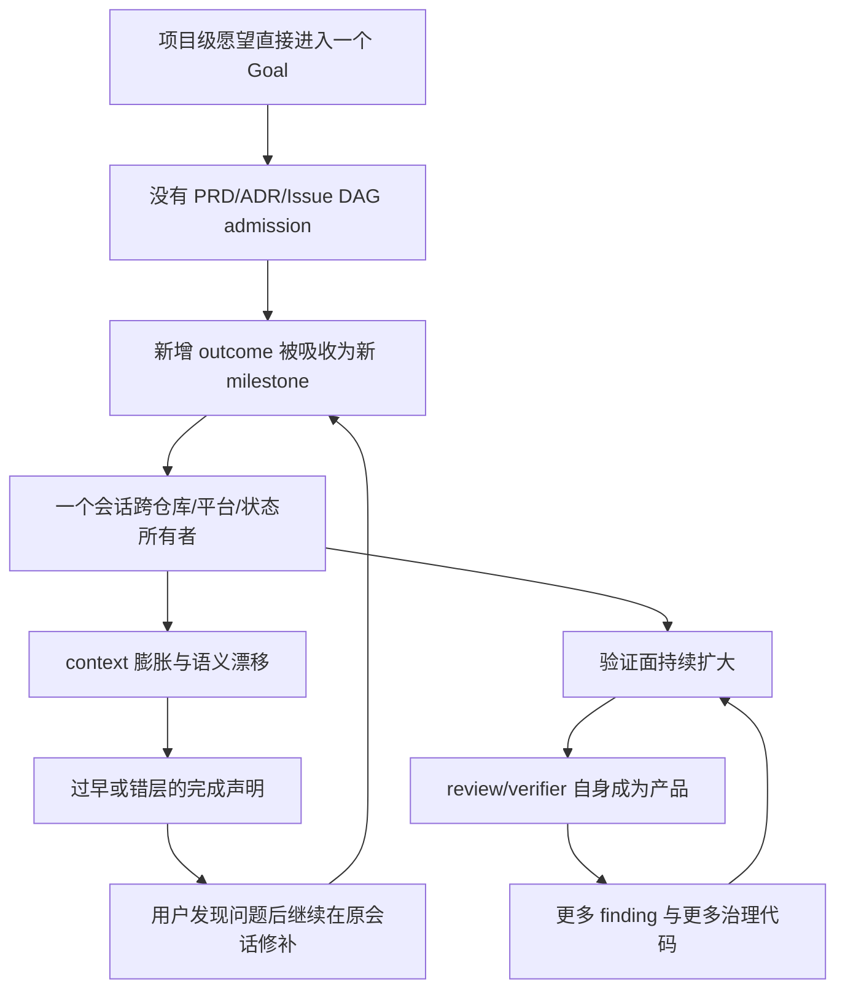
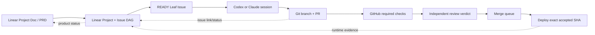
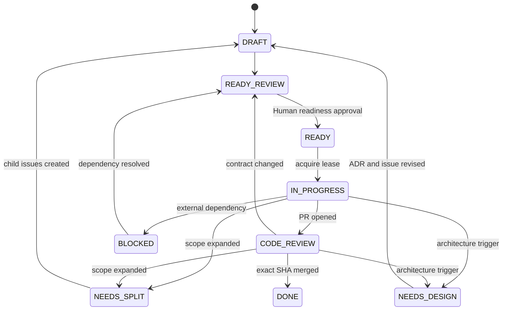

# 长程 Coding Agent 开发复盘与流程改造 PRD

> 日期：2026-08-05
> 范围：用户指定的 7 个 Codex 会话、本仓库 `goal-plan`、Agent Core 的 test/review playbook，以及截至本文日期可访问的产品官方资料。
> 核心结论：**不要再让一个 `/goal` 代表一个项目。今后只有已经通过机器检查的 READY 叶子 Issue，才能交给一个 Coding Agent 会话执行；一个叶子 Issue 对应一个工作分支、一个主要 PR 和一组冻结的验收标准。**

## 0. Executive summary

这 7 个会话不是 7 次互不相关的偶发失败，而是 5 类工作被同一种执行模型放大的结果：把项目级愿望直接变成一个长时间自动推进的会话，再用越来越多的 prompt、ledger、review 和 verifier 试图约束它。

已确认的严重后果包括：

- 搬瓦工（BWG）的 Abuse Guard Goal：约 2,100 行产品代码之外，coordination repository 增长 302 commits、276 files、`+74,423/-2`；产生 74 次 review request 和 113 个 finding，真实 binary acceptance 仍 `NOT_RUN`，两个产品仓库都没有 PR。
- Win11 AgentDesk Evaluation：连续约五天形成约 49k 行 `src/scripts/tests/benchmark` 内容，但父仓库仍是 `No commits yet`，整个 `agentdesk-eval/` 未跟踪；没有稳定基线、可审阅 diff 或 commit-bound acceptance。
- WSL Helper：从解释 Win11 Helper 和修一个操作人 bug，扩大到登录状态机、多语言、多仓库 release、更新器、新操作人和新卡台；版本、制品和 E2E 证据相互错位。
- PPT：结构检查曾通过，但标题裁切、短尾行等视觉错误仍阻断交付；这说明 gate 测了错误的层。resume 后同一个 session ID 又被错误解释成 Base URL/fleet 会话，fixed-marker 成功没有证明语义恢复正确。
- L40S Slurm Goal：base 到 HEAD 已有 211 commits、281 files、`+83,740/-21`、62 次 review request、103 个 finding；validator 仍是 `READY / ACTIVE / M3`，但没有成功 bootstrap/query、Goal GPU job、真实 primary/fallback 或 final acceptance。

这不等于所有长会话产物都是垃圾，也不等于所有新增需求都是 agent 擅自扩张。很多需求由用户明确追加，部分业务提交和测试很可能有复用价值。真正的工程错误是：**新增独立 outcome 后，没有结束当前执行单元、创建新 Issue/PR，也没有由机器拒绝继续吸收范围。**

### 立即建议

1. 暂停用 `/goal` 直接执行项目、Epic、多仓库功能、架构重写或跨平台发布；`/goal` 只允许执行 READY 叶子 Issue。
2. 暂停把当前 `goal-plan` 的 `READY` 当作“可以开始大型实现”的充分条件。它当前主要验证文档形状和 ledger 状态，不验证计划内容是否真实、足够小或可执行。
3. 采用 **Linear + GitHub** 做第一轮试点：Linear 管 PRD、项目和任务依赖；GitHub 管代码、required checks、review 和 deploy。Linear 不是质量门禁，GitHub Action 中的 readiness checker 才是。
4. 不开发一套新的项目管理平台。只写一个小的、fail-closed 的 readiness checker，调用 Linear API 并作为 GitHub required check；其余能力使用现有产品。
5. 先在 `new-api` 与 `TokenRouter` 试点，验证“无 READY 叶子 Issue 不能启动 agent/合并 PR”，再决定是否推广。

---

## 1. 本次调研是怎样拆解的

这部分记录实际执行过程，不把最后形成的结构伪装成一开始就知道的答案。

| ID | 工作包 | Owner | 输入 | 交付 | 状态 |
|---|---|---|---|---|---|
| R0 | 证据边界与永久规则 | Main Agent | `AGENTS.md`、Agent Core、memory index | 主机/会话/写入边界 | 完成 |
| R1 | 搬瓦工（BWG）两会话审计 | Explorer A | 2 个 rollout、3 个 repo、Goal ledger | `bwg-sessions.md` | 完成 |
| R2 | Win11 + WSL 三会话审计 | Explorer B | native/WSL profile、3 个 rollout、相关 repo | `win11-wsl-sessions.md` | 完成 |
| R3 | L40S 两会话审计 | Explorer C | 2 个 rollout、Slurm repo/Goal ledger | `l40s-sessions.md` | 完成 |
| R4 | `goal-plan` 机器能力审计 | Main Agent | skill、template、runtime、tests、git history | 第 4 节 | 完成 |
| R5 | 产品与工程流程比较 | Main + Explorer D | 官方文档、定价、集成说明 | `product-comparison.md` + 第 6 节 | 完成 |
| R6 | 跨案例根因与反事实控制 | Main Agent | R1–R5 | 第 5 节 | 完成 |
| R7 | 解决方案 PRD | Main Agent | 根因、现有门禁、产品能力 | 第 7–12 节 | 完成，待 review |
| R8 | 独立 Reviewer gate | Reviewer Sub-Agent | 本文与所有 evidence appendix | `final-review.md` | PASS |

### 1.1 为什么按主机分，而不是把 7 个会话全文塞给 Main Agent

- rollout 最大达到约 238 MB；全文进入一个 context 会复制原问题。
- 每个 Explorer 只负责一组主机，必须定位原始 JSONL、核验 git/PR/ledger，再写独立报告。
- Main Agent 不外包最终判断：它负责统一口径、发现跨案例模式、审计 `goal-plan` 和编写 PRD。
- 最后由没有参与写作的 Reviewer 读取实际 Markdown，而不是只看 Main Agent 摘要。

### 1.2 Resume 的证据污染边界

用户要求实际 resume 会话，本次确实执行了。但审计发现：

- Codex 0.146.0 的 `codex exec resume --ephemeral` 仍可能向原 rollout 追加 prompt/answer；BWG 审计因此记录了 pre-resume cutoff。
- PPT session 的 resume 发生语义错配；原始 JSONL 才是旧任务事实来源。
- Win11 native resume 进入线程但没有在短时限内完成，随后主动中止并转 JSONL。

因此，后续审计流程必须先记录 rollout hash/byte cutoff，再 resume；不能把 resume 生成的自述当作独立证据。

---

## 2. 判断边界：什么叫“垃圾代码”

本文不按“代码多”“agent 写的”或“最终没上线”直接判定垃圾代码。采用下面四类可观察标准：

| 分类 | 可观察标准 | 本文如何处置 |
|---|---|---|
| 无用代码 | 没有已知调用者、验收标准或未来 owner；删除不改变冻结行为 | 在依赖图和 characterization tests 前不直接删除，只列为候选 |
| 不可维护代码 | 多个状态所有者、重复 SSOT、巨型模块、无版本边界、无法局部验证 | 必须拆分或重写前先建立行为基线 |
| 破坏性代码 | 改坏 main/生产、绕过 gate、破坏用户工作或已有架构约束 | 立即隔离/回退；本次多数案例尚未进入 main |
| Overdesign | 治理/抽象/通用化成本显著超过当前 outcome，且没有交付证据证明边际价值 | 不继承为默认架构，选择性保留最小有证据部分 |

BWG 案例中的 7.4 万行 coordination 增量是极强的 overdesign 信号，但不能据行数断言每一行都无用。AgentDesk 的核心问题也不是 49k 行本身，而是这些内容全部存在于零 commit、无 PR 的工作区。

---

## 3. 七个会话的事实矩阵

### 3.1 搬瓦工（BWG）`019facc3...`

**原始 outcome**：跨 NewAPI 与 TokenRouter 修复 Abuse Guard WebSocket correlation，并完成真实 binary acceptance、paired PR 与 merge lifecycle。

**实际状态**：产品候选分支存在；NewAPI 相对 main 为 12 commits、`+853/-27`，TokenRouter 为 8 commits、`+1,277/-31`。两个 `dragtokens/main` 未变化，PR 列表为空。coordination repository 从冻结 HEAD 增长 302 commits、`+74,423/-2`，AC-09/M6 未完成。

**主要失控点**：每次 acceptance harness 暴露缺陷，都被归为原 Goal 的 in-scope 修复；review 与 verifier 变成新的产品，却没有自己的 owner、范围或停止条件。

**当前处置**：不回退 main；冻结 feature branches，仅作为待审材料；不得整体合并 coordination harness；从 clean main 重新建立小 PR。

### 3.2 搬瓦工（BWG）`019fcd21...`

这是前一个 Goal 的止损审计，不是第二个 implementation。它确认 main 未变化、PR 为零，并停止长 Goal。本次独立检查支持其主要处置，但修正了 coordination 增量口径。

### 3.3 Win11 `019fadf2...`

**原始 outcome**：调查 AgentDesk Evaluation 应在 Win11 还是 WSL、比较 Promptfoo 等框架、验证现有接口与 benchmark 数据。

**实际状态**：范围扩展为完整 evaluation 产品、trace/scoring/HTML/CLI、portable installer、Win11/macOS release 和大量文档。rollout 约 149 MB、58,870 行、72 次 compaction。当前父仓库零 commit，`agentdesk-eval/` 整体未跟踪。

**主要失控点**：研究、PRD、MVP、产品化、发布和跨平台支持没有形成串行版本边界；五天工作没有一个可审阅 commit。

**当前处置**：先做只读 inventory 与 dependency graph；建立 Git 基线；不要直接重构或发布；从一个单题 evaluation slice 开始重建 commit/PR/CI。

### 3.4 WSL `019fc840...`

**原始 outcome**：恢复五页答辩 PPT，复制新模板、迁移已有内容、逐页修改与视觉 QA。

**实际状态**：结构 gate、ZIP、notes、字号等曾通过，但标题裁切、短尾行等视觉阻断仍存在。用户手工版后来成为 authority，脚本继续全量重建会破坏人工修改。resume 又把该 ID 错审计成 Base URL/fleet 会话。

**主要失控点**：内容研究、事实核查、模板迁移、图片资产、版式兼容和最终验收被放进同一循环；机器 gate 只证明 OOXML 结构，没有证明视觉结果。

**当前处置**：用户权威 base 不可被全量脚本覆盖；按页拆任务；最终 hash 冻结后，结构和视觉在同一个 artifact 上重新验收。

### 3.5 WSL `019fae69...`

**原始 outcome**：解释并验证 Win11 Helper 如何启动、常驻、显示 Dashboard 并与服务器联动；随后修复空闲状态操作人切换。

**实际状态**：扩展到 Microsoft 登录状态机、多语言、Extension/Helper/Server 跨仓发布、安装更新、新操作人、新卡台与指定卡 canary。历史出现版本混用、release SSOT 漂移、双层 sanitizer、跨 runtime 状态不一致；没有一个最终版本的完整 E2E matrix。

**主要失控点**：真实 E2E 每发现一个新变量，就同时修改业务、状态机、发布和平台适配；无法知道哪项修复改变了结果。

**当前处置**：按 operator、dispatch、debug contract、login pages、state ownership、payment、release、platform adapter 分成独立任务；每个任务冻结 exact version matrix。

### 3.6 L40S `019fae66...`

**原始 outcome**：一次性执行 M1–M6，建成私有三节点、24×L40S 的 Slurm batch platform，同时完成 immutable submission、cache、checkpoint、primary archive、fallback/failback、runbook 和最终验收。

**实际状态**：rollout 约 96 MB、49,692 records、15,048 tool calls、74 次 compaction。仓库从 base 到 HEAD 为 211 commits、281 files、`+83,740/-21`；62 次 `REVIEW_REQUESTED`、103 个 finding ID，其中 102 个被分类为 `IN_SCOPE`。validator 是 `PASS / READY / ACTIVE / M3`，working tree clean，但没有成功 Slurm bootstrap/query、Goal GPU job、M3 completion、真实 primary/fallback 或 final acceptance。

**主要失控点**：一次 apply timeout 逐步演化成 interrupted recovery、remote CAS、selector descriptor authority、inode/witness/receipt 等自研事务协议；核心 live milestone 未完成时，Plan 又允许 PRE-M4/PRE-M5 offline work，未兑现库存继续增长。F-99 甚至为了文档中的 shell assignment 引入 CommonMark/Bash checker 和多轮 review。

**没有发现的生产破坏**：六次 foreign workload audit 都是 `foreign_gpu_workloads=34`、`remote_mutations=0`；没有证据表明 agent 格式化磁盘、删除历史数据、停止 foreign workload、公开暴露服务或绕过 live gate。

**当前处置**：冻结 branch，先做保留/删除 ADR 和外部 PR/CI；M3 bootstrap/recovery、submission、cache、primary、fallback、operator acceptance 分成独立 PR。blocked 外部状态交给 watcher，状态不变时不再生成 commit。

### 3.7 L40S `019fc29a...`

这条会话最初只是进度/偏离审计，后来被用户重新赋予 `/goal` 执行权限，成为同一 Slurm Goal 的第二个执行入口。它约 11.5 MB、2,316 tool calls、7 次 compaction；Goal internal context 从约 598k 增长到约 4.45M tokens，预算仍是 none/unbounded。

核心问题不是越权，而是审计和执行没有隔离：用户问“为什么要授权、该怎么授权”后，workflow 很容易回到原永久 Goal。foreign workload 不变时，两组三次 audit 都正确 blocked，却每次 resume 仍重建 candidate、跑 audit、写 ledger/commit；缺少只在外部状态变化时唤醒的 watcher 和 unchanged-state suppression。

### 3.8 跨案例共同模式

| 模式 | BWG | AgentDesk | PPT | Helper | L40S |
|---|---:|---:|---:|---:|---:|
| 一个会话吸收多个独立 outcome | 是 | 是 | 是 | 是 | 是 |
| 没有 READY 叶子任务 admission | 是 | 是 | 是 | 是 | 是 |
| gate 测错对象或证据层 | 是 | 是 | 是 | 是 | 是 |
| review/修复循环没有全局上限 | 是 | 部分 | 是 | 是 | 是 |
| commit/PR 与验收未绑定 | 是 | 严重 | artifact hash 漂移 | 是 | 是 |
| 新平台/仓库/状态所有者未触发拆分 | 是 | 是 | 部分 | 是 | 是 |
| resume/compaction 后语义风险 | 是 | 是 | 已证实错配 | 是 | 是 |

---

## 4. `goal-plan` 审计：它解决了什么，没解决什么

### 4.1 先区分 `/goal` 与 `/goal-plan`

官方 Codex 文档中：

- `/goal` 把一个最多 4,000 字符的目标附着在当前 chat，可以 edit/pause/resume/clear；它不是 PRD 或任务分解系统。
- 官方明确建议“一个 chat 对应一个 coherent unit of work”，并把“一个 chat 承载整个 project”列为常见错误。
- 复杂且不清晰的任务应先用 `/plan` 澄清，再开始一个已经可验证的 goal。

本仓库 README 又明确说明：`/goal-plan` 是额外安装的 planning command，**不会替换或包裹 `/goal`**。所以不能把所有长会话失败都归因于 `goal-plan`；必须逐会话确认实际使用了什么。

### 4.2 `goal-plan` 已有的有效能力

- 独立 Goal 目录和 append-only runtime/findings ledger。
- plan hash、事件顺序、pending decision、finding classification 与部分 convergence 状态校验。
- Plan review、milestone review、independent acceptance 的概念分离。
- numeric budget feasibility probe、stop-class authorization、agent identity guard。
- runtime tests 当前 61/61 通过，说明这些结构性状态机约束有真实测试，不只是 prompt。

这些能力适合做**已拆解执行单元的审计协议**，不适合证明一个项目级愿望已经足够小、可维护或值得实现。

### 4.3 可机器复现的核心缺陷

#### 缺陷 A：空白模板被测试为合法 Plan

默认模板仍包含：

- `Describe the single independently verifiable...`
- `Define included work.`
- `Verification command: replace-me`
- `Define the hard-ordered implementation milestones.`

但 `test_plan_template_passes_validation` 明确断言默认模板应通过 `validate_plan()`，实际 test suite 也通过。因此 validator 的绿色不能证明 Plan 已填写。

#### 缺陷 B：内容只做关键词/正则存在性检查

`validate_plan()` 检查 section、`Given/When/Then`、`Verification command` 等字符串是否出现，不执行 verification command，不验证 scope 是否单一，不校验 milestone 是否真实，也不检测 placeholder。

#### 缺陷 C：review 与 acceptance 没有强绑定到实际证据

- 普通 `PLAN_REVIEWED` 只比较 `plan_version`，没有要求 `plan_sha256_reviewed` 等于当前 plan hash。
- reviewer prompt 的 base/candidate commit 缺失时会写成 `not supplied`，而不是失败。
- milestone name 不必存在于 Plan，完成 milestone 不要求 commit/evidence。
- `GOAL_COMPLETED` 只需要 latest event 是一个 `PASS` 的 `ACCEPTANCE_COMPLETED`；runtime 不会逐条执行 AC 或验证 CI provenance。
- independence 主要靠 ledger 中两个字符串不同，不能证明是独立进程、独立模型或 GitHub reviewer。

#### 缺陷 D：convergence rule 太局部

当前规则在**同一个 finding** 两次 fix round 后阻止第三次；BWG 案例却可以不断产生新的 finding，于是 74 次 review 仍合法。缺少整个 Goal/PR 级的全局 review budget 和“业务 candidate 无变化但治理 artifacts 持续增长”的 stop rule。

#### 缺陷 E：`DEFAULT_AUTHORIZED` 放大了错误 Plan

2026-07-26 的改动把所有 Plan-defined、in-scope action 默认视为已授权，并允许跨 milestone 自动推进。对一个高质量、足够小的 Plan，这能减少无意义等待；对一个宽泛 Plan，它会把最初的定义错误放大到整个执行周期。

### 4.4 结论

`goal-plan` 不是这些失败的唯一原因，但它存在一个危险的不对称：

> runtime 对“如何继续”检查得很严，对“这个目标值不值得继续、是否已经拆到足够小”检查得很弱。

因此应把它降级为 READY 叶子 Issue 的执行/验收协议，不能继续作为项目级 Goal 的启动许可。

---

## 5. 根因与反事实控制

### 5.1 根因树



### 5.2 为什么 prompt 和历史经验不够

现有 skill 已写了“single outcome”“scope drift 要拆分”“independent acceptance”等正确文字，实际案例仍失控。原因不是这些原则错，而是触发条件靠 agent 自己解释：

- “这是新 outcome 还是 in-scope 修复？”由正在执行的 agent 判断；它天然倾向继续。
- “review 是否已经太多？”没有全局 event budget，旧规则只看同一个 finding。
- “Plan 是否填写完整？”validator 允许 placeholder。
- “测试证明了什么？”没有 `AC -> command -> artifact -> SHA` 的机器映射。

反事实上，如果当时有下面任意一个 fail-closed gate，损失都会显著降低：

1. 未通过 READY schema 的 parent project 不能启动 Coding Agent。
2. 执行 Issue 出现第二个 repo/runtime/platform 时自动变回 `NEEDS_SPLIT`。
3. 每个工作 slice 必须形成 commit；零 commit 的数日工作无法继续进入 release 阶段。
4. candidate SHA 连续两个 full review cycle 不变、仍未运行核心 AC 时自动停止。
5. PR 不能在没有 exact issue、exact acceptance artifact 和 independent verdict 时合并。

### 5.3 PRD、Roadmap、Issue、Plan 的职责

| Artifact | 回答的问题 | 不应该承担什么 |
|---|---|---|
| PRD | 为什么做、为谁做、成功是什么、明确不做什么 | 不直接授权 agent 修改代码 |
| ADR / Technical Design | 架构边界、数据/接口变化、替代方案、迁移与回滚 | 不充当 task backlog |
| Roadmap / Project | 先后顺序、依赖、版本与 owner | 不等于可执行任务 |
| Leaf Issue | 一个可独立验收的行为变化、精确 repo/路径/AC | 不吸收另一个独立 outcome |
| Agent execution plan | 如何完成这一个 leaf issue | 不重新定义产品目标 |
| PR | 可审阅 diff、测试和 exact SHA | 不补写缺失的 PRD 决策 |

只有 Roadmap 不够。Roadmap 可以把一个大愿望画成时间线，却不能保证每个 execution unit 已经可验证。真正的 admission artifact 是 PRD + 必要 ADR + 叶子 Issue DAG。

---

## 6. 产品比较与采购建议

### 6.1 结论先行

推荐先试点 **Linear + GitHub**，不是因为 Linear 能自动保证好设计，而是因为：

- 团队规模不大，Linear 的 project/issue/sub-issue、milestone、template 和 dependency 足以表达 PRD 到叶子任务；日常维护负担低于 Jira。
- OpenAI 官方已经提供 Codex in Linear：可把 Issue 分配给 Codex或 `@Codex`，并支持 Linear MCP；这能让“Issue 是 agent 输入”成为正常路径，而不是复制 prompt。
- GitHub 继续拥有不可替代的强制层：ruleset、required status checks、review、merge queue 和 deploy provenance。

但采购 Linear 后如果不加 readiness check，失败模式不会消失，只是从 chat 移到 Issue。Linear 的 sub-issue 和 template 是表达工具，不是正确性证明。

### 6.2 比较原则

最终比较以独立产品报告为准，至少区分：

- 产品/任务表达能力；
- workflow 自动化；
- GitHub 同步；
- 是否能阻止 merge；
- API/MCP/agent integration；
- self-host 与维护成本；
- 价格只引用可稳定获取的官方信息，不猜测。

独立调研已确认：Linear 当前文档覆盖 Initiative/sub-initiative、Project/Milestone、Issue/sub-issue、Cycle、Project dependency、required form fields、GitHub integration、GraphQL/webhooks、hosted MCP 和 OpenAI 官方 Codex delegation；GitHub 则提供最多 8 层 sub-issues、Issue dependencies、Projects automation、rulesets 和 required checks。两者的能力边界互补，而不是重复。

### 6.3 当前推荐排序

| 方案 | 适合度 | 优点 | 关键不足 | 建议 |
|---|---:|---|---|---|
| Linear + GitHub | 最高 | 低管理负担；层级/周期/项目；官方 Codex integration/MCP | tracker 本身不能强制 merge；复杂审批弱于 Jira | 首选 4 周试点 |
| GitHub Issues + Projects | 高 | 与代码/PR/Actions/ruleset 同源；成本和重复最低 | PRD/discovery、跨项目规划和非工程协作较弱 | 若团队不愿引入新 SaaS，这是保守方案 |
| Jira + GitHub | 中高 | workflow、字段、automation、权限和审计最强 | 配置与维护负担大，小团队容易流程本身 overdesign | 团队扩大或合规要求上升时选 |
| Plane + GitHub | 中 | open source/self-host；Initiative/Module/Issue 与 GitHub sync | 需要自己运维，agent integration 和生态成熟度需试点验证 | 数据必须自托管时再选 |
| Shortcut + GitHub | 中 | Stories/Epics/Roadmaps、VCS automation、MCP | 团队现有生态与 Codex 官方链路不如 Linear直接 | 作为 Linear 的轻量备选 |

---

## 7. PRD：READY 叶子 Issue 门禁

### 7.1 产品名称

**一个 READY 叶子 Issue 对应一个 Coding Agent 会话和一个主要 PR**。

本文使用简称 `Ready Issue Gate`。它不是新的项目管理产品，而是一组 Linear workflow、GitHub ruleset 和一个小 checker 的组合。

### 7.2 Problem statement

当前团队可以把模糊的项目级目标直接交给 Coding Agent。现有 `/goal`、`goal-plan`、CI 和 deploy gate 分别解决持续执行、ledger、测试与上线安全，但在“允许开始写代码”之前没有统一 admission。因此：

- 未拆解的任务能够执行；
- 新 outcome 可以被原会话吸收；
- review 和 verifier 可以无限扩张；
- 代码、Issue、验收和部署 SHA 没有端到端绑定；
- 用户只能在几天后凭结果质量发现目标已经漂移。

### 7.3 Users

- 用户本人：产品决策、技术方向和最终风险 owner。
- 共同开发者：创建/认领 Issue、review PR、参与发布。
- Codex / Claude Code：只能执行 READY leaf issue。
- Reviewer Agent：只评审冻结 Issue、diff 和 AC，不继续实现。

### 7.4 Goals

1. 未拆解或未评审的项目不能直接启动 Coding Agent implementation。
2. 每次 agent 开发都能追溯到一个 leaf issue、一个 base SHA、一个主要 PR 和一组 acceptance evidence。
3. scope 增长、review 不收敛和错层 gate 能在小时级工作单元内暴露，而不是几天后。
4. 保留 quick fix、incident 和 spike 的低摩擦路径，但例外必须可见、可审计。
5. 最大限度复用 Linear/GitHub，不建设新的 orchestration platform。

### 7.5 Non-goals

- 不让 Linear、LLM 或自动算法独立决定正确的产品拆分。
- 不追求把所有工程判断变成静态规则。
- 不用 LOC、token 或耗时作为普遍的任务正确性标准。
- 不把现有 7 个会话的全部产物自动迁移或重构。
- 不在本 PRD 中购买 SaaS、修改生产仓库或部署 gate。

### 7.6 Source of truth



- PRD/priority/owner：Linear。
- Code/test/review/merge SHA：GitHub。
- Deployment/runtime evidence：CI/CD。
- Agent chat：过程证据，不是任何状态的唯一 source of truth。

### 7.7 Issue 状态与规格冻结

最小状态机：



`READY` 不是一个可长期复用的标签，而是 human 对一个**冻结 contract revision** 的批准：

1. checker 将 Issue type、parent PRD revision、Outcome、Non-goals、AC、单一 repo、base、allowed paths、dependencies、risk、ADR、rollout/rollback 等 contract fields canonicalize，并计算 `contract_sha256`；不把 comment、普通 status 更新等非 contract 字段放进 hash。
2. 指定 human reviewer 在 Linear 中批准该 hash；agent 不能批准自己提出的拆解。批准记录包含 reviewer、时间和 `contract_sha256`。
3. `acquire` 只接受 `READY`，记录 Issue ID、`contract_sha256`、base SHA、session ID 和 lease，然后把状态改为 `IN_PROGRESS`。
4. PR gate 接受 `IN_PROGRESS` 或 `CODE_REVIEW`，不要求 Issue 仍显示 `READY`；它要求 PR 中的 contract hash、lease、base SHA 与当前 approved revision 一致。
5. 任一 contract field 变化都会产生新 hash，使旧 human approval、lease、prompt、PR check 和 acceptance evidence 立即失效；Issue 回到 `READY_REVIEW`，重新批准后才能继续。
6. `DONE` 只由 exact accepted SHA merge 触发。关闭 chat、agent 自述完成或 tracker 自动 close 都不能单独进入 `DONE`。

这些记录使用 Linear field/comment 与 GitHub check artifact 即可，不引入新的数据库或常驻 orchestration service。

### 7.8 Work item types

| Type | 可以交给 agent 写生产代码吗 | 必需产物 |
|---|---:|---|
| Project / Epic | 否 | PRD、milestones、Issue DAG |
| Discovery | 否 | 证据、用户/问题结论 |
| Spike | 默认否 | ADR/可行性结果；实验代码不可直接 merge |
| Feature leaf | 是，READY 后 | 行为变化、AC、tests、rollout/rollback |
| Bug leaf | 是，READY 后 | repro、root cause boundary、regression test |
| Refactor leaf | 是，READY 后 | behavior invariants、characterization tests |
| Incident fix | 是，走 fast path | impact、repro、最小 fix、rollback、事后补录 |

### 7.9 Definition of Ready schema

Ready checker 必须从 Linear API 读取并验证：

1. Issue 是允许执行的 leaf type，不是 Project/Epic/Discovery。
2. Parent Project 存在已批准 PRD；Issue 不存在未完成的 child issue。
3. `Outcome` 只描述一个可独立验收的行为变化，并由指定 human reviewer 对冻结 revision 作判断。
4. `Non-goals` 非空。
5. 生产代码 leaf 精确属于一个 repo、一个 base branch 和一个主要 PR；列出允许修改的 package/path 或明确 path discovery 规则。
6. Acceptance criteria 每条包含可执行 command 或明确的 reviewer/runtime evidence。
7. Dependencies 已完成或被显式标为并行且不共享写入面。
8. Risk class、owner、implementer、independent reviewer 已设置。
9. Project outcome 涉及多 repo 时，必须在 parent 建 cross-repo contract/ADR，并拆成每个 repo 独立 leaf；public API/schema、database migration、auth/permission/money、生产状态、新 runtime/platform 或新 service 也必须链接已批准 ADR。
10. rollout/rollback 对 behavior-changing task 非空。
11. 不得出现 `TBD`、`TODO`、`replace-me`、`待定` 等 placeholder。
12. 所有产品决策已回答，并由 human reviewer 判断；checker 只验证字段、关系、状态、hash 和 approval provenance，不能声称需求或设计本身正确。

跨 repo integration/release item 可以引用多个已经构建的 artifact SHA，但它本身不得顺便修改多个产品 repo。若仍需生产代码变更，必须回到各 repo 的 leaf issue。

### 7.10 Agent start contract

启动 Coding Agent 前，launcher 执行：

```text
ready-issue check <ISSUE-ID> --repo <repo> --base <sha>
ready-issue acquire <ISSUE-ID> --session <session-id>
```

只有 exit 0 才能开始 implementation。acquire 建立一个绑定 approved `contract_sha256` 的 lease：

- 一个 Issue 同时只能有一个 implementing session；
- 一个 agent 在同一个 repo 默认只能有一个 `IN_PROGRESS` coding issue；
- session prompt 由 checker 生成，包含冻结 outcome、non-goals、allowed paths、AC 和 stop triggers；
- Project/Epic 不生成 execution prompt。

### 7.11 Runtime scope gate

每次准备 commit/PR 时检查：

- diff 是否超出 issue 声明的单一 repo/path/contract surface；出现第二个 repo 时无条件进入 `NEEDS_SPLIT`；
- 是否新增第二个独立 outcome、runtime、platform 或状态 owner；
- 是否修改 tests/gates 来降低原有标准；
- 是否存在未记录的新 dependency、schema 或 migration；
- 当前工作 slice 是否有 commit-bound evidence。

任一超界时状态变为 `NEEDS_SPLIT` 或 `NEEDS_DESIGN`，当前 agent 可以记录发现，但不能继续实现新增范围。

### 7.12 Convergence gate

当前按单个 finding 计数不够。新规则按 PR/Issue 全局计数：

1. 第 1 次 full review：正常发现问题。
2. 第 2 次 full review 仍出现新 P1/架构 finding，或同一核心 AC 仍未运行：自动进入 design re-entry。
3. 普通第 3 次 full review 是最后一次；仍不收敛则进入 `NEEDS_SPLIT`，禁止第 4 次普通 review。
4. 机械 recheck 可以更轻，但仍计入总轮次；重复机械问题说明缺少 self-check。
5. candidate product SHA 连续两个 review cycle 不变，但 governance/test-only diff 持续增长且核心 AC 未推进：自动停止。

阈值可以在试点后调整，但不能由执行 agent 在当前 Issue 内自行提高。

### 7.13 PR and merge gate

GitHub ruleset/required checks 至少包括：

- `ready-issue`: PR 精确链接一个已批准的 leaf issue；Issue 当前为 `IN_PROGRESS` 或 `CODE_REVIEW`，approved contract hash、lease、base SHA 和单一 repo 全部匹配。
- `scope-check`: diff 没有越过 Issue 声明边界。第二个 repo 没有 per-PR override，必须拆分；其他 path/architecture 例外需要 contract revision、human reviewer 和原因。
- 项目已有 deterministic CI：unit/integration/security/build。
- `acceptance-manifest`: 每个 AC 绑定 command、exit code、artifact hash 和 candidate SHA。
- `independent-review`: reviewer 不是 implementer，verdict 绑定 exact HEAD；review 后的代码变化使 verdict 失效。
- deploy 只接受通过上述 gates 的 exact merge SHA。

checker 必须从 base branch 执行，PR 不能通过修改 checker 自己来改变判决。

### 7.14 Fast paths

#### Small bug

可免完整 PRD，但必须有 repro、non-goal、regression test、risk、rollback 和一个 leaf issue。触及 schema/auth/money/多 repo 时自动失去 fast-path 资格。

#### Incident

允许先止血，但 required check 记录 emergency bypass、approver、原因和后续 Issue；bypass 不得静默。

#### Spike

只交付证据/ADR；默认不能把 spike branch 直接 merge 为生产 feature。若要保留实现，重新创建 READY feature issue。

---

## 8. 对 `goal-plan` 的改造要求

这些是后续实现任务，不在本轮直接修改代码。

### 8.1 定位调整

- `goal-plan` 只接受 READY leaf issue 或纯 planning/review 任务。
- Project/Epic 输入只生成 PRD/Issue DAG，不生成 execution launch prompt。
- `/goal` 的 launch prompt 必须包含 Issue ID；没有 Issue ID 时只允许 small local task 或明确的非代码工作。

### 8.2 `validate-plan` 必须新增的机器失败条件

- 默认 placeholder 仍存在。
- Outcome/Included/Milestone 为空或保持模板文字。
- verification command 是 `replace-me`、不存在或没有可解析的 evidence type。
- milestone 未绑定 leaf issue ID；一个 milestone 包含多个 repo/runtime 且没有拆分说明。
- review 没有当前 `plan_sha256_reviewed`。
- base/candidate commit 为 `not supplied`。
- acceptance event 没有逐 AC result、artifact hash 和 CI/run provenance。

### 8.3 Runtime 必须新增的 stop conditions

- Goal 级 review 总轮次上限，而不只是单 finding 上限。
- candidate SHA 不变、核心 AC 不推进、governance artifacts 持续增长。
- 第二个 repo，或原 Issue 未声明的新 runtime/platform/state owner。
- milestone completed 没有 commit/evidence。
- Plan amendment 改变 outcome/AC 后没有重新经过 Ready Issue Gate。

### 8.4 不应继续扩建的部分

- 不再构建通用“证明历史不可篡改”的大型 coordination harness 来替代业务 acceptance。
- 不让 agent 自己生成 reviewer identity 字符串后就视为独立 review。
- 不把所有风险都变成更多 ledger schema；优先使用 GitHub、CI 和 tracker 已有的不可绕过状态。

---

## 9. 实施任务拆解

### Phase 0：止损与规则冻结

1. 在团队规范中声明：Project/Epic 不允许直接 `/goal` implementation。
2. 暂停把 `goal-plan READY` 视为项目级启动许可。
3. 冻结 7 个会话产物，不做批量删除或自动合并。

交付：一页临时规则；不改生产 gate。

### Phase 1：Linear/GitHub 试点设计

1. 建一个 Linear workspace/team，导入 `new-api` 与 `TokenRouter` 的一个真实小项目。
2. 配置 Project template、Feature/Bug/Spike/Incident issue templates、workflow states 和 required fields。
3. 连接 GitHub；验证 Issue/branch/PR 状态同步。
4. 定义 PRD、ADR 与 leaf issue schema；由两名实际开发者走一次手工流程。

交付：workspace 配置、模板、权限矩阵和一条完整但不自动化的路径。

### Phase 2：最小 readiness checker

1. 读取 Linear Issue/Project/relations/custom fields。
2. 实现 placeholder、leaf type、parent PRD、dependency、单一 repo/base、AC、risk/ADR 检查。
3. canonicalize contract fields，计算 `contract_sha256`，验证 human approval，并让 contract 变化使旧 approval/lease 失效。
4. 提供 CLI 和 GitHub Action 两个入口，共用一个核心库。
5. 添加 failure canaries：每条规则至少有一个已知坏样例必须失败。
6. 不做 UI、daemon、轮询服务或自建数据库。

交付：秒级 checker、fixture tests、Action status。

### Phase 3：GitHub required checks

1. `ready-issue` 与 `scope-check` 加入 ruleset。
2. checker 从 base branch 加载；保护 workflow/checker 自身路径。
3. 独立 review verdict 绑定 exact SHA；review commit 之外的变化使 verdict 失效。
4. emergency bypass 需要 approver + reason，并生成审计记录。

交付：在试点 repo 中无法静默绕过的 merge gate。

### Phase 4：Agent launcher

1. 输入 READY Issue ID，生成 worktree/branch/session prompt。
2. acquire/release Issue lease；进入 `NEEDS_SPLIT`、`NEEDS_DESIGN`、`BLOCKED` 或 `DONE` 时 launcher 使旧 lease 失效，重新执行必须基于新的 approval/lease。
3. 记录 session ID、base SHA、branch、PR 与 acceptance manifest。
4. scope/convergence stop condition 触发时只生成新 Issue 草案，不自动扩大当前 Issue。

交付：Codex 与 Claude Code 共用的薄 launcher；不替代各自 runtime。

### Phase 5：试点和复盘

1. 只在 `new-api`、`TokenRouter` 各选择 2–3 个真实叶子任务。
2. 至少包含一个 valid task、一个应被 admission 拒绝的大任务、一个 scope drift canary、一个 emergency bypass drill。
3. 记录失败率、review rounds、escaped defects、人工维护时间和 bypass。
4. 试点结束后再决定 Linear plan、是否推广 Helper/AgentDesk，以及是否改 `goal-plan` runtime。

---

## 10. Acceptance criteria

### AC-01：未拆解任务不能启动

- Given 一个 Project/Epic 或含 placeholder 的 Issue，
- When 执行 `ready-issue check`，
- Then exit 非 0，输出精确缺失字段，launcher 不创建 implementing session。

### AC-02：READY leaf 可以端到端追溯

- Given 一个通过 review 的 leaf issue，
- When agent 开始工作并创建 PR，
- Then Issue、session、base SHA、branch、PR、AC evidence 与 candidate SHA 可相互追溯。

### AC-03：scope drift fail-closed

- Given PR 修改了 Issue 未声明的 path、出现第二个 repo 或引入受控架构触发项，
- When GitHub 运行 `scope-check`，
- Then required check 失败；第二个 repo 必须拆新 Issue，其他架构/path 变化必须更新 ADR/contract 并重新批准，或使用规则明确允许的可见 human 例外。

### AC-04：坏 gate 能被 canary 证明

- Given 每条 readiness/scope/review 规则的 known-bad fixture，
- When CI 运行 checker tests，
- Then 每个坏样例都被拒绝；删除一条关键 guard 后测试必须变红。

### AC-05：review 不能无限循环

- Given 同一个 Issue 已完成允许的 full review rounds，
- When 仍有新 P1/架构 finding 或核心 AC 未运行，
- Then 状态变为 `NEEDS_DESIGN` 或 `NEEDS_SPLIT`，不能请求下一次普通 review。

### AC-06：independent acceptance 绑定 exact SHA

- Given reviewer 对 candidate SHA 运行 AC，
- When 任何生产代码、test、workflow、checker 或 approved contract fields 随后变化，
- Then 旧 verdict 自动失效；只有新 readiness approval 和新 review 才能恢复 required check。

### AC-07：deploy 只接受已验收 SHA

- Given 一个未通过 required checks 或 evidence manifest 不匹配的 commit，
- When deploy workflow 被调用，
- Then deploy fail-closed；通过的 merge SHA 才可进入环境。

### AC-08：例外可用但不可静默

- Given incident 需要 bypass，
- When authorized human 使用 emergency path，
- Then 记录 approver、reason、exact SHA、时间和 follow-up Issue；普通 agent 无法自己批准。

---

## 11. 试点指标与停止条件

没有当前 baseline 的性能数字不应先拍脑袋冻结。Phase 1 先记录两周 baseline，再设改进目标。第一轮只冻结二元合规指标：

- 100% 非 emergency agent PR 链接一个曾通过 READY approval、且当前 contract hash 匹配的 leaf issue。
- 100% merged agent PR 有 exact-SHA independent verdict 和 CI evidence。
- 0 个 Project/Epic 被直接分配给 Coding Agent implementation。
- 0 个未记录的 bypass。
- 任何第 4 次普通 full review 请求都被机器拒绝。

观察但暂不硬编码的指标：

- Issue 从 READY 到 merge 的 cycle time。
- 每 PR full review rounds、新 P1/P2 数、reopen rate。
- scope-check 触发次数及正确/误报比例。
- agent 代码被整体丢弃、重写或 revert 的比例。
- escaped defect、deploy rollback 与用户验收失败。
- 维护 tracker/checker 的人工时间。

如果 checker 自身开始需要 daemon、数据库、大型 UI 或超过业务团队能独立维护的复杂度，停止扩建，退回 GitHub Issue template + required check 的更小方案。

---

## 12. 风险与取舍

| 风险 | 具体后果 | 缓解 |
|---|---|---|
| 形式主义 | Issue 填满字段但仍没有好设计 | human PRD/ADR review；checker 只声称完整，不声称正确 |
| Linear/GitHub 双 SSOT | 状态和描述漂移 | 明确职责；不复制 code/review truth 到 Linear |
| 小任务摩擦过大 | 开发者绕过流程 | small bug/incident/spike fast paths；bypass 可见 |
| 任务拆得过碎 | 集成成本和局部优化上升 | 按可独立验收行为拆，不按文件/LOC 机械拆 |
| checker overdesign | 重演 BWG coordination harness | 无 daemon/DB/UI；只校验 admission；规模异常即停 |
| Agent 伪造 evidence | 绿色但没运行真实测试 | CI-owned commands、exact SHA、known-bad canary、independent reviewer |
| SaaS lock-in | 迁移成本和价格变化 | GitHub 保留代码/merge truth；schema 可导出；先试点后采购 |

---

## 13. 决策演练

> [!question] 场景 1
> 一个 Issue 要同时修改 NewAPI、TokenRouter、Compose acceptance 和 deploy workflow。是否可以因为“最终只有一个用户 outcome”而交给一个 `/goal`？

<details>
<summary>参考答案</summary>

不能直接执行。它至少跨两个 owner repo、一个集成环境和一个部署边界，应先有 Project/ADR，再拆成各 repo 的 leaf issues、独立 cross-repo acceptance 和最终 release task。用户 outcome 可以是一个，execution unit 仍必须多个。

</details>

> [!question] 场景 2
> 某 PR 连续两轮 reviewer 都通过，但真实 binary acceptance 从未运行。能否认为“review 已充分”并合并？

<details>
<summary>参考答案</summary>

不能。review PASS 只证明 reviewer 检查的 artifact。若 AC 要求 real-binary behavior，未运行就是 NOT_RUN；synthetic、ledger 或 history verifier 不能替代它。

</details>

> [!question] 场景 3
> readiness checker 所有测试都绿，但默认模板本身也能通过。这个 gate 是否可信？

<details>
<summary>参考答案</summary>

不可信。gate 没有见过它必须拒绝的 known-bad 输入。应加入 placeholder 模板 canary，并确认删除关键 guard 时测试变红。

</details>

---

## 14. 证据索引

### 本地与远端会话审计

- `docs/long-horizon-audit/bwg-sessions.md`
- `docs/long-horizon-audit/win11-wsl-sessions.md`
- `docs/long-horizon-audit/l40s-sessions.md`
- `docs/long-horizon-audit/product-comparison.md`
- `docs/long-horizon-audit/final-review.md`

### `goal-plan` 源码证据

- `goal_plan/runtime/src/goal_plan_runtime/templates/plan.md`
- `goal_plan/runtime/src/goal_plan_runtime/cli.py`
- `goal_plan/runtime/tests/test_runtime.py`
- `goal_plan/codex/skills/goal-plan/SKILL.md`
- commit `929061e`：`goal-plan: default in-scope execution to authorized`
- 当前验证：`uv run --project goal_plan/runtime python -m unittest goal_plan/runtime/tests/test_runtime.py -v`，61 tests PASS；其中包含 `test_plan_template_passes_validation`。

### 官方资料

- [Codex long-running work](https://learn.chatgpt.com/docs/long-running-work)
- [Codex best practices](https://learn.chatgpt.com/guides/best-practices)
- [Codex CLI slash commands](https://learn.chatgpt.com/docs/developer-commands?surface=cli)
- [Use Codex in Linear](https://learn.chatgpt.com/docs/third-party/linear)
- [Linear parent and sub-issues](https://linear.app/docs/parent-and-sub-issues)
- [Linear GitHub integration](https://linear.app/docs/github-integration)
- [Linear MCP server](https://linear.app/docs/mcp)
- [GitHub adding sub-issues](https://docs.github.com/en/issues/tracking-your-work-with-issues/using-issues/adding-sub-issues)
- [GitHub protected branches and required checks](https://docs.github.com/en/repositories/configuring-branches-and-merges-in-your-repository/managing-protected-branches/about-protected-branches)
- [GitHub rulesets](https://docs.github.com/en/repositories/configuring-branches-and-merges-in-your-repository/managing-rulesets/about-rulesets)

## 15. 当前未确认项

- 本轮没有逐行 review BWG 两个产品 feature branches，也没有判断每个 commit 的保留/丢弃。
- AgentDesk 未跟踪目录尚未建立完整依赖图，不能直接给出删除清单。
- Helper 当前 production 的实际版本组合没有在本轮重新做线上 E2E。
- Linear/Jira/Plane/Shortcut 的最终 plan-specific pricing 与采购条款以购买当日官方页面为准。
